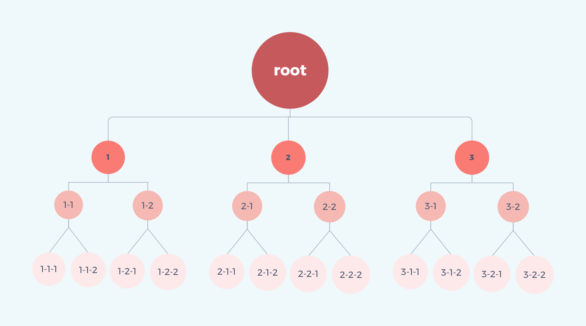

# 深度优先搜索算法

> 深度优先搜索（depth first search），从图中也可以看出来，是从根节点开始，沿树的深度进行搜索，尽可能深的搜索分支。当节点所在的边都已经搜多过，则回溯到上一个节点，再搜索其余的边。

## 1. 动画展示


## 2.数据

```bash
const root = [
  {
    id: '1',
    children: [
      {
        id: '1-1',
        children: [{ id: '1-1-1' }, { id: '1-1-2' }],
      },
      {
        id: '1-2',
        children: [{ id: '1-2-1' }, { id: '1-2-2' }],
      },
    ],
  },
  {
    id: '2',
    children: [
      {
        id: '2-1',
        children: [{ id: '2-1-1' }, { id: '2-1-2' }],
      },
      {
        id: '2-2',
        children: [{ id: '2-2-1' }, { id: '2-2-2' }],
      },
    ],
  },
  {
    id: '3',
    children: [
      {
        id: '3-1',
        children: [{ id: '3-1-1' }, { id: '3-1-2' }],
      },
      {
        id: '3-2',
        children: [{ id: '3-2-1' }, { id: '3-2-2' }],
      },
    ],
  },
];

const target = '2-2-2';
```




## 3. 代码实现
```bash
interface IItem {
  id: string;
  children?: IItem[];
}

const depthFirstSearch = (source: IItem[]) => {
  const result: string[] = []; // 存放结果的数组
  // 递归方法
  const dfs = (data: IItem[]) => {
    // 遍历数组
    data.forEach((element: IItem) => {
      // 将当前节点 id 存放进结果
      result.push(element.id);
      // 如果当前节点有子节点，则递归调用
      if (element.children && element.children.length > 0) {
        dfs(element.children);
      }
    });
  };
  // 开始搜索
  dfs(source);
  return result;
};

depthFirstSearch(root);
```
