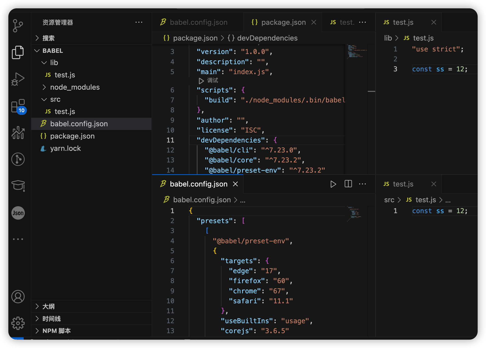

# babel 作用

- 语法转换
- 通过 Polyfill 方式在目标环境中添加缺失的功能（通过引入第三方 polyfill 模块，例如 core-js）
- 源码转换（codemods）

## 初始化 babel 测试项目

- mkdir babel-demo
- cd babel-demo
- npm init
- yarn add --dev @babel/core @babel/cli @babel/preset-env
- 根目录创建**babel.config.json**，内容如下：

```bash
{
  "presets": [
    [
      "@babel/preset-env",
      {
        "targets": {
          "edge": "17",
          "firefox": "60",
          "chrome": "67",
          "safari": "11.1"
        },
        "useBuiltIns": "usage",
        "corejs": "3.6.5"
      }
    ]
  ]
}
```

- 根目录创建**src**目录，用来写 demo 测试
- **package.json**的**scripts**添加 **"build": "./node_modules/.bin/babel src --out-dir lib"**用来方便编译脚本执行，打包编译后的代码在根目录的**lib**下。
- 终端使用**yarn build**执行编译


