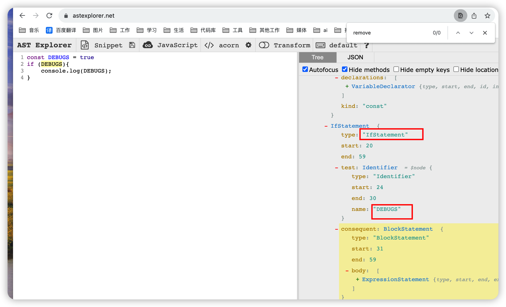

# 插件开发 ast

> 中文地址(具体 api 使用方法这里找)：https://github.com/jamiebuilds/babel-handbook/blob/master/translations/zh-Hans/plugin-handbook.md

> ast 在线解析：https://astexplorer.net/

> babel 在线编译： https://www.babeljs.cn/repl

## 官方 demo

> 目的：将**foo === bar**编译为**sebmck === dork**

插件代码：

- 目录：plugins/convertCode.js

```jsx | pure
function convertCode(babel) {
  const { types: t } = babel;
  return {
    visitor: {
      BinaryExpression(path) {
        if (path.node.operator !== '===') {
          return;
        }
        path.node.left = t.identifier('sebmck');
        path.node.right = t.identifier('dork');
      },
    },
  };
}
module.exports = convertCode;
```

本地加载：

```bash
{
  "presets": [
    [
      "@babel/preset-env",
      {
        //     "targets": {
        //       "edge": "17",
        //       "firefox": "60",
        //       "chrome": "67",
        //       "safari": "11.1"
        //     },
        // "useBuiltIns": "usage",
        // "corejs": "3.33.0"
      }
    ]
  ],
  "plugins": [
    [
      "@babel/plugin-transform-runtime",
      {
        "corejs": 3
      }
    ],
    "./plugins/convertCode.js"
  ]
}
```

效果如下：

```jsx | pure
foo === bar;
// converted to
sebmck === dork;
```

扩展：移除开发 debug 代码

目的：开发过程中，通过 DEBUGS 控制日志输出，编译时移去这部分代码；

代码如下：

```jsx | pure
const DEBUGS = true;
if (DEBUGS) {
  console.log(DEBUGS);
}
```

查看 ast:
将上面代码复制到 ast 在线网站（方便查看）https://astexplorer.net/

可以看到类型 type 为**IfStatement**的部分，对其进行处理,在**visitor**下添加**IfStatement**方法



插件：

```jsx | pure
function convertCode(babel) {
  const { types: t } = babel;
  return {
    visitor: {
      IfStatement(path) {
        if (path.node?.test?.name === 'DEBUGS') {
          console.log(path.node.test, '===');
          path.remove();
        }
      },
    },
  };
}
module.exports = convertCode;
```

结果：

```jsx | pure
const DEBUGS = true;
if (DEBUGS) {
  console.log(DEBUGS);
}
// converted to
var DEBUGS = true;
```
