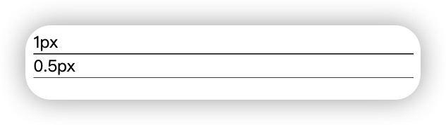
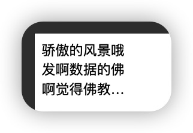
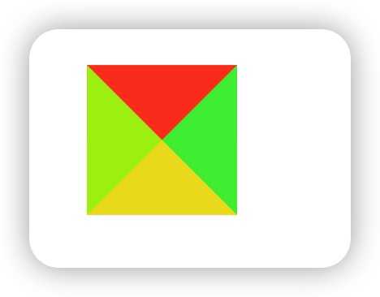

## css常用小技巧

#### 1、设置输入框placeholder样式

```css
input::-webkit-input-placeholder,
textarea::-webkit-input-placeholder {
  color: #666;
}

input:-moz-placeholder,
textarea:-moz-placeholder {
  color: #666;
}

input::-moz-placeholder,
textarea::-moz-placeholder {
  color: #666;
}

input:-ms-input-placeholder,
textarea:-ms-input-placeholder {
  color: #666;
}
```

#### 2、自定义滚动条

```css
/* 定义滚动条的整体宽度和样式 */
::-webkit-scrollbar {
  width: 10px;
  /* 滚动条宽度 */
}

/* 定义滚动条轨道的颜色 */
::-webkit-scrollbar-track {
  background: #1890ff;
  /* 轨道颜色 */
}

/* 定义滚动条滑块的颜色 */
::-webkit-scrollbar-thumb {
  background: #4fcbcd;
  /* 滑块颜色 */
}

/* 当鼠标悬停在滑块上时改变颜色 */
::-webkit-scrollbar-thumb:hover {
  background: #fd9738;
  /* 悬停时的颜色 */
}
```

#### 3、移动端h5 1像素边框怎么设置

> 在高像素密度的移动设备上，由于设备像素比（Device Pixel Ratio，简称 DPR）大于 1，将 CSS 中定义的 1 像素线条或边框渲染出来时会变得模糊或显示为多个物理像素，导致边框看起来比预期的粗



```html
<style>
    .border::after {
      content: '';
      display:block;
      height: 1px;
      background-color: #000;
    }
    .half::after {
     transform: scaleY(0.5);
    }
  </style>
</head>

<body>
  1px
  <div class="border"></div>
  0.5px
  <div class="border half"></div>
</body>
```

#### 4、禁止用户选择文字

```css
user-select:none;
```

#### 5、媒体查询横竖屏

```css
/* 竖屏 */
@media screen and (orientation:portrait) {
  .box {
    width: 100px;
    height: 100px;
    background-color: #000;
  }
}

/* 横屏 */
@media screen and (orientation:landscape) {
  .box {
    width: 100px;
    height: 100px;
    background-color: red;
  }
}
```
#### 6、多行文字显示省略号



```css
.text {
  width: 100px;
  display: -webkit-box;
  -webkit-box-orient: vertical;
  -webkit-line-clamp: 3;
  overflow: hidden;
}
```

#### 7、使用css实现小三角

效果图：


代码：

```css
<span class="test"></span>

.test {
      cursor: pointer;
      width: 0;
      height: 0;
      border-width: 20px;
      border-style: solid;
      font-size: 0;
      line-height: 0;
      position: absolute;
      left: 100px;
      top: 100px;
      border-color: #ff4423 #44EC41 #eedd23 #aaee11;
    }
    
```
