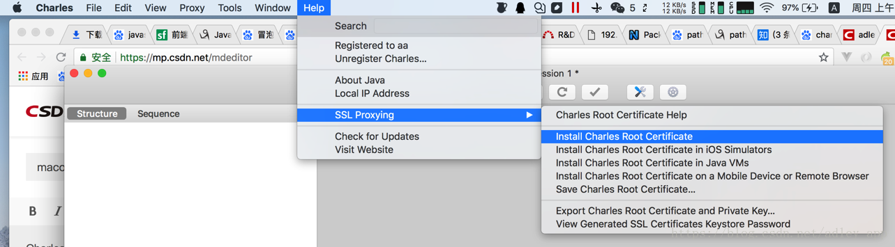
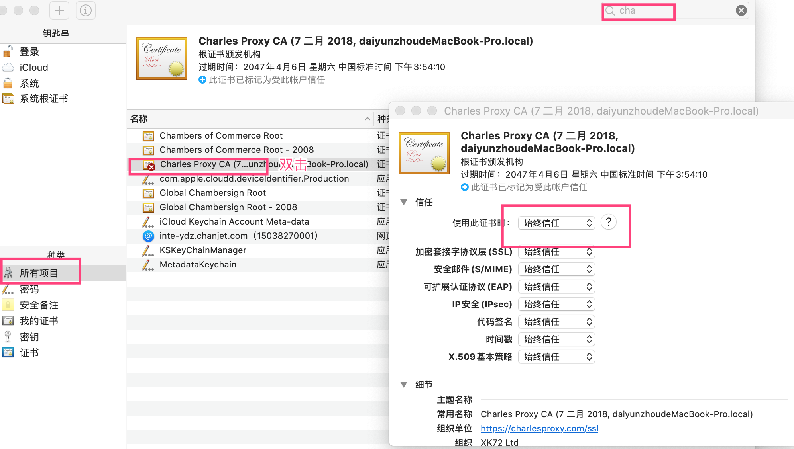
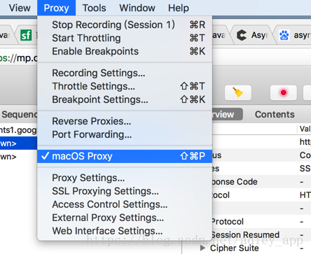
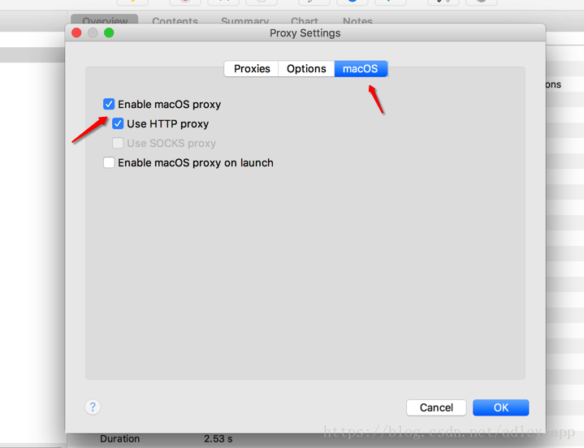
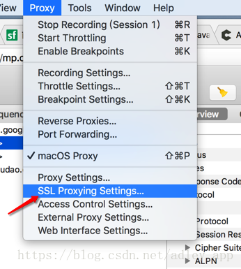
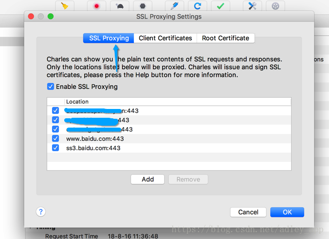

# MacOS下 Charles 抓包浏览器https接口

Charles抓去http的接口非常简单方便。下面在mac下，利用Charles抓去Chrome的网页中的https接口。

##### 1.导出charles的证书

##### 2.打开本机钥匙串，找到charles证书，修改为始终信任

双击修改就可以，这样就导入到macos证书了

##### 3.修改Charles配置

这样就可以抓去浏览器中的https网页了。可以试试https://www.baidu.com/
