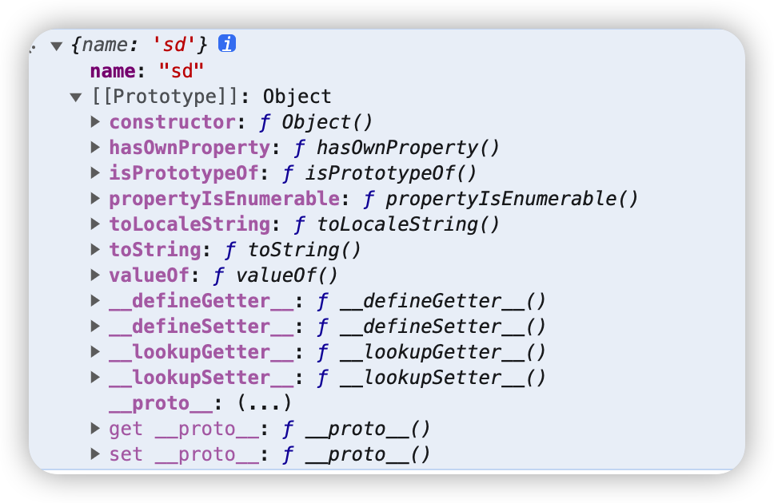
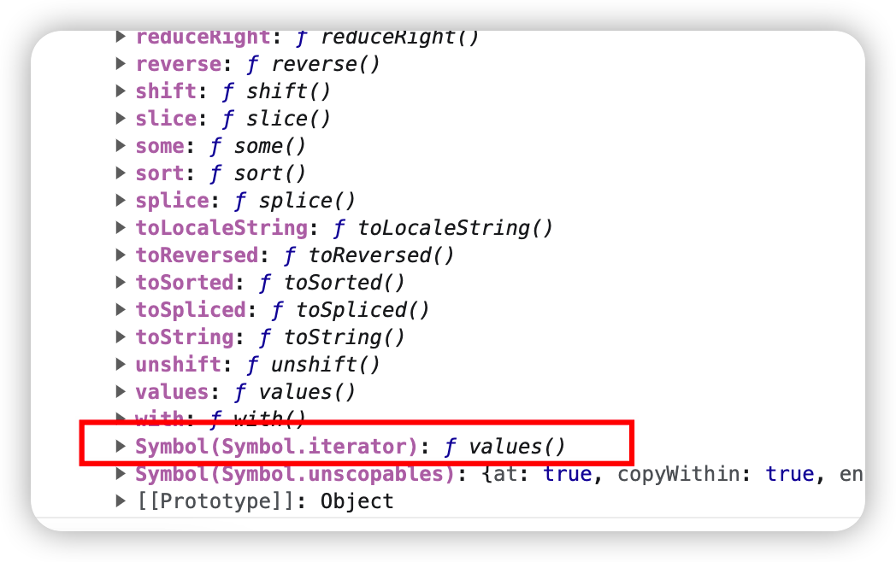

# javascript 基础

## 1. meta viewport 是做什么用的，怎么写？

```sh
<meta name="viewport" content="width=device-width, initial-scale=1, maximum-scale=1, minimum-scale=1" />
```

## 2.解析 Url 参数

> 解析 url 参数，返回键值对对象

```tsx | pure
const urlParse = (url: string) => {
  const query = url.replace(/.*\?/, '').replace(/#.*/, '');
  const reg = /([^=&]*)(=)([^=&]*)/g;
  const obj = {};
  while (reg.exec(query)) {
    obj[RegExp.$1] = RegExp.$3;
  }
  return obj;
};
```

<code src="./UrlParse/index.tsx"></code>

## 3.bind 实现

请描述原生 js 里 bind 函数的作用，什么场景需要用到它，并手写 Function.bind 函数

- 主要作用是改变函数中的 this 指向

```jsx | pure
Function.prototype.bind = function (context) {
  // 获取到bind第一个参数（要绑定的函数）之外的参数数组；
  // args: [234,23443]
  var args = Array.prototype.slice.call(arguments, 1);

  // 缓存当前this
  var that = this;
  // 创建一个新的函数
  var bind = function () {
    // 获取到执行对应绑定方法时接手到的参数
    // innerArgs: [12]
    var innerArgs = Array.prototype.slice.call(arguments);
    // 合并所有参数
    // finalArgs: [234, 23443, 12]
    var finalArgs = args.concat(innerArgs);
    return that.apply(context, finalArgs);
  };
  bind.prototype = that.prototype;
  return bind;
};

function ss() {
  this.state = {
    name: '12',
  };
}
function bb() {
  console.log(arguments, this); //[234, 23443, 12] , ss
}
bb.bind(ss, 234, 23443)(12);
```

## 4.伪数组转成数组方法

### 什么是伪数组：

- 1、拥有 length 属性；
- 2、不具有数组所具有的 push,pop 等方法。

### 案例

伪数组：`const divs = document.querySelectorAll('div');`

1. 循环方法

```jsx | pure
const arr = [];
console.log(divs instanceof Array);
for (let i = 0; i < divs.length; i++) {
  arr.push(divs[i]);
}
```

2. Array 的 slice 方法

```jsx | pure
[].slice.call(divs);
// 或者
Array.prototype.slice.call(divs);
```

3. Array.form

```jsx | pure
Array.form(divs);
```

4. 扩展运算符

```jsx | pure
[...divs];
```

## 5.let const var

### var ES5 变量声明方式

- 在变量未赋值时，变量 undefined（为使用声明变量时也为 undefined）
- 作用域 var 的作用域为方法作用域；只要在方法内定义了，整个方法内的定义变量后的代码都可以使用

### let ES6 变量声明方式

- 在变量为声明前直接使用会报错
- 作用域 let 为块作用域,通常 let 比 var 范围要小
- let 禁止重复声明变量，否则会报错；var 可以重复声明

### const ES6 变量声明方式

1. const 为常量声明方式；声明变量时必须初始化，在后面出现的代码中不能再修改该常量的值

2. const 实际上保证的，并不是变量的值不得改动，而是变量指向的那个内存地址不得改动

## 6.js 数据类型，区别

### 基本数据类型：

Number，String，Boolean，null，undefined，symbol，bigint（后两个为 ES6 新增）

### 引用数据类型：

object，function（proto Function.prototype）

- object：普通对象，数组对象，正则对象，日期对象，Math 数学函数对象。

### 两种数据存储方式：

- 基本数据类型是直接存储在栈中的简单数据段，占据空间小、大小固定，属于被频繁使用的数据。栈是存储基 本类型值和执行代码的空间。

- 引用数据类型是存储在堆内存中，占据空间大、大小不固定。引用数据类型在栈中存储了指针，该指针指向堆 中该实体的起始地址，当解释器寻找引用值时，会检索其在栈中的地址，取得地址后从堆中获得实体。

### 两种数据类型的区别：

- 堆比栈空间大，栈比堆运行速度快。

- 堆内存是无序存储，可以根据引用直接获取。

- 基础数据类型比较稳定，而且相对来说占用的内存小。

- 引用数据类型大小是动态的，而且是无限的。

## 7.Object.assign

- 作用：Object.assign 可以实现对象的合并。

- 语法：Object.assign(target, ...sources)

> Object.assign 会将 source 里面的可枚举属性复制到 target，如果和 target 的已有属性重名，则会覆盖。
> 后续的 source 会覆盖前面的 source 的同名属性。
> Object.assign 复制的是属性值，如果属性值是一个引用类型，那么复制的其实是引用地址，就会存在引用共享的问题。

## 8.rem

rem 是值相对于根元素`<html>`字体大小的尺寸单位，如果`<HTML>`元素没有指定字体尺寸，那么以浏览器默认的字体尺寸为准。例如，`<HTML>`元素设置了字体尺寸为 24px，那么 2rem 就代表 48px。
在`<HTML>`元素上设置特定的 font-size 值，通过媒体查询的方式，若当前设备宽度小于某个值时，采用 rem 单位的布局。

可以用 JavaScript 来根据用户的屏幕宽度，动态更改`<HTML>`元素上的 font-size 值，从而使实际显示的内容比例始终保持不变，不同用户看到的效果也会保持一致。

`<HTML>`元素的 font-size 计算公式为：

```bash
( 用户设备宽度 / 设计稿标准宽度 ) * 100
```

```jsx | pure
function setRem() {
  var uiSize = 750; //设计稿尺寸 750、640
  var width = document.documentElement.clientWidth || window.innerWidth;
  var fontSize = (width / uiSize) * 100;
  document.getElementsByTagName('html')[0].style.fontSize = fontSize + 'px';
}
setRem();
window.onresize = function () {
  setRem();
};
```

这里乘以 100 只是一个系数，在写 rem 的时候，将标准设计稿中的宽度除以 100，就可以转化成了 rem 单位的宽度。

例如，标准设计稿中某盒子宽度为 40px，40 / 100 = 0.4，那么移动端适配时，改成 0.4rem 即可。

## 9.for of 可以遍历哪些对象

for..of..: 它是 es6 新增的一个遍历方法，但只限于迭代器(iterator), 所以普通的对象用 for..of 遍历
是会报错的。

可迭代的对象：包括 Array, Map, Set, String, TypedArray, arguments 对象等等

```jsx | pure
// variable：每个迭代的属性值被分配给该变量。
// iterable：一个具有可枚举属性并且可以迭代的对象。
for (variable of iterable) {
  // 要执行的代码
}
```

### 普通对象为何不能被 for of 迭代?

for of 语句创建一个循环来迭代可迭代的对象，可迭代的对象内部实现了Symbol.iterator方法，而普通对象没有实现这一方法，所以普通对象是不可迭代的。

因为普通对象没有 `迭代器(iterator)`，当用 for of 迭代普通对象时，也会报一个“not iterable”的错误。实际上，任何具有 Symbol.iterator 属性的元素都是可迭代的。我们可以简单查看几个可被 for of 迭代的对象，看看和普通对象有何不同：

```sh
var ss = {name:'sd'};
```



```sh
var arr = []
```


### 如何实现Symbol.iterator方法，使普通对象可被 for of 迭代

ES6 为了统一集合类型数据结构的处理，增加了 iterator 接口，供 for...of 使用，简化了不同结构数据的处理。而 iterator 的遍历过程，则是类似 Generator 的方式，迭代时不断调用 next 方法，返回一个包含 value（值）和 done 属性（标识是否遍历结束）的对象。

```jsx | pure
// 普通对象
const obj = {
  foo: 'value1',
  bar: 'value2',
  [Symbol.iterator]() {
    // 这里Object.keys不会获取到Symbol.iterator属性，原因见下文
    const keys = Object.keys(obj); 
    let index = 0;
    return {
      next: () => {
        if (index < keys.length) {
          // 迭代结果 未结束
          return {
            value: this[keys[index++]],
            done: false
          };
        } else {
          // 迭代结果 结束
          return { value: undefined, done: true };
        }
      }
    };
  }
}
for (const value of obj) {
  console.log(value); // value1 value2
};
```

## 10.js静态类型检查

> js是动态类型语言

### 静态类型语言和动态类型语言

- 静态类型语言：类型检查发生在编译阶段，因此除非修复错误，否则会一直编译失败

- 动态类型语言：只有在程序运行了一次的时候错误才会被发现，也就是在运行时，因此即使代码中包含了会在运行时阻止脚本正常运行的错误类型，这段代码也可以通过编译

### js静态类型检查的方法

- Flow是Facebook开发和发布的一个开源的静态类型检查库，它允许你逐渐地向JavaScript代码中添加类型。
- TypeScript是一个会编译为JavaScript的超集（尽管它看起来几乎像一种新的静态类型语言）

### 使用静态类型的优势

- 可以尽早发现bug和错误
- 减少了复杂的错误处理
- 将数据和行为分离
- 减少单元测试的数量
- 提供了领域建模（domain modeling）工具
- 帮助我们消除了一整类bug
- 重构时更有信心

### 使用静态类型的劣势

- 代码冗长
- 需要花时间去掌握类型

## 11. iframe有什么优点、缺点

### 优点：

1. iframe能够原封不动的把嵌入的网页展现出来。
2. 如果有多个网页引用iframe，那么你只需要修改iframe的内容，就可以实现调用的每一个页面内容的更改，方便快捷。
3. 网页如果为了统一风格，头部和版本都是一样的，就可以写成一个页面，用iframe来嵌套，可以增加代码的可重用。
4. 如果遇到加载缓慢的第三方内容如图标和广告，这些问题可以由iframe来解决。

### 缺点：

1. iframe会阻塞主页面的onload事件；
2. iframe和主页面共享连接池，而浏览器对相同域的连接有限制，所以会影响页面的并行加载。会产生很多页面，不容易管理。
3. iframe框架结构有时会让人感到迷惑，如果框架个数多的话，可能会出现上下、左右滚动条，会分散访问者的注意力，用户体验度差。
4. 代码复杂，无法被一些搜索引擎索引到，这一点很关键，现在的搜索引擎爬虫还不能很好的处理iframe中的内容，所以使用iframe会不利于搜索引擎优化（SEO）。
5. 很多的移动设备无法完全显示框架，设备兼容性差。
6. iframe框架页面会增加服务器的http请求，对于大型网站是不可取的。
