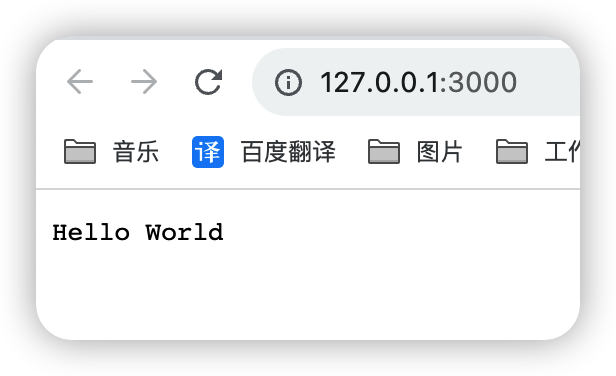
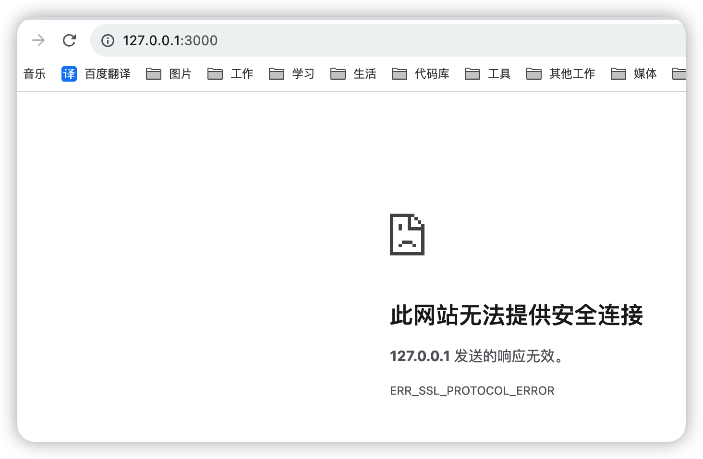
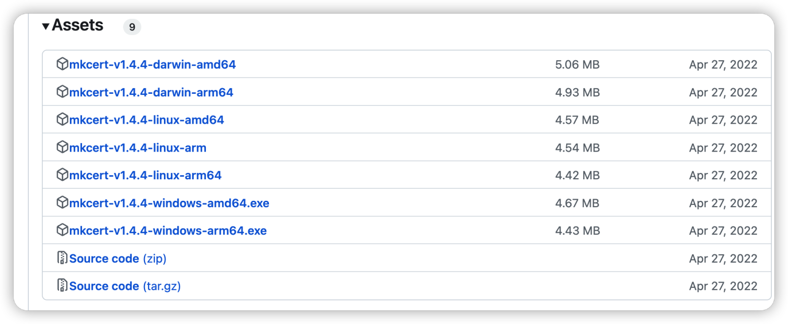
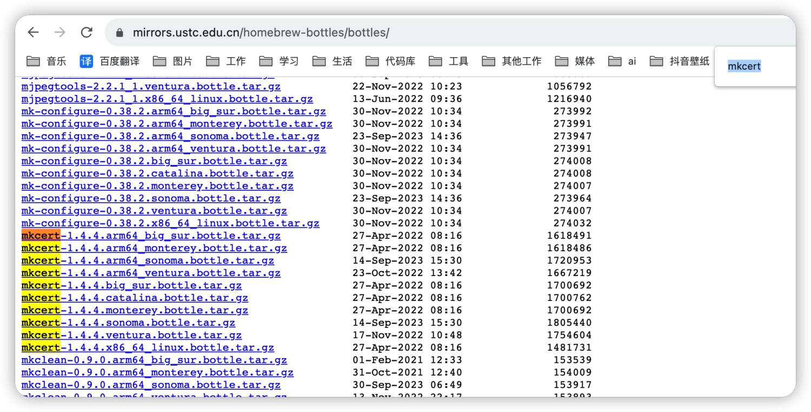
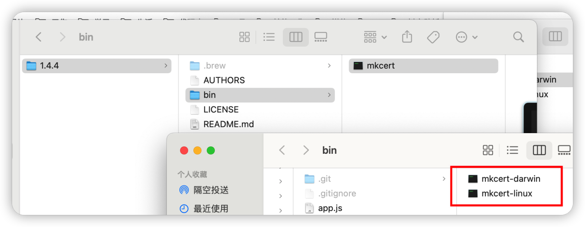
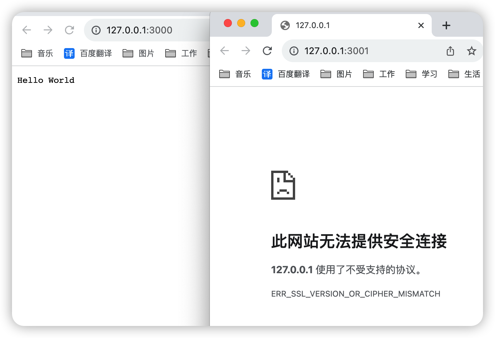
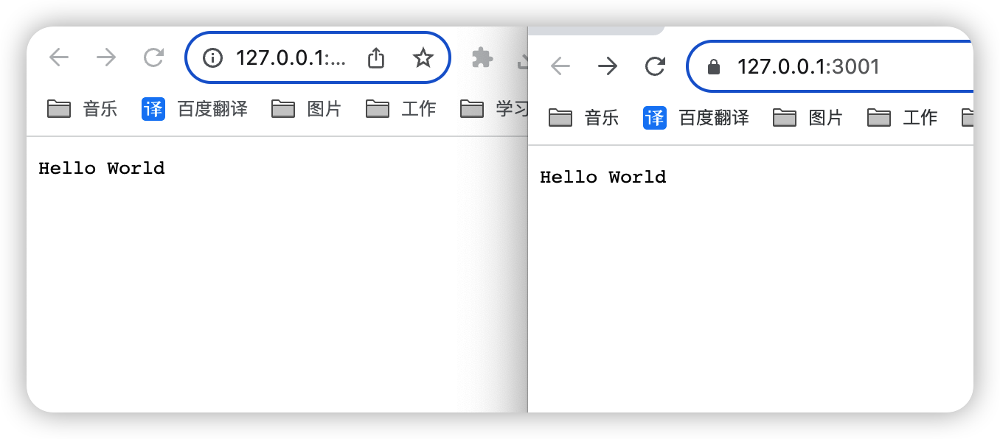

# node + koa + mkcert实现本地开发https

## 一、基于koa创建一个简单的可访问的项目

> 参考koa官网简单实现

#### （1）代码如下

```jsx | pure
const Koa = require('koa');
const app = new Koa();

app.use(async ctx => {
  ctx.body = 'Hello World';
});

app.listen(3000,()=>{
    console.log(`
    http://127.0.0.1:3000
    `);
});
```

#### （2）浏览器访问（当前是http）



如果使用https访问则会异常



####（3）下载mkcert

https://github.com/FiloSottile/mkcert/releases

从github上下载所需平台工具(不知道为什么用不了呢)



从brew镜像查找文件

https://mirrors.ustc.edu.cn/homebrew-bottles/bottles/



下载后解压复制改名



mac 我是先按住command打开了一次，然后再用的，不然提示打不开

#### (4) 调整代码支持https
koa官网提供使用https方法如下：

```jsx | pure
const http = require('http');
const https = require('https');
const Koa = require('koa');
const app = new Koa();
http.createServer(app.callback()).listen(3000);
https.createServer(app.callback()).listen(3001);
```
调整代码后为：

```jsx | pure
/**
 * 入口文件
 */
const Koa = require('koa');
const http = require('http');
const https = require('https');
const app = new Koa();

app.use(async ctx => {
    ctx.body = 'Hello World';
});
// 启动http侦听
http.createServer(app.callback()).listen(3000, () => {
    console.log(`
    http://127.0.0.1:3000
    `);
});
https.createServer(app.callback()).listen(3001, () => {
    console.log(`
    https://127.0.0.1:3001
    `);
});
```
此时查看浏览器：

> 此时还没有配置ssl，所以https依然无法访问



## 二、动态生成ssl证书

本地开发时，公司网络局域网IP基本都是动态IP，如果IP改了，之前的ssl证书就有问题，所以采用动态生成ssl证书解决

####（1）要生成ssl证书需要先知道node如何使用cert文件：

> 文档参考：https://www.nodejs.com.cn/api/https.html#httpscreateserveroptions-requestlistener

node中文网文档如下：

``语法：https.createServer([options][, requestListener])``

- options ``<Object>`` 接受来自 tls.createServer()、tls.createSecureContext() 和 http.createServer() 的 options。

- requestListener ``<Function>`` 要添加到 'request' 事件的监听器。

- 返回: ``<https.Server>``

```jsx | pure
// curl -k https://localhost:8000/
const https = require('node:https');
const fs = require('node:fs');

const options = {
  key: fs.readFileSync('test/fixtures/keys/agent2-key.pem'),
  cert: fs.readFileSync('test/fixtures/keys/agent2-cert.pem')
};

https.createServer(options, (req, res) => {
  res.writeHead(200);
  res.end('hello world\n');
}).listen(8000);
```

####（2）生成cert文件流程及命令

- 安装mkcert：
命令：证书名 --install

- 生成ssl证书:
和前面安装mkcert的步骤一样，将 -install 参数更改为你要生成SSL证书的域名或IP

命令：证书名 -cert-file cert.pem存储位置 -key-file key.pem存储位置 example.com 127.0.0.1 localhost

代码如下：

```jsx | pure
/**
 * 动态生成cert文件
 */
const path = require('path');
const { execSync } = require('child_process');
const fs = require('fs');
const os = require('os');

/**
 * 获取当前本地ip地址
 * @returns 
 */
const getLocalIP = () => {
    const interfaces = os.networkInterfaces();
    let ip = '';
    Object.values(interfaces).forEach(list=>{
        list.forEach(ipInfo => {
            if(ipInfo.family === 'IPv4' && ipInfo.address !== '127.0.0.1' && !ipInfo.internal){
                ip = ipInfo.address
            }
        })
    })
   return ip;
};


const mkCmd = () => {
    const localIP = getLocalIP();
    console.log(`localIP: ${localIP}`);
    const option = `-cert-file ${path.resolve(__dirname, 'ssl/cert.pem')} -key-file ${path.resolve(__dirname, 'ssl/key.pem')}`;
    const list = `127.0.0.1 ${localIP} *.example.com`;
    console.log(`
    option:${option}
    list:${list}
    `);
    // 这里可以根据当前环境动态区分控制用哪个脚本
    const bin = path.resolve(__dirname, './bin/mkcert-darwin');

    return {
        get install() {
            return `${bin} -install`;
        },
        get cert() {
            return `${bin} ${option} ${list}`;
        },
    };
};

/**
 * 生成证书文件
 */
const generateFile = () => {
    const mkcertCmd = mkCmd();
    execSync(mkcertCmd.install, { stdio: 'pipe' });
    execSync(mkcertCmd.cert, { stdio: 'pipe' });
};

/**
 * 返回https服务所需的options
 * @returns 
 */
const certOptions = () => {
    // 获取证书前就重新生成一次
    generateFile();

    // 获取文件
    const cert = fs.readFileSync(path.resolve(__dirname, 'ssl/cert.pem'));
    const key = fs.readFileSync(path.resolve(__dirname, 'ssl/key.pem'));

    return {
        cert,
        key,
    };
};

module.exports = {
    certOptions
};
```

## 三、重新启动项目，查看https支持情况



## 项目地址

https://github.com/dai1254473705/nodeSSL

## 参考网站：

- koa: https://koa.bootcss.com/
- node中文网：https://www.nodejs.com.cn/api/
- mkcert: https://github.com/FiloSottile/mkcert
