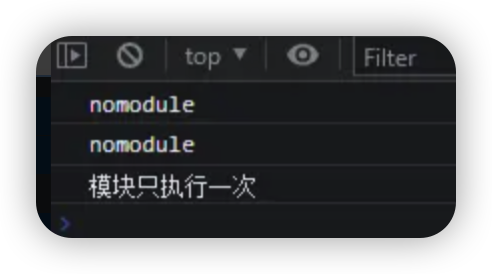
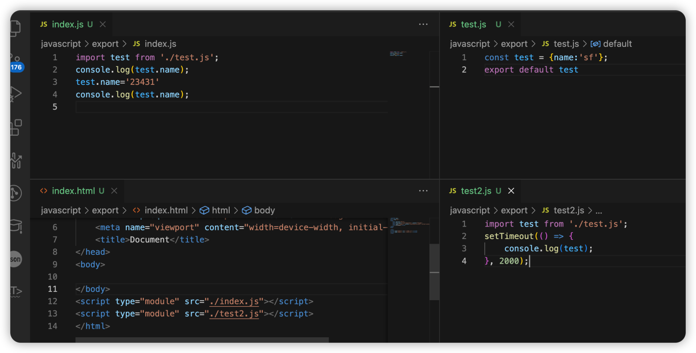

# 前端模块化

## 一、模块化简述

把复杂代码按功能的不同划分成不同的模块单独维护，提高开发效率，降低维护成本 模块化只是思想、理论，不包含具体实现

## 二、模块化的演进

- 第一阶段：仅仅基于文件的划分模块的方式
  具体做法就是将每个功能及其相关状态数据各自单独放到不同的文件中，约定每个文件就是一个独立的模块，使用某个模块就是将这个模块引入到页面中，然后直接调用模块中的成员（变量 / 函数） 缺点：所有模块都直接在全局工作，没有私有空间，所有成员都可以在模块外部被访问或者修改，而且模块一段多了过后，容易产生命名冲突，另外无法管理模块与模块之间的依赖关系
- 第二阶段：每个模块暴露一个全局对象，所有模块成员都挂载到这个对象中
  具体做法就是在第一阶段的基础上，通过将每个模块「包裹」为一个全局对象的形式实现，有点类似于为模块内的成员添加了「命名空间」的感觉。 通过「命名空间」减小了命名冲突的可能，但是同样没有私有空间，所有模块成员也可以在模块外部被访问或者修改，而且也无法管理模块之间的依赖关系。
- 第三阶段：使用立即执行函数表达式（IIFE：Immediately-Invoked Function Expression）为模块提供私有空间
  具体做法就是将每个模块成员都放在一个函数提供的私有作用域中，对于需要暴露给外部的成员，通过挂在到全局对象上的方式实现 有了私有成员的概念，私有成员只能在模块成员内通过闭包的形式访问。
- 第四阶段： 利用 IIFE 参数作为依赖声明使用
  具体做法就是在第三阶段的基础上，利用立即执行函数的参数传递模块依赖项。 这使得每一个模块之间的关系变得更加明显。
- 第五阶段： 模块化规范
  Require.js 提供了 AMD 模块化规范，以及一个自动化模块加载器---模块化规范的出现，再之后便有了其他更多标准紧接而来，CommonJS、CMD。。。

## 三、模块化规范的出现

需：模块化标准+模块加载器

**CommonJS 规范(nodejs 提出的一套标准)**

- 标准： 一个文件就是一个模块 每个模块都有单独的作用域 通过 module.exports 导出成员 通过 require 函数载入模块
- 缺点：CommonJS 是以同步模式加载模块，node 执行机制是启动时加载模块，执行过程中不需要加载只需使用，在 node 中不会有问题；但是在浏览器端页面加载会导致大量同步请求出现，而效率低

**AMD(Asynchronous Module Definition)异步模块定义规范模块通过 define 函数定义**

- 优势：目前绝大多数第三方库都支持 AMD 规范
- 缺点： 使用复杂 模块划分细致，模块 JS 文件会出现请求频繁的情况

**Sea.js(淘宝推出) + CMD(通用模块定义规范)**

- CMD 规范类似 CommonJS 规范 后期也被 Require.js 兼容了

**Require.js**

- 提供了 AMD 模块化规范，以及一个自动化模块加载器 提供 require 函数加载模块

## 四、模块化默认规范

- 浏览器环境使用 ES Modules
- nodejs 使用 CommonJS

## 五、关于 ES Modules

通过给 script 添加 type = module 的属性，在浏览器中使用 ES Modules

```bash
<script type="module" src="./main.mjs"></script>
<script type="module"></script>
```

1. ESM 自动采用严格模式，忽略 'use strict'
2. 每个 ES Module 都是运行在单独的私有作用域中
3. ESM 是通过 CORS 的方式请求外部 JS 模块的
4. ESM 的 script 标签会延迟执行脚本
   对于我们前端平时开发，其实用得最多的是 es modules，这里也简单介绍一下这种规范的一些常用写法

> 模块默认情况下是延迟的,因此你还可以使用 `defer` 的方式延迟你的 `nomodule` 脚本:

```bash
<script type="module">
    console.log("模块情况下的");
</script>
<script src="./index.js"></script>
<script>
    console.log("正常 script标签");
</script>
```


```bash
<script type="module">
    console.log("模块情况下的");
</script>
<script src="./index.js" defer></script>
<script>
    console.log("正常 script标签");
</script>
```


> 在浏览器中,引入相同的`nomodule` 脚本会被执行多次,而模块只会被执行一次:

```bash
<script src="./foo.js"></script>
<script src="./foo.js"></script>

<script type="module" src="./main.js"></script>
<script type="module" src="./main.js"></script>
<script type="module" src="./main.js"></script>
```



## 六、 模块的默认延迟

> 默认情况下,nomodule 脚本会阻塞 HTML 解析。你可以通过添加 defer 属性来解决此问题,该属性是等到 HTML 解析完成之后才执行。


- defer 和 async 是一个可选属性,他们只可以选择其中一个,在 nomodule 脚本下,defer 等到 HTML 解析完才会解析当前脚本,而 async 会和 HTML 并行解析,不会阻塞 HTML 的解析,模块脚本可以指定 async 属性,但对于 defer 无效,因为模块默认就是延迟的。

- 对于模块脚本,如果存在 async 属性,模块脚本及其所有依赖项将于解析并行获取,并且模块脚本将在它可用时进行立即执行。

## 七、ES Modules 导出

> 单个导出

```bash
export const name = 'foo module'
export function hello () {
    console.log('hello')
}
```

> 合并导出

```bash
const name = 'foo module'
function hello () {
    console.log('hello')
}
class Person {}
export { name, hello, Person }
```

> 合并导出，且重命名

```bash
const name = 'foo module'
function hello () {
    console.log('hello')
}
class Person {}
export {
    name1: name,
    hello2: hello,
    Person3: Person
}
```

> 默认导出

```bash
const name = 'foo module'
function hello () {
    console.log('hello')
}
class Person {}

export default name;
```

> 导出语句必须在模块顶级,不能嵌套在某个块中（报错）:

```bash
if(true){
export {...};
}
```

- !!!ES Modules 导入导出的注意事项 导出字面量和导出模块的区别

```bash
导出字面量(如:对象):export default { name, age }
注意: import {name, age} from 'modulename'导入模块无法使用到name和age的值
导出模块:
export { name, age }
import {name, age} from 'modulename' 导入模块可以使用到name和age的值
原因：import导入的是对模块内部的使用
```

> 导出模块的引用
> 注意：export 暴露的是模块的引用关系(地址)，并且只读不可修改(尝试修改会报错误---Uncaught TypeError:Assignment to constant variable)

#### 注意点

1. CommonJS 中是先将模块整体导入为一个对象，然后从对象中结构出需要的成员 const { name, age } = require('./module.js')
2. ES Module 中 { } 是固定语法，就是直接提取模块导出成员 import { name, age } from './module.js'
3. 导入成员并不是复制一个副本，而是直接导入模块成员的引用地址，也就是说 import 得到的变量与 export 导入的变量在内存中是同一块空间。一旦模块中成员修改了，这里也会同时修改
4. 导入模块成员变量是只读的 name = 'tom' // 报错
5. 导入的是一个对象，对象的属性读写不受影响 name.xxx = 'xxx' // 正常
   如：




## 八、ES Modules 导入

#### 导入文件路径

1. 需要引用的名称
2. 相对路径上的./不能省略
3. 可以使用绝对路径和完整的 url

#### 导入模块时是否提取模块成员

1. 导入模块并提取模块成员 import {} from './module.js'
2. 导入模块暂不提取模块成员 import './module.js' (导入不需要外界控制的子功能模块时很有用)

#### 同时导入模块多个成员或所有成员

`import * as mod from './module.js'`需要把所有提取成员放到一个对象当中，通过 as,导入的成员都会作为对象属性出现

#### 动态导入模块(在需要满足某些条件才能导入时可用)

- 标准用法的 import 导入的模块是静态的，会使所有被导入的模块，在加载时就被编译（无法做到按需编译，降低首页加载速度）。有些场景中，你可能希望根据条件导入模块或者按需导入模块，这时你可以使用动态导入代替静态导入。
- 关键字 import 可以像调用函数一样来动态的导入模块。以这种方式调用，将返回一个 promise。

> import ('./module.js') 返回的是 promise 取模块成员的方式:

```bash
import('./module.js').then(function (module) {
    //所有模块成员都在module参数里
})
```

同时导入命名成员和默认成员

```bash
import { name, age, default as other} from './module.js'
```

或者

```bash
import other,{ name, age} from './module.js';
```

other 代表 module 模块所有默认导出的成员

> 由于 import 是静态执行，所以不能使用表达式和变量，这些只有在运行时才能得到结果的语法结构。

```bash
// 错误
import { 'b' + 'ar' } from './foo.js';

// 错误
let module = './foo.js';
import { bar } from module;

// 错误
if (x === 1) {
  import { bar } from './foo.js';
} else {
  import { foo } from './foo.js';
}
```

#### ES Modules in Node.js

ES Modules in Node.js - 与 CommonJS 交互
ES Module 中可以导入 CommonJS 模块

#### CommonJS 模块始终只会导出一个默认成员

commonjs.js

```bash
module.exports = {
    foo: 'commonjs exports value'
}
exports.foo = 'commonjs exports value'
```

不能在 CommonJS 模块中通过 require 载入 ES Module

```bash
const mod = require('./es-module.mjs')
console.log(mod)
```

#### ES Modules in Node.js - 与 CommonJS 的差异

示例:

```bash
// 加载模块函数
console.log(require)

// 模块对象
console.log(module)

// 导出对象别名
console.log(exports)

// 当前文件的绝对路径
console.log(__filename)

// 当前文件所在目录
console.log(__dirname)

```

1、ESM 中无法引用 CommonJS 中的那些模块全局成员

2、require, module, exports 可通过 import 和 export 代替

3、**filename** 和 **dirname** 通过 **import** 对象的 **meta** 属性获取

```bash
const currentUrl = import.meta.url
console.log(currentUrl)
// 通过 url 模块的 fileURLToPath 方法转换为路径
import { fileURLToPath } from 'url'
import { dirname } from 'path'
const __filename = fileURLToPath(import.meta.url)
const __dirname = dirname(__filename)
console.log(__filename)
console.log(__dirname)
```

#### ES Modules in Node.js - 新版本进一步支持

1. Node v12 之后的版本，可以通过 package.json 中添加 type 字段为 module， 将默认模块系统修改为 ES Module 此时就不需要修改文件扩展名为 .mjs 了

2. 如果需要在 type=module 的情况下继续使用 CommonJS， 需要将文件扩展名修改为 .cjs

package.json:

```bash
{ "type": "module" }
```

#### ES Modules in Node.js - Babel 兼容方案

1. 安装 babel:yarn add @babel/node @babel/core @babel/preset-env --dev
2. 运行 babel-node 测试:yarn babel-node index.js --presets=@babel/preset-env
   **.babelrc 配置 **

```bash
{ "plugins": [ "@babel/plugin-transform-modules-commonjs" ] }
```

## 九. 总结

#### 什么是前端模块化吧?

模块化的开发方式可以提高代码复用率，方便进行代码的管理。通常一个文件就是一个模块，有自己的作用域，只向外暴露特定的变量和函数。

#### 模块化有哪几种标准？

目前流行的 js 模块化规范有 CommonJS、AMD、CMD 以及 ES6 的模块系统

#### ES Modules 和 CommonJS 的一些区别

1. CommonJs 导出的是一个值拷贝，会对加载结果进行缓存，一旦内部再修改这个值，则不会同步到外部;ESModule 是导出的一个引用，内部修改可以同步到外部;
2. CommonJs 是运行时加载模块，ESModule 是在静态编译期间就确定模块的依赖;
3. CommonJS 模块的 require() 是同步加载模块，ES6 模块的 import 命令是异步加载，有一个独立的模块依赖的解析阶段。
4. 使用语法层面，CommonJs 是通过 module.exports，exports 导出，require 导入；ESModule 则是 export 导出，import 导入;
5. ESModule 在编译期间会将所有 import 提升到顶部，CommonJs 不会提升 require;
6. CommonJs 中顶层的 this 指向这个模块本身，而 ESModule 中顶层 this 指向 undefined;
7. CommonJS 加载的是整个模块，将所有的接口全部加载进来，ESModule 可以单独加载其中的某个接口;

#### Es module 是如何解决循环引用的

在 Es Module 中有 5 种状态，分别为 unlinked、linking、linked、evaluating 和 evaluated，用循环模块记录(Cyclic Module Records)的 Status 字段来表示,正是通过这个字段来判断模块是否被执行过,每个模块只执行一次。这也是为什么会使用 Module Map 来进行全局缓存 Module Record 的原因了,如果一个模块的状态为 evaluated,那么下次执行则会自动跳过,从而包装一个模块只会执行一次。 Es Module 采用 **深度优先** 的方法对模块图进行遍历,每个模块只执行一次,这也就避免了死循环的情况了。

> **深度优先搜索算法**（英语：Depth-First-Search，DFS）是一种用于遍历或搜索树或图的算法。这个算法会尽可能深地搜索树的分支。当节点 v 的所在边都己被探寻过，搜索将回溯到发现节点 v 的那条边的起始节点。这一过程一直进行到已发现从源节点可达的所有节点为止。如果还存在未被发现的节点，则选择其中一个作为源节点并重复以上过程，整个进程反复进行直到所有节点都被访问为止。


循环引用：initialization 错误,防止死循环


#### CommonJs 特性

1. 模块代码只在加载后运行;
2. 模块只能加载一次;
3. 模块可以请求加载其他模块;
4. 支持循环依赖;
5. 模块可以定义公共接口,其他模块可以基于这个公共接口观察和交互;

#### es module 特性

- Es Module 的独特之处在于,既可以通过浏览器原生加载,也可以与第三方加载器和构建工具一起加载。
- 支持 Es module 模块的浏览器可以从顶级模块加载整个依赖图,且是异步完成。浏览器会解析入口模块,确定依赖,并发送对依赖模块的请求。这些文件通过网络返回后,浏览器就会解析它们的依赖,如果这些二级依赖还没有加载,则会发送更多请求。
- 这个异步递归加载过程会持续到整个应用程序的依赖图都解析完成。解析完成依赖图,引用程序就可以正式加载模块了。
- Es Module 不仅借用了 CommonJs 和 AMD 的很多优秀特性,还增加了一些新行为:

1. Es Module 默认在严格模式下执行;
2. Es Module 不共享全局命名空;
3. Es Module 顶级的 this 的值是 undefined(常规脚本是 window);
4. 模块中的 var 声明不会添加到 window 对象;
5. Es Module 是异步加载和执行的;
