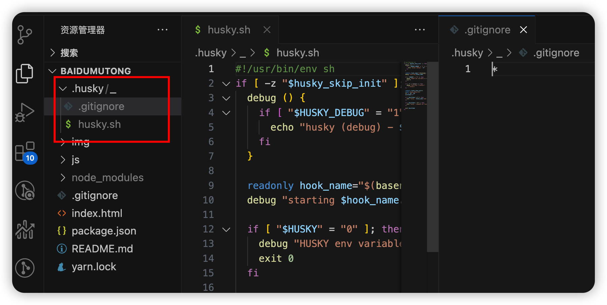
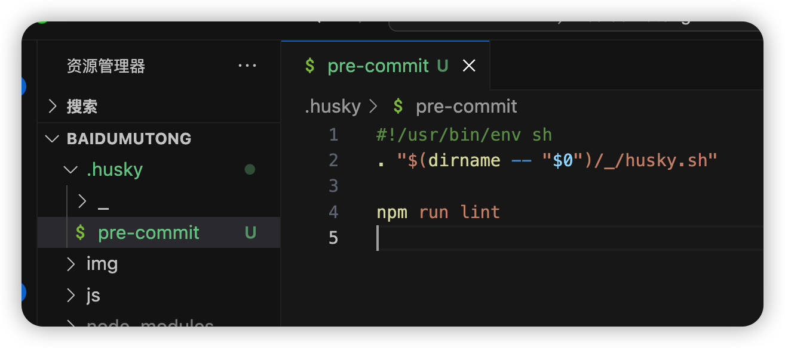
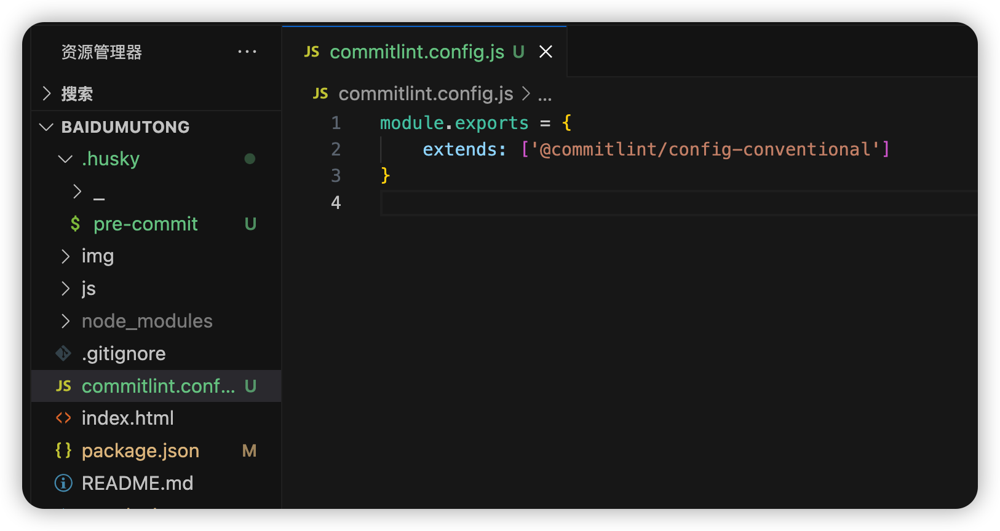
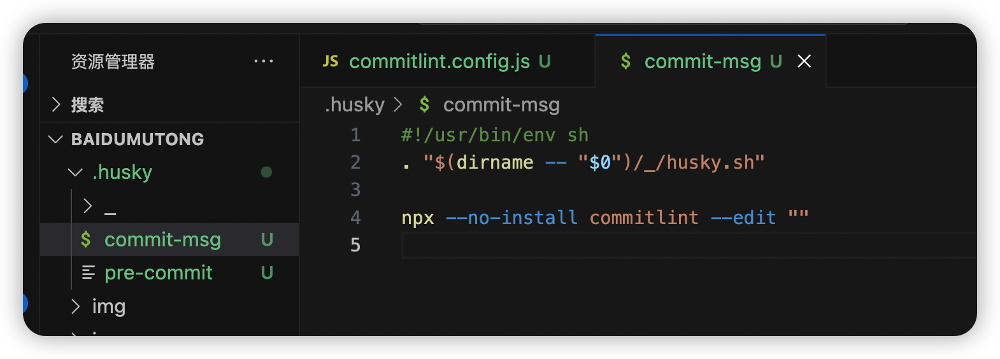

# 1. 基于husky实现git提交代码前校验

## 1. 手动安装

使用脚本安装下面的依赖包

```bash
yarn add --dev husky
```

我们在终端通过 `npx husky install` 来初始化 husky,执行命令后项目中会多出一个`.husky`文件夹：



我们还需要生成 pre-commit 钩子的时候来执行 npm run lint

```bash
// 这句话的意思是说，在commit之前先执行 npm run lint脚本
npx husky add .husky/pre-commit "npm run lint"
```

安装完成后，会在 .husky 目录中新增一个文件 pre-commit

```bash
daiyunzhou@daiyunzhoudeMacBook-Pro-2 baidumutong % npx husky add .husky/pre-commit "npm run lint"
husky - created .husky/pre-commit
```




> npm run lint 前提是 package.json 中配好 lint 格式化命令(eslint,prettier)

## 2. 设置自动安装 husky

> 上面是手动 `npx husky install`的，我们需要让后面使用咱们配置的人自动来初始化 husky

自动初始化：
在 `package.json` 注册 `prepare` 命令，在项目进行依赖安装之后就先 Huksy 的安装，命令如下:

```bash
"prepare": "husky install"
```

> 不知道为什么`prepare`会自动执行？看这里：https://docs.npmjs.com/cli/v10/using-npm/scripts#prepare-and-prepublish

## 3. 规范 commit 的 message

> 文档：https://commitlint.js.org/#/reference-configuration

### 1）安装依赖

```bash
yarn add -D commitlint @commitlint/cli @commitlint/config-conventional

// 安装完后：
"devDependencies": {
    "@commitlint/cli": "^17.7.1", // 规范提交信息
    "@commitlint/config-conventional": "^17.7.0", // commitlint 常用的msg配置
    "commitlint": "^17.4.2",// commitlint 主包
}
```
### 2）添加配置文件commitlint.config.js

```bash
echo "module.exports = {extends: ['@commitlint/config-conventional']}" > commitlint.config.js

```



### 3) 添加commit-msg文件

```bash
npx husky add .husky/commit-msg 'npx --no-install commitlint --edit "$1"'
```

    

### 4) 测试下是否可以提交

因为没有配置eslint等格式化，所以先把``pre-commit``文件中的```# npm run lint```注释掉

下面是随便乱写commit message“asdf”被拦截的提示：

```bash
> git -c user.useConfigOnly=true commit --quiet --allow-empty-message --file -
⧗   input: asdf
✖   subject may not be empty [subject-empty]
✖   type may not be empty [type-empty]

✖   found 2 problems, 0 warnings
ⓘ   Get help: https://github.com/conventional-changelog/commitlint/#what-is-commitlint

husky - commit-msg hook exited with code 1 (error)
```
打开链接：https://github.com/conventional-changelog/commitlint/#what-is-commitlint
可以看到提交message的规范：

```bash
type(scope?): subject  #scope is optional; multiple scopes are supported (current delimiter options: "/", "\" and ",")
```
#### type类型如下：

- build
- chore
- ci
- docs
- feat
- fix
- perf
- refactor
- revert
- style
- test


## 4.参考文档
- https://juejin.cn/post/7197986292713652261?searchId=202310181059150864243E2B94897B9B20#heading-5
