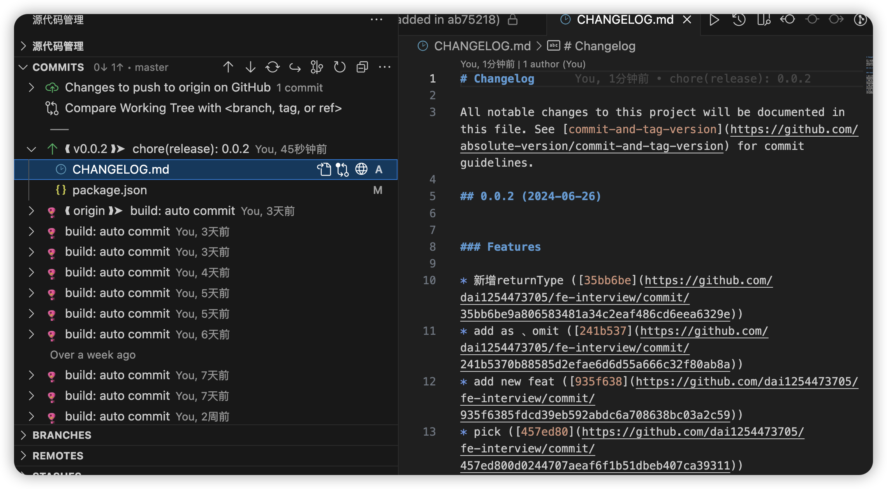

# 3. Changelog 编写规范

## 前言

https://www.conventionalcommits.org/zh-hans/v1.0.0/#%e7%ba%a6%e5%ae%9a%e5%bc%8f%e6%8f%90%e4%ba%a4%e8%a7%84%e8%8c%83

> 作为一个普通的开发者，我必须为我的项目维护一个更新日志（以下简称 changelog）吗？

1. 如果你在维护一个开源项目，或者公司内部的底层技术产品，那么提供一个 changelog 是必需的。开发者用户很可能需要从一个低版本升级到最新版，changelog 可以帮助他们了解新版本有哪些变化。
2. 如果你在开发一个业务应用，那么 changelog 不是必需的。然而提供一个 changelog 会更好，因为其他协作者或是交接方能更直观地看到业务逻辑的演变。

我记得你还约束了 Git log 的规范，那为何还要再规范 changelog 的格式呢？两者不是差不多？

1. 即便是约束了 Git log 的规范，也无法直接将 Git log 导出一个良好的 changelog。因为 changelog 中描述的内容需要更加精炼和归纳，对信息降噪处理等等，因此手写 changelog 仍然是更好的选择；当然，不排除以后自动转换的可能。
2. 不管是手写还是自动转换，changelog 的格式都不能直接照搬 Git log 的格式。这两者的区别与联系同在。

## changelog 文件
组件下的 changelog 文件必须取名为 HISTORY.md，存放在项目的根目录下，和 README.md、CONTRIBUTING.md 等并列，同时保持风格一致。

## 基本的 changelog 格式

```
# {Group} - {ComponentName}
## [<version>]
* <desc>
* <desc>
```

其中，按照最新的版本号在前的顺序排列。

## 词汇表


### 标题

标题部分使用固定的文案：「更新日志」。

如果是面向国际的项目，需要使用英文，则文案为「Change Log」。

### version

版本号 version 即项目的每一个发布版所使用的版本号。版本号需遵循 SemVer 版本号命名规范。

注意：版本号前不要加 v。

另外，版本号建议增加一个链接，指向当前版本和上一个版本之间的 diff。详情可参考后文的样本示例。

```
### type
更新类型 type 用以说明更新的方面。这里的 type 和 Git 提交日志中的 type 有所联系，然而并不一一对应。
同前面提到的「标题」部分，默认使用中文版本的词汇，如果是面向国际的项目，则使用括号中的英文版本。
type 的可选值如下：
* 新增（Features）：新增功能。
* 修复（Fixed）：修复 bug。
* 变更（Changed）：对于某些已存在功能所发生的逻辑变化。
* 优化（Refactored）：性能或结构上的优化，并未带来功能的逻辑变化。
* 即将删除（Deprecated）：不建议使用 / 在以后的版本中即将删除的功能。
* 删除（Removed）：已删除的功能。
### desc
描述内容 desc 需要注意：
1. 使用完整的句子。即在标点方面遵循一般的文档格式规范；如果使用英语，则句首大写。
2. 时态方面使用一般现在时，不要用过去时态。虽然查看 changelog 时，changelog 内容本身都发生在过去，然而使用现在时的时态更简洁明确，并且更易达成一致性。
3. 句式使用祈使句式。即一般情况不要增加主语。因为在绝大情况下，主语都是作者「我」。
4. 注明修复的问题。如有提过 issue，则在句尾增加 issue 的 ID 和链接。
## 样本示例

# Next - Search
---
## 0.2.5
`tag:z` 不再控制p元素，增加class `next-form-text-align` 来控制对齐
## 0.2.4
`tag:z` label展现优化
## 0.2.3
`tag:z` 增加内嵌模式
## 0.2.2
`tag:z` Form.Item增加size属性
```

参考资料

1. Keep a CHANGELOG
http://keepachangelog.com/

2. The Discussion about Change Log
https://news.ycombinator.com/item?id=9054627

### 自动生成CHANGELOG.md

```
const execa = require('execa');
const groupBy = require('lodash/groupBy');
const sortBy = require('lodash/sortBy');
const uniq = require('lodash/uniq');
const {writeFile, readFileSync} = require('fs-extra');
const args = require('minimist')(process.argv.slice(2));

const types = {
  fix: {title: '🐛 Bug Fixes'},
  feat: {title: '🚀 Features'},
  refactor: {title: '💅 Refactors'},
  refact: {title: '💅 Refactors'},
  perf: {title: '🔥 Performance'},
  examples: {title: '📝 Examples'},
  chore: {title: '🏡 Chore'},
  test: {title: '👓 Tests'},
};

const knownAuthors = [];
const ignoreScopes = ['deps'];

const isKnownAuthor = name =>{
  console.log('name:=>',name);
  return Boolean(knownAuthors.find(n => name.toLowerCase().includes(n)))
};

const allowedTypes = Object.keys(types);

async function main() {
  // Get last git tag
  const lastGitTag = await getLastGitTag();

  // Get current branch
  const currentGitBranch = await getCurrentGitBranch();

  // Get all commits from last release to current branch
  console.log(`${currentGitBranch}...${lastGitTag}`);
  let commits = await getGitDiff(currentGitBranch, lastGitTag);

  // Parse commits as conventional commits
  commits = parseCommits(commits);

  // Filter commits
  commits = commits.filter(c => allowedTypes.includes(c.type));

  // Generate markdown
  const markdown = generateMarkDown(commits);

  // Show in console
  process.stdout.write('\n\n' + markdown + '\n\n');

  // Write to CHANGELOG.md
  const targetVersion = args._[0];

  if (targetVersion) {
    const title = `v${targetVersion} / ${getDate()}` + '\n===================';
    let oldMarkdown = readFileSync('CHANGELOG.md', {encoding: 'utf8'});
    await writeFile('CHANGELOG.md', title + '\n\n' + markdown + '\n\n' + oldMarkdown, 'utf-8');
  }
}

function getDate(split = '-') {
  const t = new Date();
  const twoDig = num => ('0' + num).slice(-2);
  const r = [t.getFullYear(), twoDig(t.getMonth() + 1), twoDig(t.getDate())];
  return r.join(split);
}

function execCommand(cmd, args) {
  return execa(cmd, args).then(r => r.stdout);
}

async function getLastGitTag() {
  const r = await execCommand('git', ['--no-pager', 'tag', '--sort=v:refname', '-l']).then(r => r.split('\n'));
  return r[r.length - 1];
}

async function getCurrentGitBranch() {
  const r = await execCommand('git', ['rev-parse', '--abbrev-ref', 'HEAD']);
  return r;
}

async function getGitDiff(from, to) {
  // # https://git-scm.com/docs/pretty-formats
  const r = await execCommand('git', ['--no-pager', 'log', `${from}...${to}`, '--pretty=%s|%h|%an|%ae']);
  return r.split('\n').map(line => {
    const [message, commit, authorName, authorEmail] = line.split('|');

    return {message, commit, authorName, authorEmail};
  });
}

function parseCommits(commits) {
  return commits
    .filter(c => c.message.includes(':'))
    .map(commit => {
      let [type, ...message] = commit.message.split(':');
      message = message.join(':');

      // Extract references from message
      message = message.replace(/\((fixes) #\d+\)/g, '');
      const references = [];
      const referencesRegex = /#[0-9]+/g;
      let m;
      while ((m = referencesRegex.exec(message))) {
        // eslint-disable-line no-cond-assign
        references.push(m[0]);
      }

      // Remove references and normalize
      message = message.replace(referencesRegex, '').replace(/\(\)/g, '').trim();

      // Extract scope from type
      let scope = type.match(/\((.*)\)/);
      scope = !scope ? 'general' : scope[1];
      type = type.split('(')[0];

      return {
        ...commit,
        message,
        type,
        scope,
        references,
      };
    });
}

function generateMarkDown(commits) {
  console.log(commits,'authorsauthorsauthors');
  const typeGroups = groupBy(commits, 'type');

  let markdown = '';

  for (const type of allowedTypes) {
    const group = typeGroups[type];
    if (!group || !group.length) {
      continue;
    }

    const {title} = types[type];
    markdown += '\n\n' + '### ' + title + '\n\n';

    const scopeGroups = groupBy(group, 'scope');
    for (const scopeName in scopeGroups) {
      markdown += '- `' + scopeName + '`' + '\n';
      for (const commit of scopeGroups[scopeName]) {
        markdown +=
          '  - ' +
          commit.references.join(', ') +
          (commit.references.length ? ' ' : '') +
          commit.message.replace(/^(.)/, v => v.toUpperCase()) +
          '\n';
      }
    }
  }
  const authors = sortBy(uniq(commits.map(commit => commit.authorName).filter(an => !isKnownAuthor(an))));
  if (authors.length) {
    markdown += '\n\n' + '### ' + '💖 Thanks to' + '\n\n';
    markdown += authors.map(name => '- ' + name).join('\n');
  }

  return markdown.trim();
}

main().catch(console.error);
```

输出如下：
```md
v1 / 2023-xx-xx
===================

### 🐛 Bug Fixes

- `id`
  - 【commit message 1】
- `id2`
  - 【commit message 1】
  - 【commit message 2】
  - 【commit message 3】

### 💅 Refactors

- `id3`
  - commit message 4
  - commit message 5
- `id6`
  - commit message 6


### 🏡 Chore

- `id7`
  - commit message 7

### 👓 Tests

- `id8`
  - commit message 8


### 💖 Thanks to

- author1
- author2


```

## 使用开源工具生成CHANGELOG.md
> https://github.com/absolute-version/commit-and-tag-version

### 在项目中安装

```sh
yarn add commit-and-tag-version
```

### 修改package.json

```json
{
  "scripts": {
    "release": "commit-and-tag-version"
  }
}
```

### 生成CHANGELOG.md

```sh
yarn run release
```
输出如下：

```sh
daiyunzhou@daiyunzhoudeMacBook-Pro-2 fe-interview % yarn run release
yarn run v1.22.10
warning ../../../package.json: No license field
$ commit-and-tag-version
✔ bumping version in package.json from 0.0.1 to 0.0.2
✔ created CHANGELOG.md
✔ outputting changes to CHANGELOG.md
✔ committing package.json and CHANGELOG.md
✔ tagging release v0.0.2
ℹ Run `git push --follow-tags origin master && yarn publish` to publish
✨  Done in 2.52s.
```

查看项目如下：



