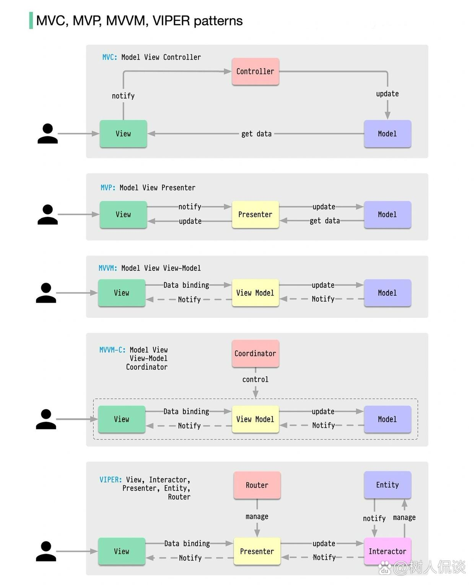
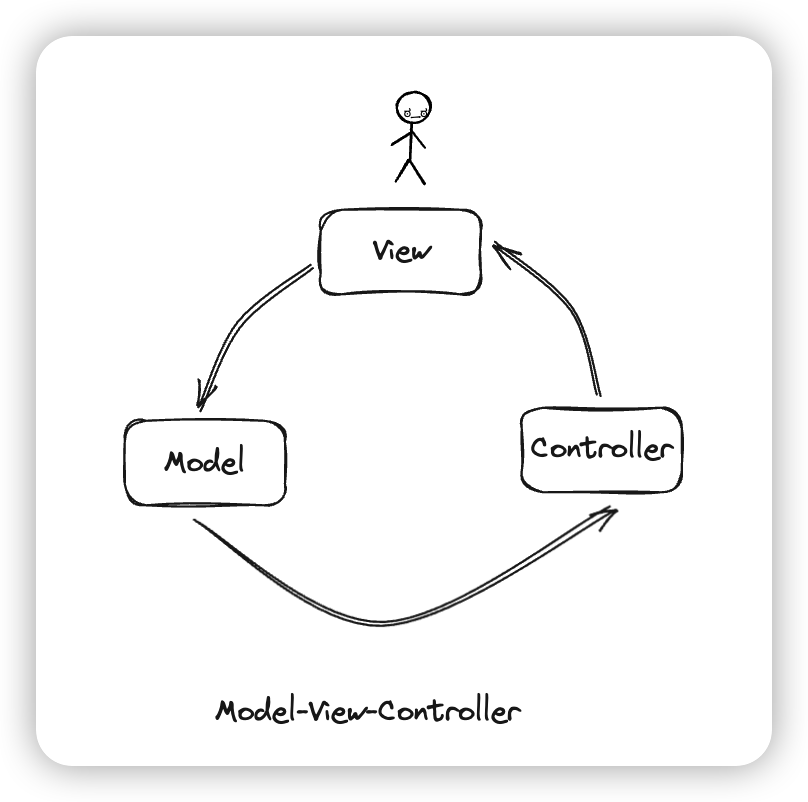
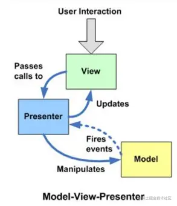
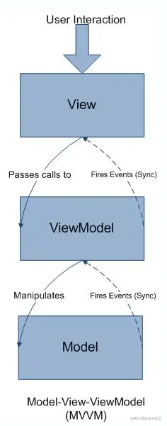

# 1. 前端软件架构模式MVC_MVP_MVVM

https://juejin.cn/post/6844903782015303687

- [GUI 应用程序架构的十年变迁：MVC、MVP、MVVM、Unidirectional、Clean](https://link.juejin.cn/?target=https%3A%2F%2Fzhuanlan.zhihu.com%2Fp%2F26799645)
- [MVC，MVP 和 MVVM的图示](https://link.juejin.im/?target=http%3A%2F%2Fwww.ruanyifeng.com%2Fblog%2F2015%2F02%2Fmvcmvp_mvvm.html)
- [浅析前端开发中的 MVC/MVP/MVVM 模式](https://juejin.im/post/6844903480126078989)

MVC，MVP和MVVM都是常见的软件架构设计模式（Architectural Pattern），它通过分离关注点来改进代码的组织方式。不同于设计模式（Design Pattern），只是为了解决一类问题而总结出的抽象方法，一种架构模式往往使用了多种设计模式。
要了解MVC、MVP和MVVM，就要知道它们的相同点和不同点。不同部分是C(Controller)、P(Presenter)、VM(View-Model)，而相同的部分则是MV(Model-View)。
## MVC模式
**MVC模式（Model–view–controller）:**
是软件工程中的一种软件架构模式，把软件系统分为三个基本部分：模型（Model）、视图（View）和控制器（Controller）。

- 模型（Model） - Model层用于封装和应用程序的业务逻辑相关的数据以及对数据的处理方法。一旦数据发生变化，模型将通知有关的视图。
- 视图（View） - View作为视图层，主要负责数据的展示,并且响应用户操作.
- 控制器（Controller）- 控制器是模型和视图之间的纽带，接收View传来的用户事件并且传递给Model，同时利用从Model传来的最新模型控制更新View.

### **数据关系:**

- View 接受用户交互请求
- View 将请求转交给Controller
- Controller 操作Model进行数据更新
- 数据更新之后，Model通知View更新数据变化.**PS:** 还有一种是View作为Observer监听Model中的任意更新，一旦有更新事件发出，View会自动触发更新以展示最新的Model状态.这种方式提升了整体效率，简化了Controller的功能，不过也导致了View与Model之间的紧耦合。
- View 更新变化数据

**方式:**
所有方式都是单向通信
### **结构实现:**

- View ：使用 组合(Composite)模式
- View和Controller：使用 策略(Strategy)模式
- Model和 View：使用 观察者(Observer)模式同步信息

### **缺点:**

- **View层过重:** View强依赖于Model的,并且可以直接访问Model.所以不可避免的View还要包括一些业务逻辑.导致view过重,后期修改比较困难,且复用程度低.
- **View层与Controller层也是耦合紧密:** View与Controller虽然看似是相互分离，但却是联系紧密.经常View和Controller一一对应的，捆绑起来作为一个组件使用.解耦程度不足.

## MVP模式
MVP（Model-View-Presenter）是MVC模式的改良.MVP与MVC有着一个重大的区别：在MVP中View并不直接使用Model，它们之间的通信是通过Presenter (MVC中的Controller)来进行的，所有的交互都发生在Presenter内部，而在MVC中View会直接从Model中读取数据而不是通过 Controller。

- Model - Model层依然是主要与业务相关的数据和对应处理数据的方法。
- View - View依然负责显示,但MVP中的**View并不能直接使用Model**
- Presenter - Presenter作为View和Model之间的“中间人”，且MVP中的View并不能直接使用Model，而是通过为Presenter提供接口，让Presenter去更新Model，再通过观察者模式更新View。

### **数据关系:**

- View 接收用户交互请求
- View 将请求转交给 Presenter
- Presenter 操作Model进行数据更新
- Model 通知Presenter数据发生变化
- Presenter 更新View数据

**方式:**
各部分之间都是双向通信

### **结构实现:**

- View ：使用 组合(Composite)模式
- View和Presenter：使用 中介者(Mediator)模式
- Model和Presenter：使用 命令(Command)模式同步信息
### **MVC和MVP关系**

- MVP：是MVC模式的变种。
- 项目开发中，UI是容易变化的，且是多样的，一样的数据会有N种显示方式；业务逻辑也是比较容易变化的。为了使得应用具有较大的弹性，我们期望将UI、逻辑（UI的逻辑和业务逻辑）和数据隔离开来，而MVP是一个很好的选择。
- Presenter代替了Controller，它比Controller担当更多的任务，也更加复杂。Presenter处理事件，执行相应的逻辑，这些逻辑映射到Model操作Model。那些处理UI如何工作的代码基本上都位于Presenter。
- MVC中的Model和View使用Observer模式进行沟通；MPV中的Presenter和View则使用Mediator模式进行通信；Presenter操作Model则使用Command模式来进行。基本设计和MVC相同：Model存储数据，View对Model的表现，Presenter协调两者之间的通信。在MVP 中 View 接收到事件，然后会将它们传递到 Presenter, 如何具体处理这些事件，将由Presenter来完成。

### **MVP的优点:**

- Model与View完全分离，修改互不影响
- 更高效地使用，因为所有的逻辑交互都发生在一个地方—Presenter内部
- 一个Preseter可用于多个View，而不需要改变Presenter的逻辑（因为View的变化总是比Model的变化频繁）。
- 更便于测试。把逻辑放在Presenter中，就可以脱离用户接口来测试逻辑（单元测试）
### **MVP的缺点:**

- Presenter中除了业务逻辑以外，还有大量的View->Model，Model->View的手动同步逻辑，造成Presenter比较笨重，一旦视图需要变更，那么Presenter也需要变更,维护起来比较困难。

## MVVM模式
MVVM是Model-View-ViewModel的简写。由Microsoft提出，并经由Martin Fowler布道传播。在 MVVM 中，不需要Presenter手动地同步View和Model.View 是通过数据驱动的，Model一旦改变就会相应的刷新对应的 View，View 如果改变，也会改变对应的Model。这种方式就可以在业务处理中只关心数据的流转，而无需直接和页面打交道。ViewModel 只关心数据和业务的处理，不关心 View 如何处理数据，在这种情况下，View 和 Model 都可以独立出来，任何一方改变了也不一定需要改变另一方，并且可以将一些可复用的逻辑放在一个 ViewModel 中，让多个 View 复用这个 ViewModel。

- Model - Model层仅仅关注数据本身，不关心任何行为（格式化数据由View负责），这里可以把它理解为一个类似json的数据对象。
- View - MVVM中的View通过使用模板语法来声明式的将数据渲染进DOM，当ViewModel对Model进行更新的时候，会通过数据绑定更新到View。
- ViewModel - 类似与Presenter. ViewModel会对View 层的声明进行处理.当 ViewModel 中数据变化，View 层会进行更新;如果是双向绑定,一旦View对绑定的数据进行操作，则ViewModel 中的数据也会进行自动更新.

### **数据关系:**

- View 接收用户交互请求
- View 将请求转交给ViewModel
- ViewModel 操作Model数据更新
- Model 更新完数据，通知ViewModel数据发生变化
- ViewModel 更新View数据

**方式:**
双向绑定。View/Model的变动，自动反映在 ViewModel，反之亦然。
### **实现数据绑定的方式：**

- 数据劫持 (Vue)
- 发布-订阅模式 (Knockout、Backbone)
- 脏值检查 (旧版Angular)

**使用:**

- 可以兼容你当下使用的 MVC/MVP 框架。
- 增加你的应用的可测试性。
- 配合一个绑定机制效果最好
### **MVVM优点:**
MVVM模式和MVC模式一样，主要目的是分离视图（View）和模型（Model），有几大优点:

- 1,低耦合。View可以独立于Model变化和修改，一个ViewModel可以绑定到不同的”View”上，当View变化的时候Model可以不变，当Model变化的时候View也可以不变。
- 2,可重用性。你可以把一些视图逻辑放在一个ViewModel里面，让很多view重用这段视图逻辑。
- 3, 独立开发。开发人员可以专注于业务逻辑和数据的开发（ViewModel），设计人员可以专注于页面设计，生成xml代码。
- 4, 可测试。界面素来是比较难于测试的，而现在测试可以针对ViewModel来写。
### **MVVM缺点:**

- 类会增多，ViewModel会越加庞大，调用的复杂度增加

