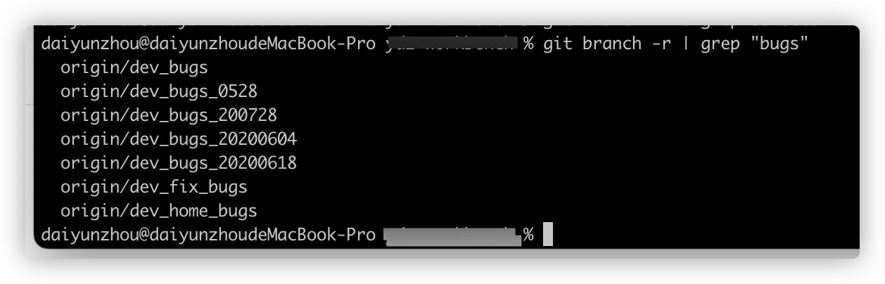

# 1. Git新建、查看、删除、重命名、tag、对比

## git中一些选项解释:
+ -d: --delete：删除
+ -D: --delete --force的快捷键
+ -f: --force：强制
+ -m: --move：移动或重命名
+ -M: --move --force的快捷键
+ -r: --remote：远程
+ -a: --all：所有

## 1.  新建分支

```sh
git branch <BranchName>
```
## 2.  查看分支
 
### (1) 查看本地所有分支

```sh
git branch
```

### (2) 查看分支及信息列表
```sh
git branch -v
git branch -vv
```

### (3) 查看本地和远程的所有分支
```sh
git branch -a
```
### (4) 查看远程所有分支

```sh
git branch -r
```

### (5)查看本地当前使用的分支

```sh
git branch --show-current
```
### (6)查看并搜索分支



```
git branch -r | grep "模糊搜索的关键字"
```

## 3.  删除分支和tag

### (1) 删除本地分支
```sh
git branch -d <BranchName>
```

### (2) 删除远程分支
```
git push origin --delete <BranchName>
```

### (3) 删除标签tag
```
git tag -d <TagName>
```

### (4) 删除远程tag
```
git push origin --delete tag <TagName>
```
### (5) 实际操作：在test分支上，删除dev分支

- 先切换到别的分支: git checkout test
- 删除本地分支： git branch -d dev
- 如果删除不了可以强制删除，git branch -D dev
- 有必要的情况下，删除远程分支**(慎用)**：git push origin --delete dev

## 4.删除不存在对应远程分支的本地分支

### （1）获取远程仓库的新分支以及删除远程仓库已删除的分支

```sh
git fetch -p
```

### （2）查看remote地址，远程分支，还有本地分支与之相对应关系等信息

```sh
git remote show origin
```

### （3）删除所有远端已经删除本地仍然存在的分支

```sh
git remote prune origin
```

## 5. 重命名

### (1) 重命名本地分

```sh
git branch -m <oldbranch> <newbranch>
```

### (2) 重命名远程分支

1、删除远程待修改分支
2、push本地新分支到远程服务器


## 6.对比两个分支具体某个文件的差异
+ 显示出所有有差异的文件列表

```sh
git diff branch1 branch2 --stat
```
+ 显示指定文件的详细差异

```sh
git diff branch1 branch2 具体文件路径
```

+ 显示出所有有差异的文件的详细差异

```sh
git diff branch1 branch2                 ```
