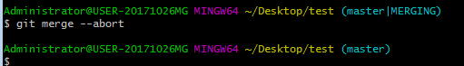

# 13. git 放弃merge代码

当我们使用`git merge`操作合并代码但还没add时，若想取消这次合并，使用“`git merge --abort`”命令即可

假如不幸已经 `git add` 了怎么办呢？ 其实也很简单，先用 `git reflog` 指令显示历史的操作
.png)

再用 'git reset --hard commit id’就可以回退到操作之前的状态了
