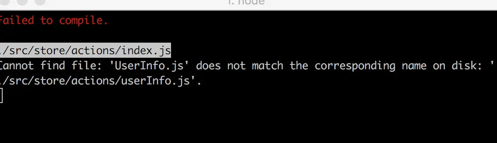

# 2. 解决git不区分文件名大小写的问题

> git 默认对文件名的大小写不敏感，更改文件名大小写后不会提示，导致出错，如下图：




### 查看

> 在终端输入下面指令，默认是`true`，表示忽略大小写；

```
git config --get core.ignorecase
```
### 设置

> 在终端输入以下指令

```
git config core.ignorecase false
```

修改完成后再次执行`git config --get core.ignorecase`，就是`false`（不忽略文件大小写）了；
