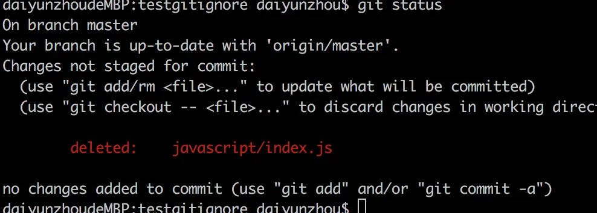
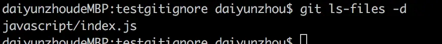

# 3. Git恢复删除或修改的文件 ls-files


## 一、git ls-files -d 查看删除了的文件

#### 1.查看当前状态可以看到删除了一个index.js；

```sh
git status 
```

 
 
#### 2.查看当前项目中删除了的文件

```sh
git ls-files -d
```



#### 3.恢复删除的单个文件 

```sh
git checkout  -- javascript/index.js
```
 
 
 

#### 4.如果要恢复多个被删除的文件,直接输入

```sh
git ls-files -d | xargs git checkout --
```


## 二、查看修改了的文件

```sh
git ls-files -m 
```
  恢复修改文件的方法与恢复删除文件的方法一样，只是 **-d** 换成 **-m**；
