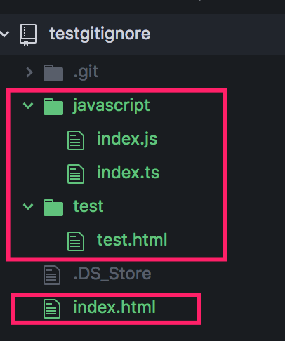

# 4. .gitignore 设置忽略上传的文件

## 1. 首先在一个项目中新建如下所示文件用来测试；



#### 生成.gitignore文件

进入项目根目录，打开终端,输入:
```
vi .gitignore
```

创建并打开隐藏文件.gitignore；

## 设置要忽略上传的文件或文件夹
   
1、过滤整个文件夹（test文件夹）,命令：`test/`;

2、过滤具体文件,命令：`index.html`;

3、过滤指定后缀的文件(过滤后缀为ts的文件),命令：`*.ts`; 
4、过滤隐藏文件,命令：隐藏文件名 （如mac 的.DS_Store 则写为 “`.DS_Store`”即可，和过滤具体文件命令相同）；

## 语法介绍

1、注释：“`#`”  写在行的开头，表示该行为注释；
2、指定添加文件：”`!`” 在过滤的命令前面添加一个“`!`”，则表示要添加某一项；如：`test/` 表示`过滤test`文件夹，但是`!test/` 表示`添加test`文件夹； 


## 注意事项

1、`git` 对于 `.ignore` 配置文件是`按行从上到下进行规则匹配`的，意味着`如果前面的规则匹配的范围更大，则后面的规则将不会生效`；

2、如果在创建`.gitignore`文件`之前就push了项目`，那么`.gitignore中`的过滤规则，这些`规则不会起作用`，Git仍然会对所有文件进行版本管理。如果要新增忽略规则，需要按照下面操作进行；

## `.gitignore`文件中添加新过滤文件，但是此文件已经提交到远程库，如何解决？

**第一步，为避免冲突需要先同步下远程仓库**
```
git pull
```
**第二步，在本地项目目录下删除缓存**
```
git rm -r --cached .
```
**第三步，再次add所有文件**

输入以下命令，再次将项目中所有文件添加到本地仓库缓存中
```
git add .
```
**第四步，添加commit，提交到远程库**
```
git commit -m "filter new files"
git push
```


