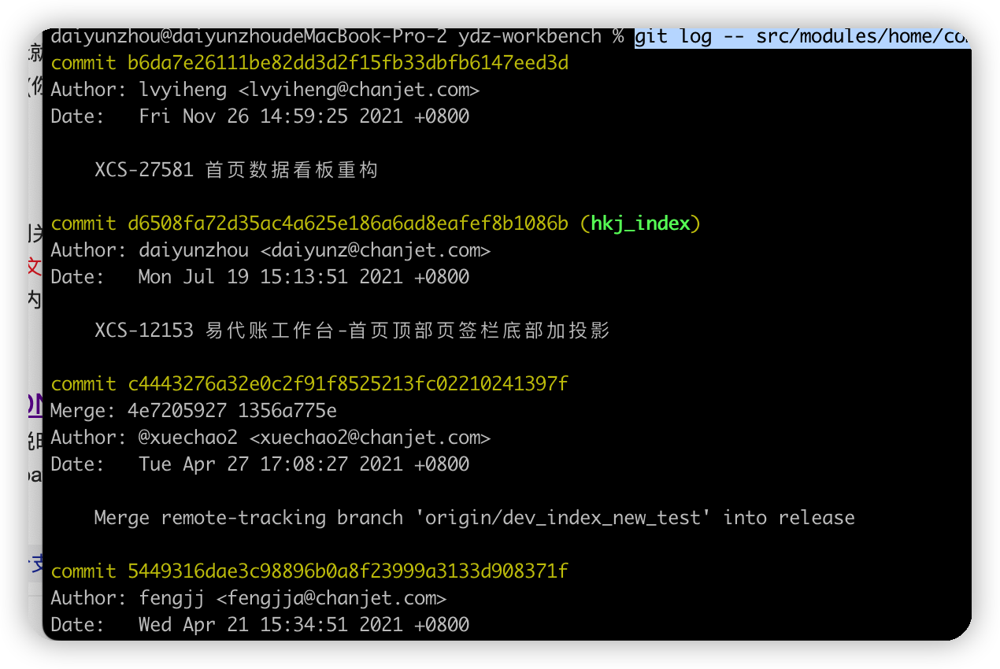

# 9. git log使用


## 1. 获取最后一条记录
```
git log -1
```

## 2.获取最后一条记录的提交者
```
git log -1 --pretty=%an
```

## 3.查看某个文件修改记录（包含已经删除的）

```sh
git log -- src/modules/home/components/Main.tsx
```


## 4. git log --pretty=format:" "
```
'%H': commit hash

'%h': abbreviated commit hash

'%T': tree hash

'%t': abbreviated tree hash

'%P': parent hashes

'%p': abbreviated parent hashes

'%an': author name

'%aN': author name (respecting .mailmap, see git-shortlog or git-blame)

'%ae': author email

'%aE': author email (respecting .mailmap, see git-shortlog or git-blame)

'%ad': author date (format respects --date= option)

'%aD': author date, RFC2822 style

'%ar': author date, relative

'%at': author date, UNIX timestamp

'%ai': author date, ISO 8601-like format

'%aI': author date, strict ISO 8601 format

'%cn': committer name

'%cN': committer name (respecting .mailmap, see git-shortlog or git-blame)

'%ce': committer email

'%cE': committer email (respecting .mailmap, see git-shortlog or git-blame)

'%cd': committer date (format respects --date= option)

'%cD': committer date, RFC2822 style

'%cr': committer date, relative

'%ct': committer date, UNIX timestamp

'%ci': committer date, ISO 8601-like format

'%cI': committer date, strict ISO 8601 format

'%d': ref names, like the --decorate option of git-log

'%D': ref names without the " (", ")" wrapping.

'%e': encoding

'%s': subject

'%f': sanitized subject line, suitable for a filename

'%b': body

'%B': raw body (unwrapped subject and body)

'%N': commit notes

```
如：
```shell
$ git log --pretty=format:'%h: %s'
2eeb74a: modify c
5d340c4: modify b
e51aaca: modify b
16aee3f: modify b
58c8fed: modify a
f6f3452: Initial commit
```

