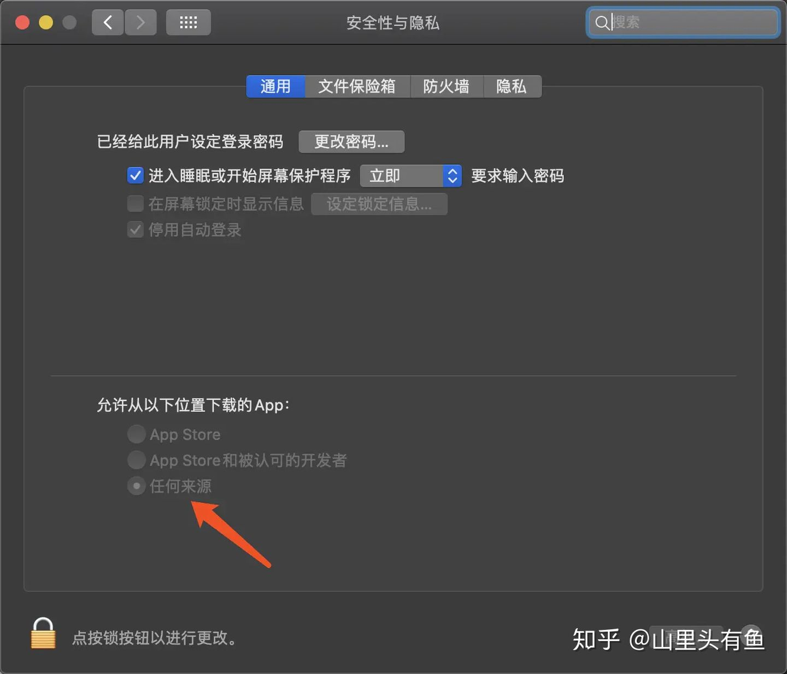
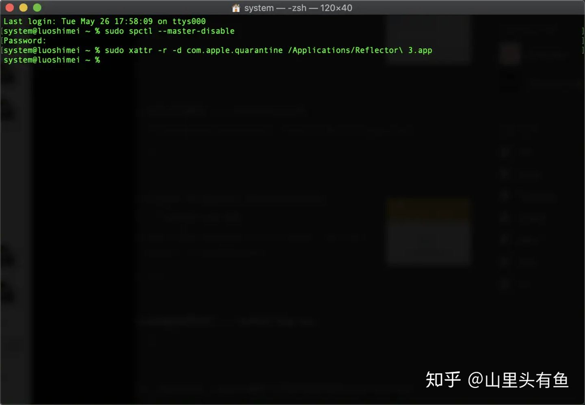

# 1. mac 常用技巧

#### mac清除dns缓存
```sh
sudo killall -HUP mDNSResponder 
```

#### mac 查看ip

```sh
ifconfig查看所有
ifconfig en0 查看ip
```

#### 在终端打开文件夹：

```sh
如：open ~/.ssh 
```

#### 显示隐藏文件

终端输入下面代码：
```sh
defaults write com.apple.finder AppleShowAllFiles TRUE ; killall Finder
```

#### 终端无法运行文件报错Permission Denied

```sh
1. 终端下先 cd到该文件的目录下
2. 执行命令 chmod a+x ./文件名
```

#### mac提示已损坏，无法打开

前提已经执行了下面的命令行，然后在系统安全性与隐私打开任何来源

```sh
sudo spctl --master-disable
```


在终端粘贴复制输入命令：

```sh
sudo xattr -r -d com.apple.quarantine 
```
在应用程序中找到App拖入终端里面即可

