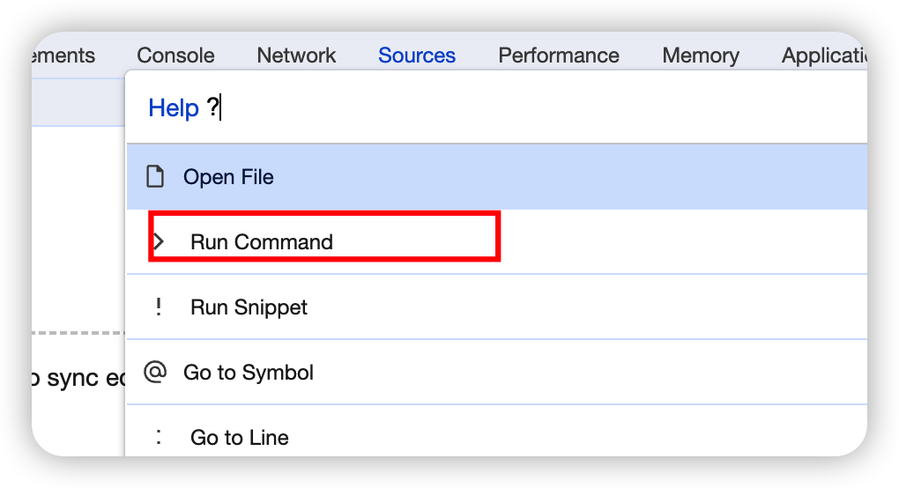
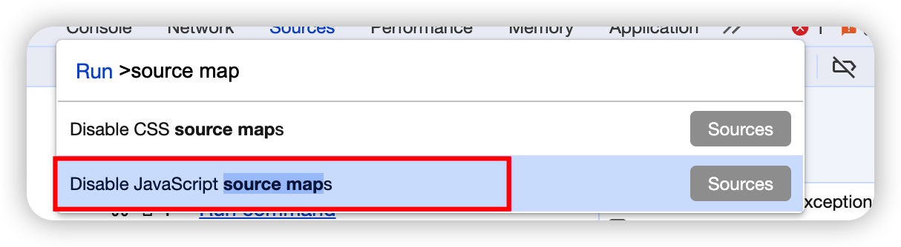
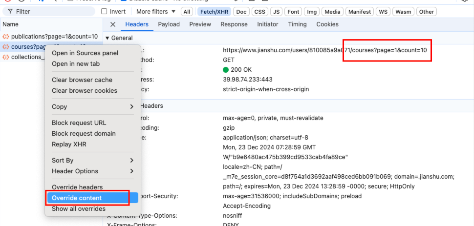
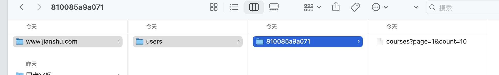
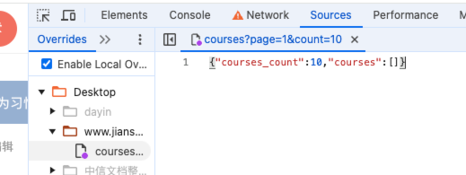
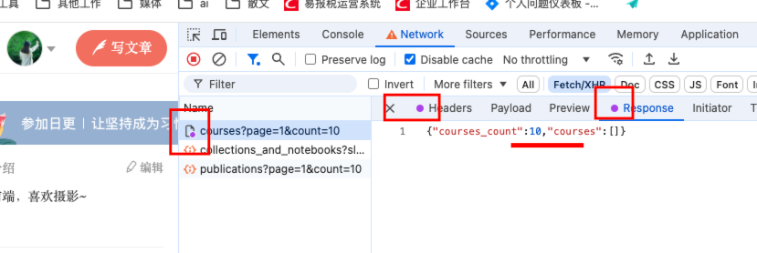
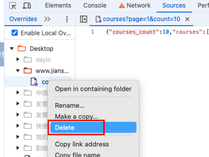

# 1. Chrome使用调试技巧
#### 将当前页面快速添加到浏览器收藏夹

快捷键：
```sh
ctrol+d / command+d
```

#### 浏览器关闭/启用sourcemap调试源码

1. 进入控制台**Sources**面板；
2. 快捷键 **command + p**打开输入框；
3. 英文输入法输入 **?**，选择 **Run Command**;
 
4.输入 **source map** ,找到对应关闭/启用选项点一下；


#### 浏览器调试本地接口数据

> 局限性：如果接口后面有动态改变的数据，每次都不一致，可能不太适用

在浏览器控制台的`netWork` 下面找到要调试的接口，右键选择`“override content”`



此时如果之前没有操作过，会让你`选择一个文件夹`(涉及到权限的，要点击同意)，我这里操作过，所以直接会在之前选择的文件夹下生成一个当前域名的目录，用来保存对应接口的数据



我们可以在浏览器的 source下面直接编辑，也可以在编辑器打开保存在本地的文件中的数据



这里我把`courses_count`改为了 `10`

刷新浏览器，重新请求接口，可以看到请求本地的数据会添加标识：


测试完成后，可以在`source`下删除对应接口，再次刷新就会正常请求了



