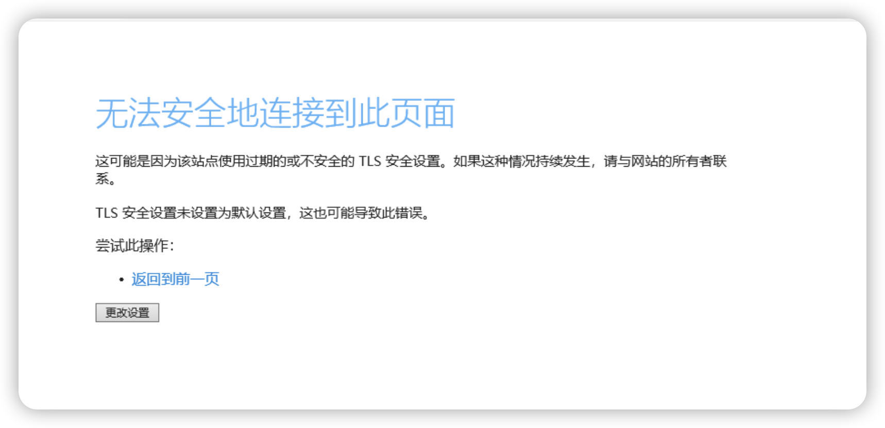
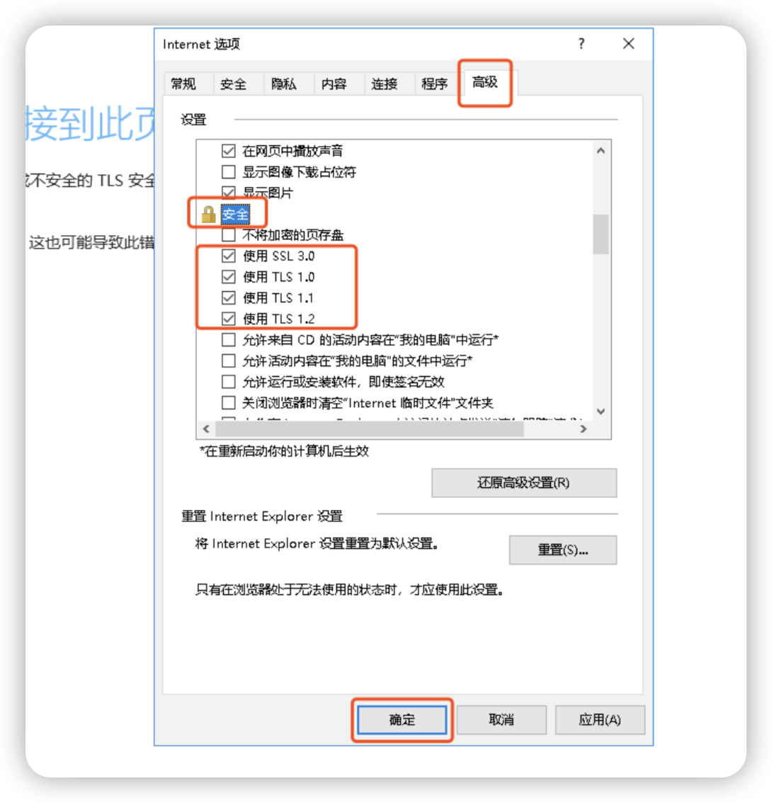
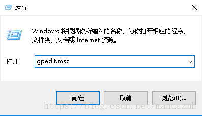
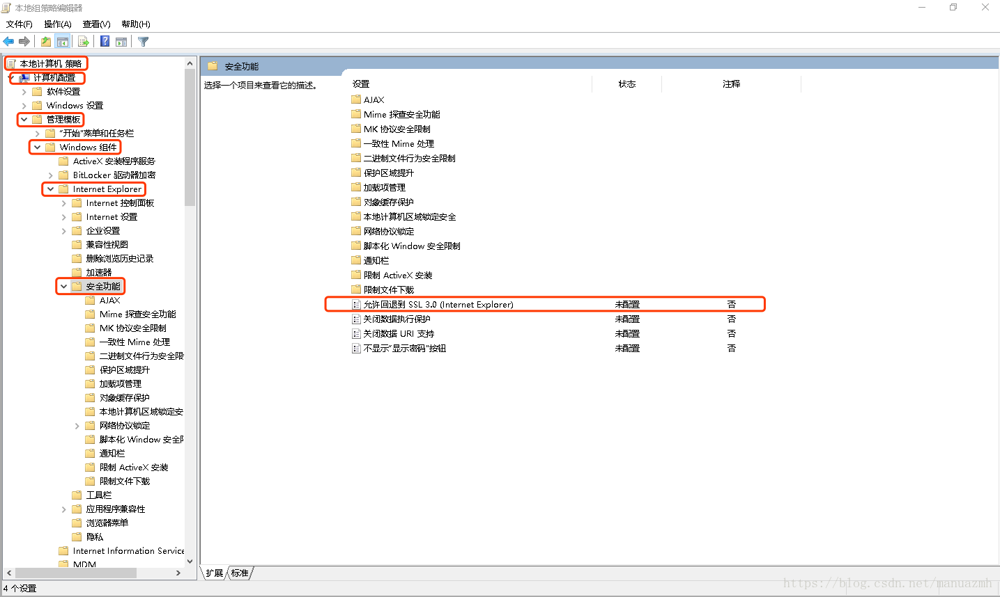
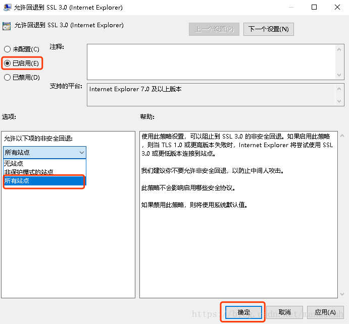

# 2. IE 11 无法安全地连接到此页面，这可能是因为该站点使用过期的或不安全的 TLS 安全设置

## 错误提示

访问某个比较老旧的网站或者内部站点时，提示：`无法安全地连接到此页面，这可能是因为该站点使用过期的或不安全的 TLS 安全设置`。
如果这种情况持续发生，请与网站的所有者联系。TLS 安全设置未设置为默认设置，这也可能导致此错误。

错误图片：

## 原因
这是`win10`升级后`系统安全策略`自动禁用的，请确保访问的网站为内部站点或者可信站点，修改安全配置可能引起安全风险，概不负责。

## 解决方法

### 方法一、 修改TLS设置
依次打开IE的`Internet选项`、`高级`，往下拉，找到`安全模块`，
勾上四个使用：
- 使用SSL 3.0
- 使用TLS 1.0
- 使用TLS 1.1
- TLS 1.2

点击确定，刷新页面重试。

### 方法二、修改组策略

**打开运行（可直接按win＋R），输入gpedit.msc，确定。**

**在弹出的本地组策略编辑器中，依次选择：本地计算机策略、计算机配置、管理模板、Windows 组件、Internet Explorer、安全功能。在右边选中允许回退到SSL 3.0（Internet Explorer），双击打开。**

**修改“未配置”为已启用，然后在允许以下项的非安全回退中，下拉选择所有站点，点击确定进行保存，然后重启系统即可。**

