# 3. 浏览器插件开发
参考：
https://juejin.cn/post/7152697551760654349?share_token=45516DE3-80B2-4811-A7B8-A279B12D77B9

## 参考文档

https://juejin.cn/post/7152697551760654349?share_token=45516DE3-80B2-4811-A7B8-A279B12D77B9

https://blog.csdn.net/weixin_45491473/article/details/139421752

- 官方文档：https://developer.chrome.com/docs/extensions/mv3/
- 框架参考：https://docs.plasmo.com/

## 项目目录结构

### manifest.json

所有的浏览器插件必须在根目录下新建文件`manifest.json`清单记录重要的元数据，定义资源，声明权限，并标识哪些文件在后台和页面上运行。这是插件的配置文件，说明了插件的各种信息；它的作用等同于小程序的`app.json`和前端项目的`package.json`。

### service worker

`service worker`作用是处理和监听浏览器事件，相当于是在后台持续运行的脚本，可以使用浏览器的全部api；但是不能和页面内容直接交互。

### content scripts

content scripts是在网页上执行的javascript，可以读取和修改网页上的dom元素，但只能使用部分的浏览器api，具体请见：[content scripts](https://developer.chrome.com/docs/extensions/mv3/content_scripts/)。

```json
"content_scripts": [ // 配置content scripts
    {
      "matches": [
        "*://www.baidu.com/*"
      ],
      "js": [
        "test.js"
      ],
      "all_frames": true,
      "css": []
    }
  ],
```
在 `content_scripts` 的 `matches` 字段中可以写多种模式来指定匹配的网页范围，常见的包括：

- 具体的网址，如 `https://example.com` 。
- 使用通配符，比如 `*://example.com/*` 表示匹配任何协议（`http` 或 `https` 等）下的 `example.com` 及其子路径。
- 也可以使用更广泛的通配符模式，如 `<all_urls>` 表示匹配所有网址。
### 插件页面

插件页面包括浏览器的图标以及其点击后的效果，如`popup页面`；
`options页`面，也就是右键浏览器图标之后点击选项弹出的页面；
其他页面，也就是除了上述两种页面的其他浏览器插件的页面。

所有的插件页面都可以使用浏览器api。

## manifest配置

> 具体配置请参考文档[manifest](https://developer.chrome.com/docs/extensions/mv3/manifest/)

**manifest.json常用的配置如下：**

```js
{
  // 必须的
  "manifest_version": 3,
  "name": "插件名称",
  "version": "版本",
  // 常用
  "description": "插件描述",
  "author": "作者名",
  "background": { // 配置service worker
    "service_worker": "background.js"
  },
  "options_ui": { // 配置options页面
    "page": "options.html",
    "open_in_tab": true
  },
  "content_scripts": [ // 配置content scripts
    {
      "matches": [
        "*://www.baidu.com/*"
      ],
      "js": [
        "test.js"
      ],
      "all_frames": true,
      "css": []
    }
  ],
  "web_accessible_resources": [ // 配置Web可访问资源
    {
      "matches": [
        "*://www.baidu.com/*"
      ],
      "resources": [
        "test.css"
      ]
    }
  ],
  "host_permissions": [ // 与主机权限相关，推荐使用同样的设置
    "https://*/*"
  ],
  "permissions": [ // 配置插件所使用的api权限
    "storage",
    "contextMenus",
    "cookies"
  ],
  "action": { // 使用action api配置插件工具栏中图标、弹出页面等内容
    "default_icon": {
      "16": "icon16.png",
      "32": "icon32.png",
      "48": "icon48.png",
      "64": "icon64.png",
      "128": "icon128.png"
    },
    "default_popup": "popup.html",
    "icons": {
      "16": "icon16.png",
      "32": "icon32.png",
      "48": "icon48.png",
      "64": "icon64.png",
      "128": "icon128.png"
    }
  }
}
```

### 创建一个最简单的manifest.json配置文件

我们在项目中创建一个最简单的`manifest.json`配置文件，`manifest` 描述插件的元数据，包括插件名、描述以及版本等等：

```json
{
    "manifest_version": 3,
    "name": "文案助手",
    "version": "1.0.0",
    "description": "插件描述",
    "author": "作者名",
}
```
### 加载未打包插件

> 为方便插件调试，Chrome在开发模式下，支持加载未打包的插件。只需指定插件的开发目录（包含manifest）即可完成加载，关键步骤如下：

- 打开插件管理页面，直接点这个访问这个链接即可：[chrome://extensions](chrome://extensions)；

或者按照下图所示找到：

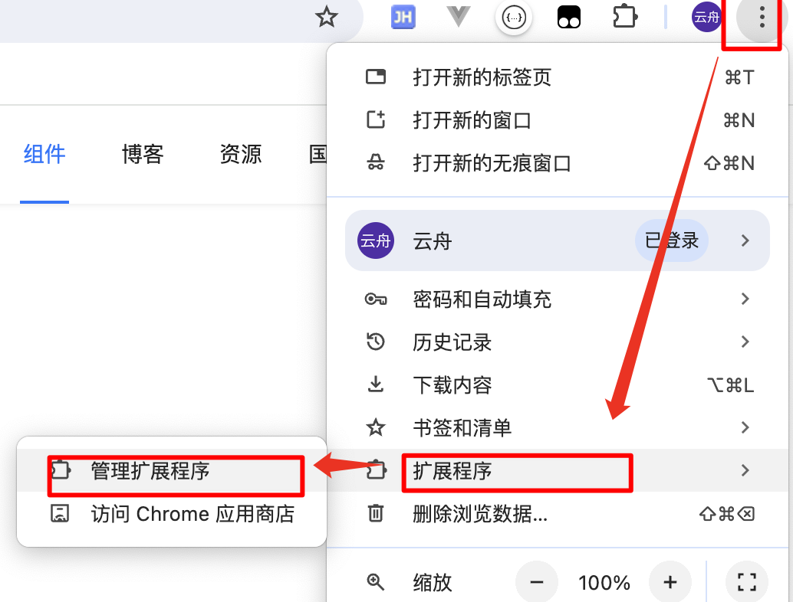


- 点击位于右上角的开发模式开关，开启开发模式；

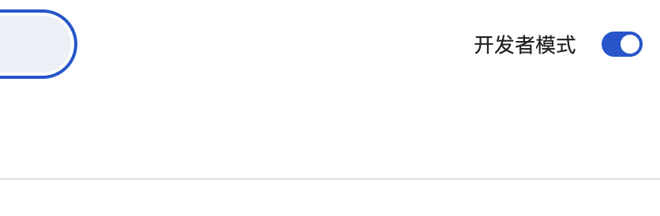

- 点击左上角的加载已解压的扩展程序，然后直接选择插件目录即可；

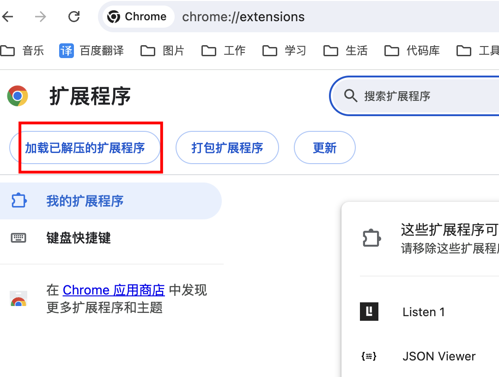


插件安装成功！由于还没在 manifest 配置文件里注册图标，Chrome 会为插件显示默认图标。

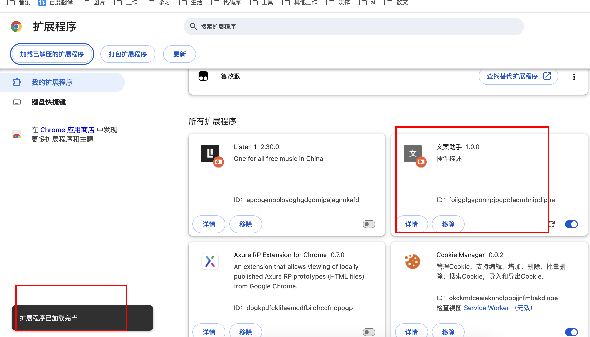


## 添加简单功能

插件虽已安装，却啥也没干，因为还没添加执行逻辑。我们先写一些代码，让插件保存背景颜色值。


### 注册后台执行脚本

跟其他重要部件一样，后台脚本也必须注册到 manifest 配置文件。在 manifest 注册后台脚本，相当于告诉插件去哪找后台脚本，以及脚本应该执行什么事情。

#### **serviceWorker:**

> 在 manifest 加上 background 配置后，Chrome 现在知道插件包含一个 服务执行器（ service worker ）。当你重新加载插件时，Chrome 会找到注册的后台脚本，执行其中的额外指令，比如监听一些重要事件。

```json
"background": {
  "service_worker": "background.js",
  "type": "module"
}
```
#### 编写后台脚本

> 在插件目录创建 background.js 文件，并写上代码：

```js
const color = "#3aa757";

chrome.runtime.onInstalled.addListener(() => {
    console.log("插件已被安装");
    chrome.storage.sync.set({ color });
    console.log(`[Coloring] default background color is set to: ${color}`);
});
```

这段代码通过常量定义默认的背景色，然后通过 `Chrome API` 注册 `onInstalled` 事件监听函数。监听函数将在插件安装的时候执行，调用 `storage` 存储接口，保存默认的背景色。

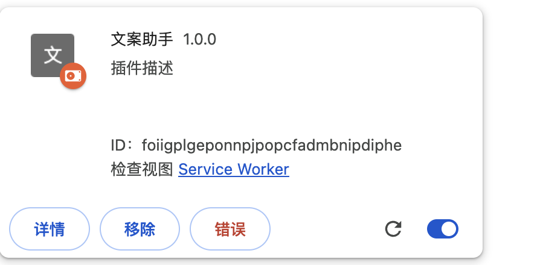


现在点击插件右下角的转圈，重新加载插件，但我们发现插件报错了。因为插件使用了 storage 接口，但还没获得 `Chrome` 的授权。

查看错误原因：
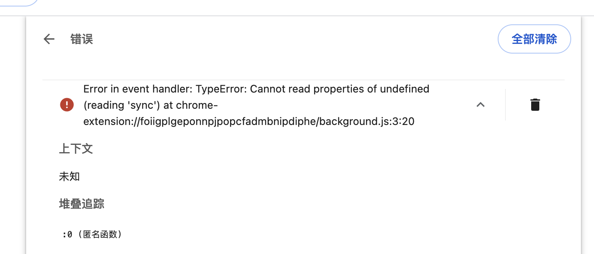


由此可见，chrome.storage 是 undefined ，因为 Chrome 还没将 storage 接口授权给插件。

#### storage存储接口授权

我们在插件安装时在`storage`中设置一个值，这将允许多个插件组件访问该值并进行更新操作。大部分接口，包括 `storage` 接口，必须注册在 `manifest` 配置文件 `permissions` 字段下，获得授权之后才能使用：

```json
"permissions": ["storage"]
```
重新加载插件，检查视图：

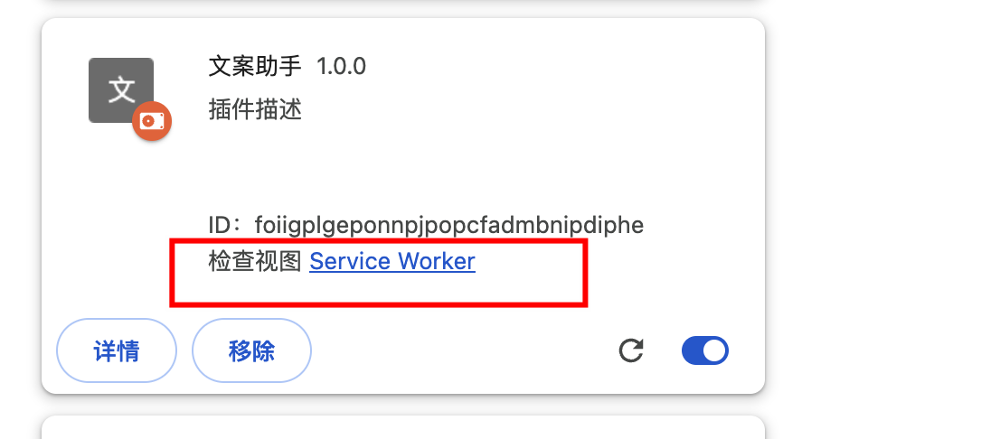
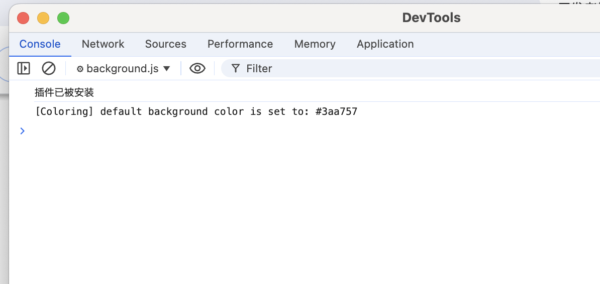


### 弹窗操作以及选项界面

Chrome 插件可能使用各种形式的用户界面，我们先试试 `Popup` 弹出窗口。在插件目录创建一个名为 `popup.html` 的文件，在创建个`button.css`：


跟后台脚本一样，用户界面文件也要在 `manifest` 中注册后，才能被 `Chrome` 识别。
我们在 `manifest` 中添加一个 `action` 对象，并将`popup.html` 文件作为 `default_popup` 属性注册进去：

```json
"action": {
  "default_popup": "popup.html"
},
"options_ui": {
  "page": "options.html",
  "open_in_tab": true
}
```

**效果如图：**

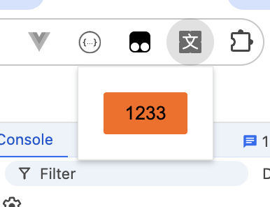

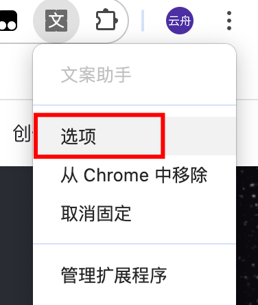
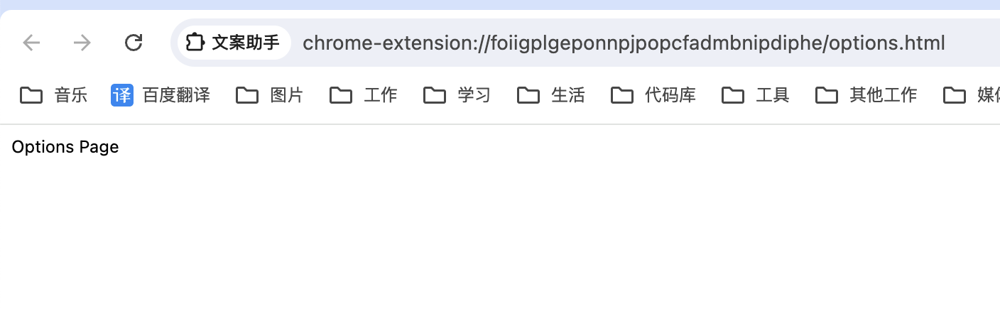


## 配置icon图标

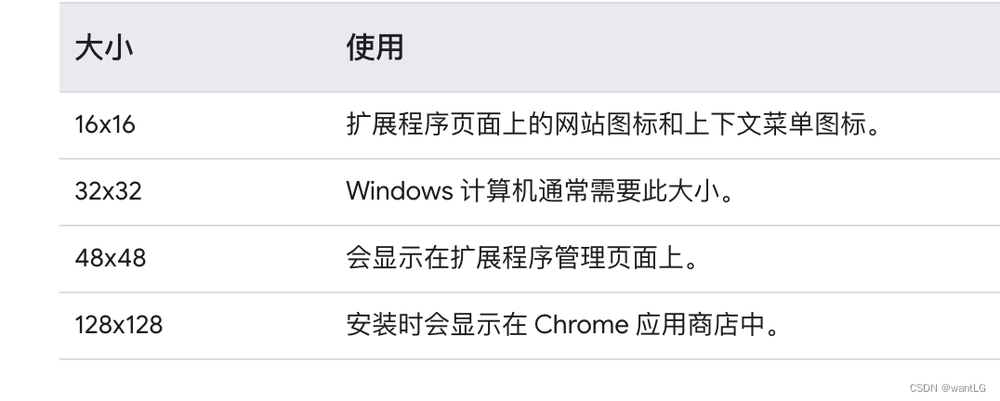


> 在线批量生成图标： https://uutool.cn/chrome-icon/

备注：先改成 gif，然后再生成的，就可以用，直接用的 jpg 不太行，不知道是网站原因还是格式原因

```json
"icons": {
  "16": "asssets/image/icon16.jpg",
  "32": "asssets/image/icon32.jpg",
  "48": "asssets/image/icon48.jpg",
  "128": "asssets/image/icon128.jpg"
}
```

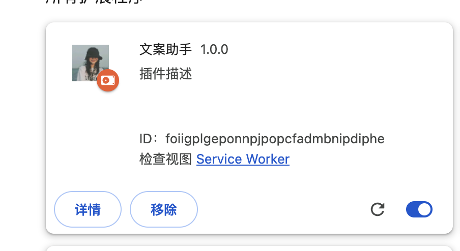


## content scripts

content scripts运行拓展将逻辑注入页面

https://developer.chrome.com/docs/extensions/mv3/content_scripts/#capabilities

### api权限

`content scripts`只能使用部分的浏览器api，最常用的api为`storage`与`runtime`两个api。

所以在进行一些特定操作时需要通过`runtime.sendMessage`向`service worker`发送信息来执行某些操作

### 运行环境

`content scripts`存在于一个孤立的环境中，允许内容脚本对其 JavaScript 环境进行更改，而不会与页面或其他扩展的content scripts发生冲突。

比如content scripts的变量对于主机页面和其他插件的content scripts是不可见的；又或者通过content scripts改写了页面的某个api，而页面原本的元素在触发这个api时并没有按照预期的效果执行，其原因就是content scripts修改的只是自身环境的api，而不是原页面的api。

### 注入方式
注入方式分两种：静态注入和动态注入

#### 静态注入
在manifest.json中配置的脚本即为静态注入，在匹配的页面上自动注入脚本。

```json
{
  "name": "test",
  ...
  "content_scripts": [
    {
      "matches": ["https://*.test.com/*"],
      "css": ["styles.css"],
      "js": ["content-script.js"]
    }
  ],
  ...
}
```
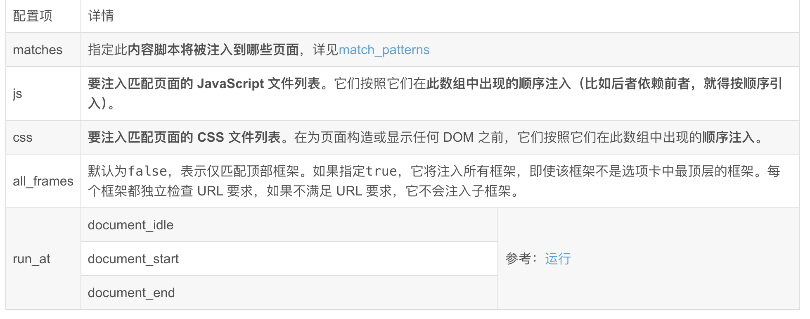


#### 动态注入

使用`chrome.scripting.executeScript`进行动态注入

```json
chrome.action.onClicked.addListener((tab) => {
  chrome.scripting.executeScript({
    target: { tabId: tab.id },
    world: "MAIN",
    files: ['content-script.js']
  });
});
```

**动态注入的脚本可以通过设置world属性为MAIN直接进入网页文档，而不是独立的环境**。这时在主页面就可以访问到脚本的变量等信息

如果想要主动将脚本注入主页面，可以在background监听页面进行注入；或者在静态注入的脚本中动态插入script标签并且将src设置为想要注入主页面的脚本的url。

## UI elements

https://developer.chrome.com/docs/extensions/mv3/user_interface/#additional_features

### 指定工具栏图标

在manifest.json的action配置项配置图标

```json
{
  "name": "My Extension",
  ...
  "action": {
    "default_icon": {
      "16": "image_16.png",
      "32": "image_32.png",
      "48": "image_48.png",
      "128": "image_128.png"
    }
  }
  ...
}
```
### Action badge

在图标右下角可以显示一些内容，最多展示四个字符，效果如下图：


```json
chrome.action.setBadgeText({text: 'ON'}); // 配置文本
chrome.action.setBadgeBackgroundColor({color: '#4688F1'}); // 配置背景颜色
```
### popup页面

弹出窗口是一个 HTML 文件，当用户单击操作图标时，它会显示在一个特殊的窗口中。弹出窗口的工作方式与网页非常相似；它可以包含指向样式表和脚本标签的链接，但不允许内联 JavaScript。

```json
{
  "name": "Drink Water Event",
  ...
  "action": {
    "default_popup": "popup.html"
  }
  ...
}
```

弹出窗口也可以通过调用动态设置(`action.setPopup`)[https://developer.chrome.com/docs/extensions/reference/action#method-setPopup]。

```json
chrome.storage.local.get('signed_in', (data) => {
  if (data.signed_in) {
    chrome.action.setPopup({popup: 'popup.html'});
  } else {
    chrome.action.setPopup({popup: 'popup_sign_in.html'});
  }
});
```

### Tooltip

将鼠标悬停在操作图标上时，使用工具提示向用户提供简短说明或说明。默认情况下，提示会显示扩展的名称。

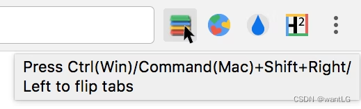


可以通过default_title设置。

```json
{
  "name": "Tab Flipper",
  ...
  "action": {
    "default_title": "default_title"
  }
  ...
}
```

也可以通过(`action.setTitle`)[https://developer.chrome.com/docs/extensions/reference/action#method-setTitle]设置。

### 图标点击事件

```js
chrome.action.onClicked.addListener(function(tab) {
  chrome.action.setTitle({tabId: tab.id, title: "You are on tab:" + tab.id});
});
```

### Omnibox

用户可以通过`Omnibox API`调用扩展功能。在清单中包含该"omnibox"字段并指定关键字。多功能框新标签搜索示例：tt用作关键字。

```js
chrome.omnibox.onInputEntered.addListener((text) => {
  // Encode user input for special characters , / ? : @ & = + $ #
  const newURL = 'https://www.google.com/search?q=' + encodeURIComponent(text);
  chrome.tabs.create({ url: newURL });
});
```

```json
{
  "manifest_version": 3,
  "name": "My Extension",
  "version": "0.0.1",
  "description": "插件描述",
  "author": "gaolu",
  "background": {
      "service_worker": "background.js"
  },
  "host_permissions": [
      "https://*/*"
  ],
  "omnibox": { "keyword" : "tt" }
}
```
### Context menu

可以通过在清单中授予权限来使用[`ContextMenus API`](https://developer.chrome.com/docs/extensions/reference/contextMenus/) 。

```json
{
  "permissions": [
    "contextMenus",
    "storage"
  ]
}
```
`contextMenus.create()`通过调用后台脚本创建上下文菜单。这应该在`runtime.onInstalled`侦听器事件下完成。

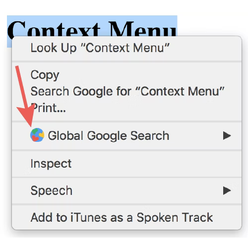


### Notifications

您可以通过直接在用户的系统托盘中显示通知来向用户传达相关信息。

要使用`notifications API`，您必须在清单中声明权限`notifications`。

```json
{ 
  "permissions": [
    "notifications",
  ],
}
```
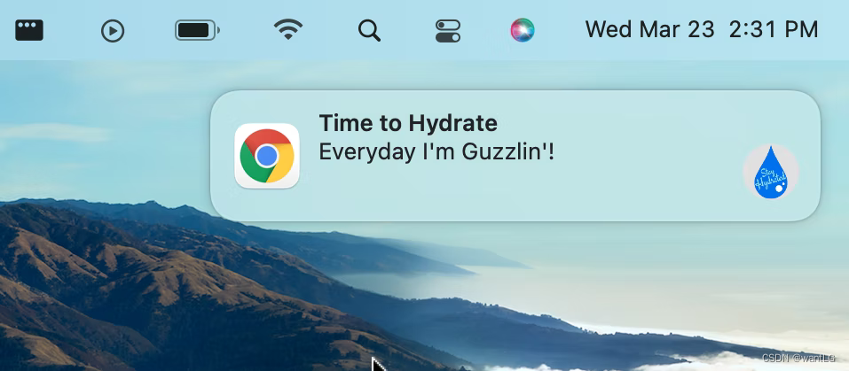


### 浏览器 api

插件除了使用网页的web api外，也可以使用浏览器的api

api文档：[chrome api](https://developer.chrome.com/docs/extensions/reference/api?hl=zh-cn)

大多数的api都是异步的，所以使用其返回的结果有两种方式：

- 通过回调函数
- 通过异步操作（推荐）

```js
// Promise
chrome.tabs.query(queryOptions)
.then((tabs) => {
  chrome.tabs.update(tabs[0].id, {url: newUrl});
  someOtherFunction();
});
 
// async-await
async function queryTab() {
  let tabs = await chrome.tabs.query(queryOptions);
  chrome.tabs.update(tabs[0].id, {url: newUrl});
  someOtherFunction();
}
 
// callback
chrome.tabs.query(object queryInfo, function callback)
```

有些api的应用需要在manifest的permissions字段设置对应权限


## 通信

> [messaging](https://developer.chrome.com/docs/extensions/mv3/messaging/)

由于`content_scripts`运行在网页中，而不是浏览器插件的环境，所以它需要一些特殊的方式来和浏览器插件的内容进行通信。

通信的方式包括用于一次性请求的简单通信和用于长期连接的长连接通信。

### 简单通信
简单通信可以使用[`runtime.sendMessage()`](https://developer.chrome.com/docs/extensions/reference/runtime#method-sendMessage)或[`tabs.sendMessage()`](https://developer.chrome.com/docs/extensions/reference/tabs#method-sendMessage)与插件的其他部分进行通信。

上述api可以将`json`字段从`content_scripts`发送给插件，当然也可以从插件将信息发送给`content_scripts`。如果要处理返回的数据，需要使用返回的`Promise`；也可以设置回调函数。

**从content_scripts发送请求：**

```js
(async () => {
  const response = await chrome.runtime.sendMessage({
    data: 'hello',
  });
  console.log(response);
})();
```

### 接收信息

在事件接收端需要设置一个`runtime.onMessage`事件侦听器来处理消息。

```js
chrome.runtime.onMessage.addListener((request, sender, sendResponse) => {
  console.log(request, sender);
  if (request.greeting === "hello") {
    sendResponse({farewell: "goodbye"});
  }
});
```
需要注意的是：`sendResponse`是同步调用的，如果想要在异步调用需要在`onMessage`的事件处理函数中添加`return true`;

```js
chrome.runtime.onMessage.addListener((request, sender, sendResponse) => {
    // console.log(request, sender);
    (async () => {
    if (request.greeting === "hello") {
          const data = await getData();
          sendResponse(data);
    }
    })();
    return true;
});
```

如果多个页面侦听onMessage事件，则只有第一个调用`sendResponse()`特定事件的页面才能成功发送响应。其他对该事件的所有其他响应事件将被忽略。


### 长连接通信

某些情况下需要持续事件更长的通信，这时可以使用长连接通信，分别使用[`runtime.connect`](https://developer.chrome.com/docs/extensions/reference/runtime#method-connect)或[`tabs.connect`](https://developer.chrome.com/docs/extensions/reference/tabs#method-connect)打开一个从`content_scripts`到插件的长期通道或插件到`content_scripts`的长期通道。

#### 建立连接

建立连接时，每一端都会获得一个runtime.Port对象，用于发送和接收消息。

```js
const port = chrome.runtime.connect({name: "knockknock"});
port.postMessage({joke: "Knock knock"});
port.onMessage.addListener((msg) => {
  if (msg.question === "Who's there?")
    port.postMessage({answer: "Madame"});
  else if (msg.question === "Madame who?")
    port.postMessage({answer: "Madame... Bovary"});
});
```

从插件向`content_scripts`发送请求是类似的，只需要指定要连接到哪个选项卡。只需将上例中的连接调用替换为`tabs.connect()`即可。

#### 处理连接信息

需要设置一个`runtime.onConnect()`事件侦听器。当插件的另一部分调用`connect()`时，将触发此事件，其中回调函数的参数是用来通过连接发送和接收消息的`runtime.Port`对象

```js
chrome.runtime.onConnect.addListener((port) => {
  console.assert(port.name === "knockknock");
  port.onMessage.addListener((msg) => {
    if (msg.joke === "Knock knock")
      port.postMessage({question: "Who's there?"});
    else if (msg.answer === "Madame")
      port.postMessage({question: "Madame who?"});
    else if (msg.answer === "Madame... Bovary")
      port.postMessage({question: "I don't get it."});
  });
});
```

## 浏览器插件Storage

> 与网页类似，浏览器插件也有用来储存数据的空间：我们可以调用浏览器插件的`storage api`，以此来持久化用户数据和状态。

**关于浏览器插件储存有一些特性：**

- 浏览器的所有页面（包括service worker、content script）都可以使用storage api
- 读取和写入是异步的
- 用户清除缓存和历史记录，数据也不会收到影响


### 使用storage api

想要使用storage api首先要在manifest的permissions字段中配置：

```json
{
  "name": "My extension",
  ...
  "permissions": [
    "storage"
  ],
  ...
}
```

#### local：

```js
chrome.storage.local.set({ key: value }).then(() => {
  console.log("Value is set");
});
 
chrome.storage.local.get(["key"]).then((result) => {
  console.log("Value currently is " + result.key);
});
```

#### sync

```js
chrome.storage.sync.set({ key: value }).then(() => {
  console.log("Value is set");
});
 
chrome.storage.sync.get(["key"]).then((result) => {
  console.log("Value currently is " + result.key);
});
```

#### session：

```js
chrome.storage.session.set({ key: value }).then(() => {
  console.log("Value was set");
});
 
chrome.storage.session.get(["key"]).then((result) => {
  console.log("Value currently is " + result.key);
});
```

#### 监听储存变化

使用`chrome.storage.onChanged.addListener`添加监听的回调函数

```js
chrome.storage.onChanged.addListener((changes, namespace) => {
  for (let [key, { oldValue, newValue }] of Object.entries(changes)) {
    console.log(
      `Storage key "${key}" in namespace "${namespace}" changed.`,
      `Old value was "${oldValue}", new value is "${newValue}".`
    );
  }
});
```
## 插件架构

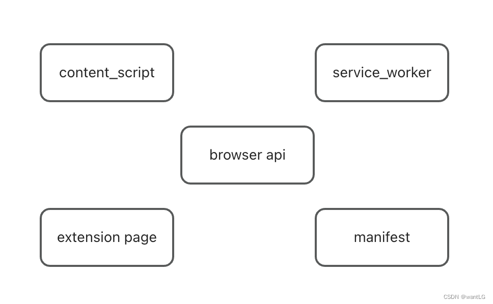


### 一个浏览器插件主要是由五部分组成

- manifest：插件配置文件

- content_script：注入到浏览器页面的脚本

- service_worker：插件自己的后台脚本

- extension page：插件的各个页面，比如popup、options、devtools、sidepanel

- browser api：可以通过api调用浏览器的功能（存储、历史记录、通信等）

1. 首先manifest是一个json文件，配置了插件的信息，其余部分的内容都需要在这里配置（当然也可以在service_worker中动态配置）；需要放在插件的根目录下

2. browser api是插件与浏览器交互的通道；根据浏览器不同，可能有些差异，但大部分的api是一致的

3. content_script是注入到浏览器页面的脚本，可以实现修改页面的dom，获取页面元素等操作。他能使用的browser api是有限的，想实现一些功能需要与service_worker或者extension page通信，由这两部分的代码代为执行一些操作。

4. service_worker相当于是插件的后端，也就是一个在后台运行的脚本，能够访问到所有的browser api。控制浏览器的操作都可以在这里运行

5. extension page是插件内部的一些页面。有一些页面是插件规定的，比如popup、options、devtools、sidePanel等；还有一些页面是插件自定义的页面，可以通过browser api打开这些页面。在extension page也可以使用所有的browser api

### 数据流

- 浏览器插件的通信是注入到网页的脚本（content_script）与插件（service_worker和extension page）使用browser api传递数据。

- 插件向脚本发送信息需要知道对应脚本所在标签页的id，才可以发送信息，并且获得脚本返回的响应

- 而脚本向插件发送信息则可以直接发送，并获取插件返回的响应


