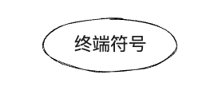
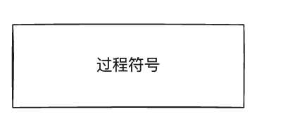
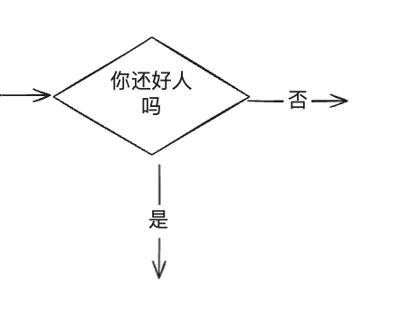
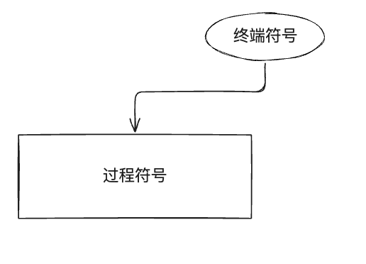
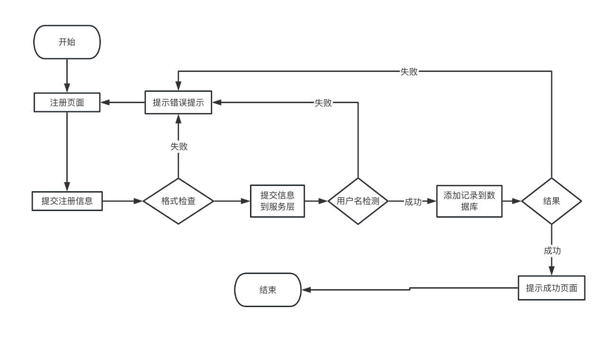
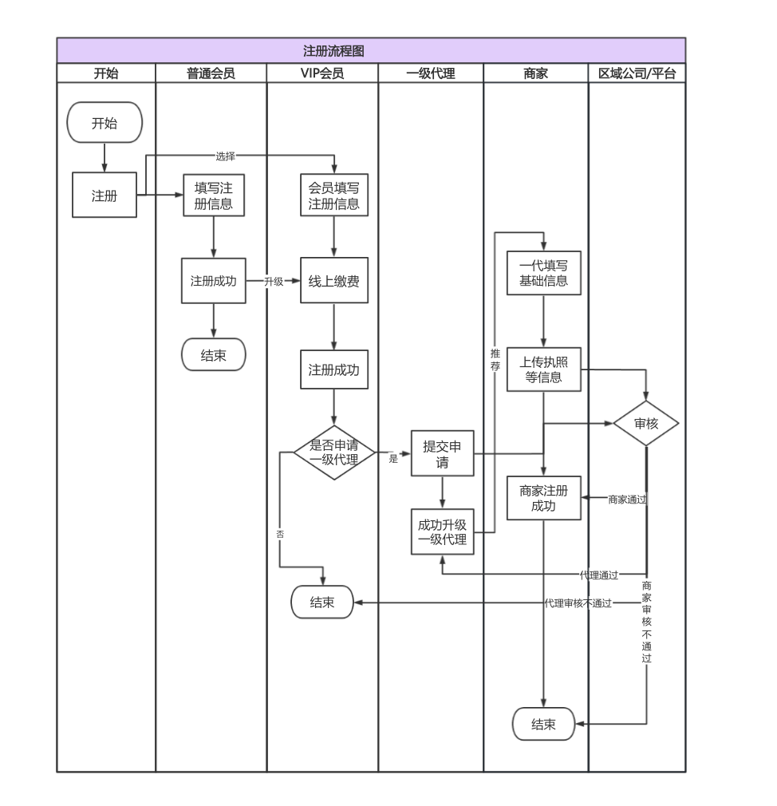

# 常见的流程图符号及含义

特定的图形符号加上说明，表示算法的图，称为流程图。流程图常常用来表示一些动态过程，通常会有一个“起点”， 可以有一个或多个终点，流程图可以直观、明确地表示动态过程从开始到结束的全部步骤，在日常生活和工作中的应用范围十分广泛。

## 各符号含义

### 终端符号（Terminal Symbol）

> 端点符号表示流程图的开始或结束。该符号通常带有文本“`开始`”或“`结束`”，“`开始`”和“`结束`”写在符号内。

### 过程符号（Process Symbol）

> 矩形符号即`过程符号`,过程流程符号代表流程中的一个步骤，这是流程图中最常见、出现频率最多的组件,活动的`简要说明`写在矩形内。

### 判断符号（Decision Symbol）

> 流程图中出现的`菱形符号`是`判断符号`，通常用来表示过程中的`一项判定`或`一个分叉点`，判定或分岔的`说明写在菱形内`，常以问题的形式出现。对该问题的回答决定了判定符号之外引出的路线，`每条路线标上相应的回答`，如此一来流程便可以取得进一步进展。

### 流线符号（Flowline Symbol）

> 流线表示过程的`方向`。每条流线通常连接两个块，流线可以是`直线`、`单向箭头`或`双向箭头`，表示步骤之间的不同类型的连接。在具体的使用过程中，我们可以根据流程图的具体布局以及流程进展的要求选择不同的流线。

## 参考

