# uml 常用箭头符号含义

## 泛化

- 泛化：表示类之间的继承关系。箭头从子类指向父类。
- 箭头：实线空心三角箭头

如下图所示，`Person`为父类，`Son`为子类

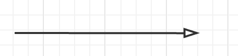


```js
// 定义父类 Person
class Person {
  constructor(name) {
    this.name = name;
  }

  introduce() {
    console.log(`我叫${this.name}，是一个人。`);
  }
}

// 定义子类 Son 继承自 Person
class Son extends Person {
  constructor(name, age) {
    super(name);
    this.age = age;
  }

  introduce() {
    super.introduce();
    console.log(`我今年${this.age}岁。`);
  }
}

// 使用示例
const son = new Son('小明', 10);
son.introduce();
```

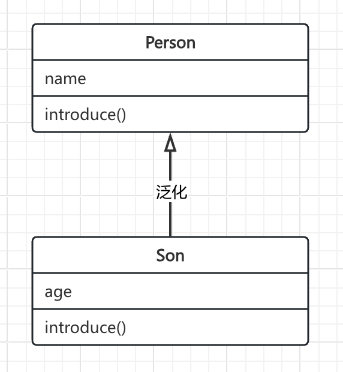

## 实现

- 实现： 表示类之间的实现关系。箭头从子类指向接口，表示子类实现了接口的所有方法。
- 箭头： 虚线空心三角箭

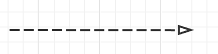

```js
// 定义接口
interface IPrintable {
  print(): void;
}

// 定义实现类
class Document implements IPrintable {
  print(): void {
    console.log('正在打印文档');
  }
}
```

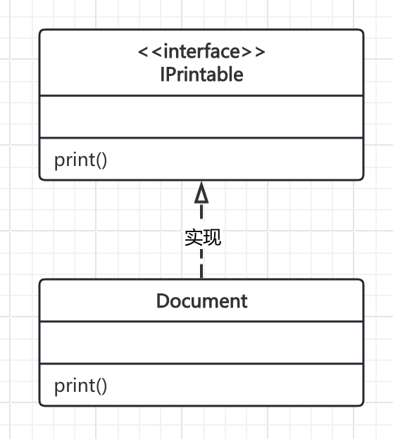


## 依赖

- 依赖： 表示依赖关系，某个类的方法`必须依赖`另一个类`才可以执行`，箭头指向被依赖的类
- 箭头： 虚线箭头

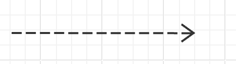


```js
// 定义被依赖的类
class Utility {
  usefulMethod() {
    console.log('执行有用的方法');
  }
}

// 定义依赖类
class Main {
  doSomething(utility) {
    utility.usefulMethod();
  }
}
```

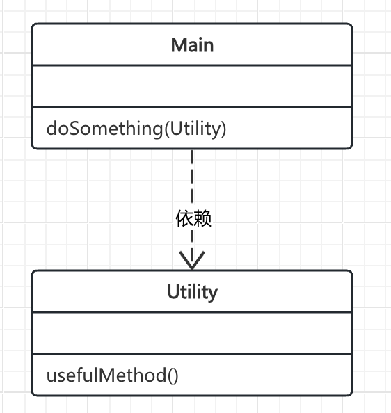


## 关联

- 关联： 表示类之间的关联关系。箭头表示类之间的一种连接关系。两个类的关系是平等的，可以双向关联，`A 可以关联 B`，`B 也可以关联 A`，箭头指向被关联的类
- 箭头： 实线箭头

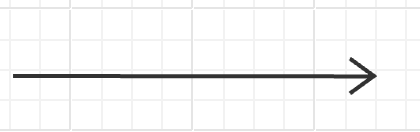

```js
// 定义类 B
class B {
  doSomethingB() {
    console.log('B 执行操作');
  }
}

// 单向关联：类 A 中使用类 B 作为成员变量
class A {
  constructor() {
    this.b = new B();
  }

  doSomethingA() {
    this.b.doSomethingB();
  }
}

/**
* 双向关联：类 A 和类 B 相互作为成员变量
*
这种相互引用的代码在某些情况下是可以执行的，但需要 谨慎处理，否则可能会导致一些问题，比如无限递归调用或内存泄漏。
在上述代码中，如果在 doSomethingC 方法和 doSomethingD 方法中没有适当的条件控制或者终止逻辑，可能会导致无限的相互调用。
在实际开发中，双向关联需要仔细设计和管理，确保在使用这种关系时不会出现意外的错误。
**/
class C {
  constructor() {
    this.d = new D();
  }

  doSomethingC() {
    this.d.doSomethingD();
  }
}

class D {
  constructor() {
    this.c = new C();
  }

  doSomethingD() {
    this.c.doSomethingC();
  }
}
```

**单项关联：**

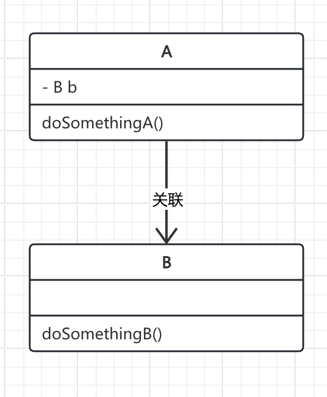

**双向关联：**

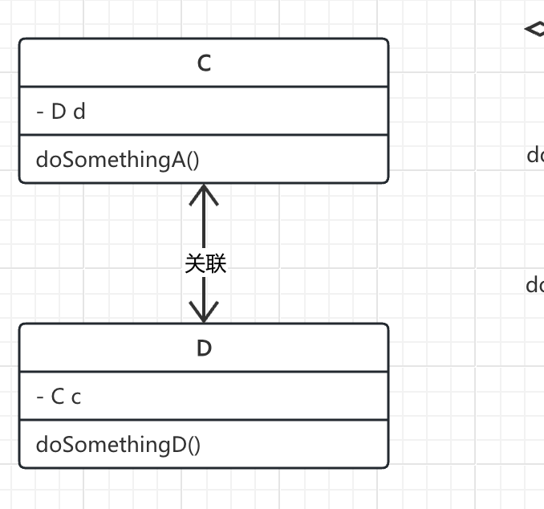


## 聚合

描述的是`整体和部分`的关系，`整体`生命周期`结束`并`不代表部分声明周期的结束`。

- 聚合： 表示类之间的聚合关系。箭头从聚合类指向被聚合类，表示一个类包含另一个类的对象。
- 箭头： 空心菱形实线箭头，菱形指向被聚合类，箭头指向聚合类

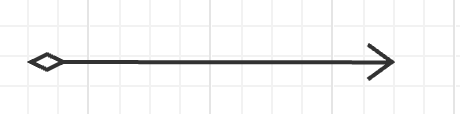

```js
// 定义班级类
class ClassRoom {
  constructor() {
    this.students = [];  // 班级包含学生的数组
  }

  addStudent(student) {
    this.students.push(student);
  }

  showStudents() {
    for (const student of this.students) {
      console.log(student.name);
    }
  }
}

// 定义学生类
class Student {
  constructor(name) {
    this.name = name;
  }
}

// 使用示例
const classRoom = new ClassRoom();
const student1 = new Student('张三');
const student2 = new Student('李四');

classRoom.addStudent(student1);
classRoom.addStudent(student2);

classRoom.showStudents();
```

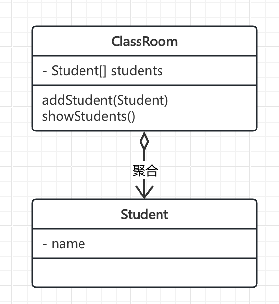


## 组合

`整体和部分`的关系，整体生命周期结束，`部分的声明周期也结束`。比如一只毛毛虫死了，毛毛虫的腿部分也是死的。

- 组合：表示类之间的组合关系。箭头从组合类指向被组合类，表示一个类包含另一个类的对象，同时`控制对象的生命周期`。
- 箭头： 实心菱形实线箭头

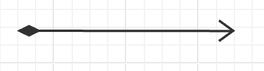

```js
// 定义腿部类
class Leg {
  move() {
    console.log('腿在移动');
  }
}

// 定义毛毛虫类
class Caterpillar {
  constructor() {
    this.leg = new Leg();  // 创建毛毛虫时创建腿部，并控制腿部的生命周期
  }

  die() {
    // 当毛毛虫死亡时，腿部也不再能移动
    this.leg = null;
    console.log('毛毛虫死了');
  }
}

// 使用示例
const caterpillar = new Caterpillar();
caterpillar.die();
```

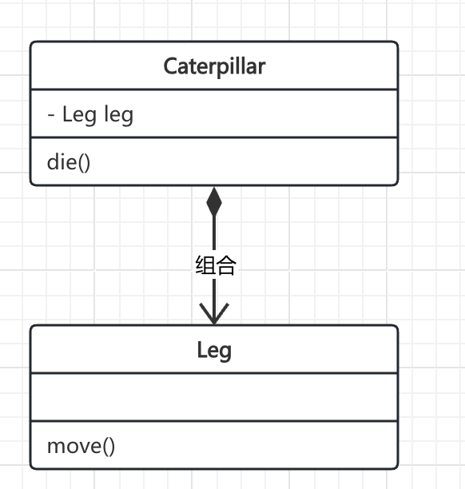
