# vscode 常用插件

| 插件 | 功能 | 官网 |
| --- | --- | --- |
| 插件 | 功能 | 官网 |
| Git History | Git History, Search and More (including git log) |https://marketplace.visualstudio.com/items?itemName=donjayamanne.githistory|
| Git Project Manager | Git Project Manager (GPM) is a Microsoft VSCode extension that allows you to open a new window targeting a git 
repository directly from VSCode window. |https://marketplace.visualstudio.com/items?itemName=felipecaputo.git-project-manager|
| GitLens —Git supercharged | GitLens supercharges the Git capabilities built into Visual Studio Code. It helps you to visualize code authorship at a glance via Git blame annotations and code lens, seamlessly navigate and explore Git repositories, gain valuable insights via powerful comparison commands, and so much more. |https://marketplace.visualstudio.com/items?itemName=eamodio.gitlens|
| Jest | Jest测试辅助工具 |https://marketplace.visualstudio.com/items?itemName=Orta.vscode-jest) |
| open in browser | This allows you to open the current file in your default browser or application. |https://marketplace.visualstudio.com/items?itemName=techer.open-in-browser|

| gitlab-workflow | 代码review |  |

## Project Manager
> 用于多个项目之间的快速切换

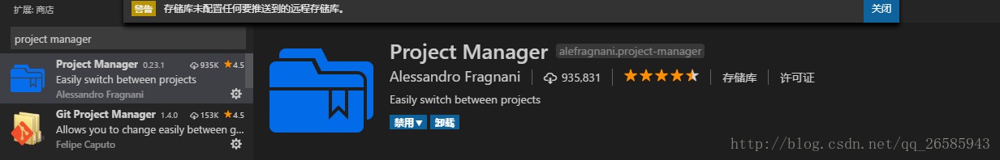

输入：>`Project Manager:Edit Projects`，打开`project.json`,配置工程名和路径

```js
[
    {
        "name": "GitHubTest",
        "rootPath": "E:/RNworkspace/GitHubTest",
        "paths": [],
        "group": ""
    },
    {
        "name": "HelloReact",
        "rootPath": "E:/RNworkspace/HelloReact",
        "paths": [],
        "group": ""
    }

]
```

然后在PROJECTS/Favorites中切换项目：

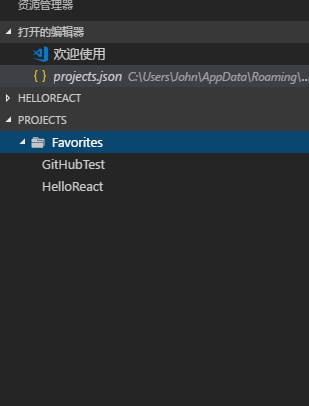


## EditorConfig

> EditorConfig 通过在工程中增加一个配置文件以及安装对应的插件，实现在不同编辑器和 IDE 保持工程中代码文件编码格式的一致性，EdEitorConfig的配置文件具有良好的可读性，并能很好的和版本控制系统一起协作

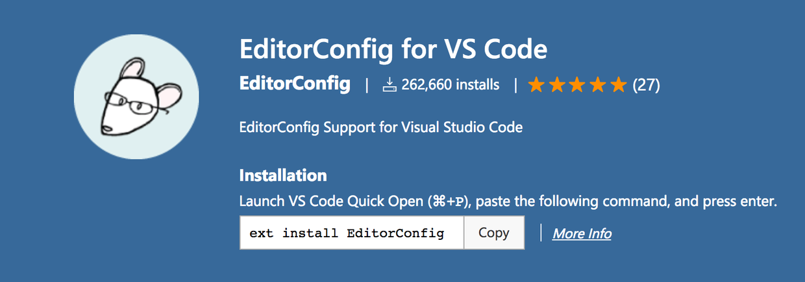

## Path autocomplete

> 在 VS Code 中支持自动补全文件路径名的插件。


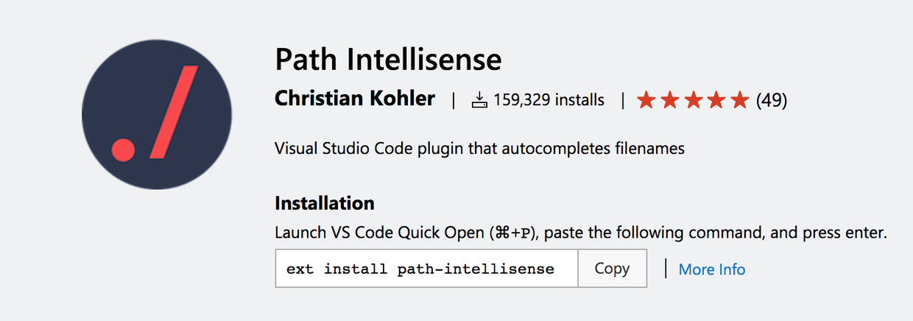

## project-tree

> ctrl+shift+p and enter `Project Tree` to enter. Generate a tree structure of the project in README.md.

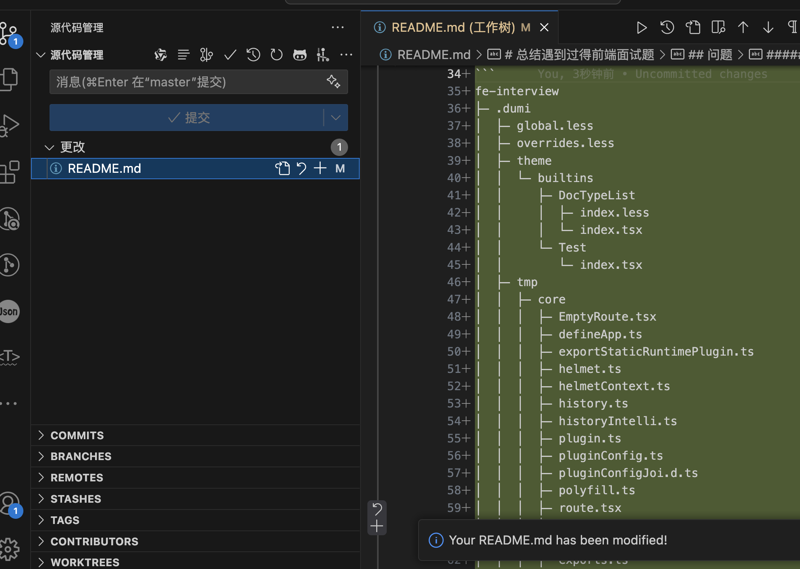


## Ascii Tree Generator

> 生成文件目录树

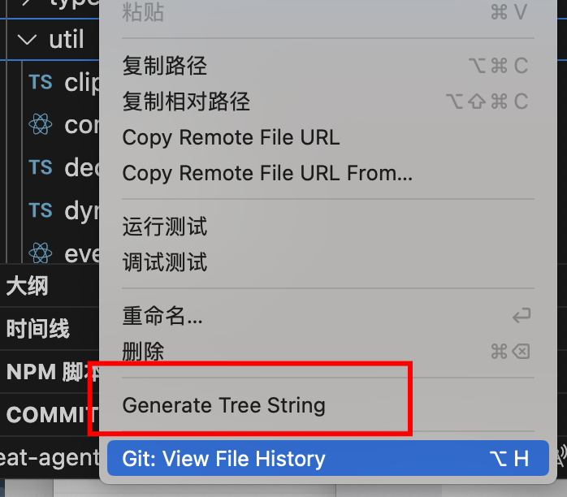

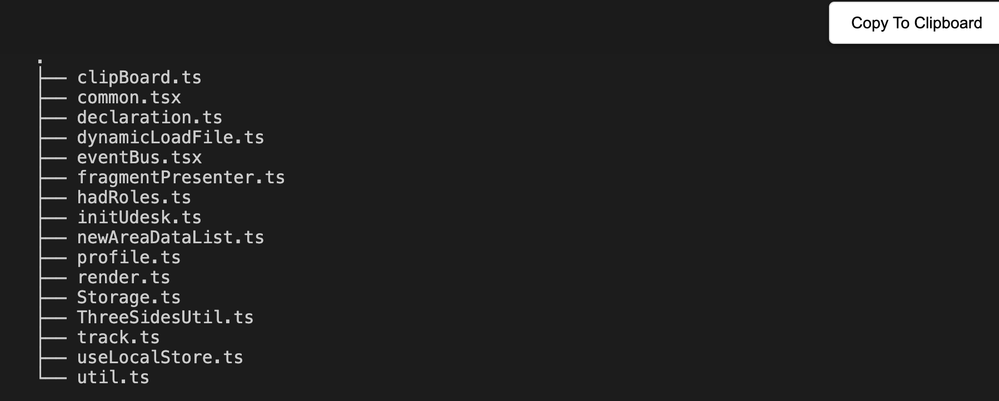


## Rainbow Brackets

在 React Native 开发中经常会存在多种括号混合使用，为了能够更好的区分，这个插件支持不同类型的括号进行彩色着色，支持圆括号，方括号和花括号。


## Git Blame

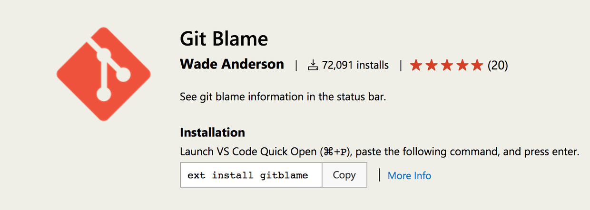

在团队多人协作开发过程中，我们通常需要知道某行代码最近一次是谁修改的，Git Blame 插件就提供了这么一个便利的功能。

## Document This

> 在 VS Code 中支持在 TypeScript 和 JavaScript 文件中自动生成 JSDoc 注释的插件。

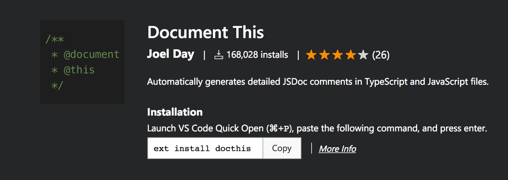


##  Color Highlight

> 代码中经常会出现设置颜色，通常是用十六进制格式来表示一个颜色值，例如 #EB6066，但这个值对开发者而言是没有意义的，我们看不出来到底对应的是什么颜色，这个插件帮忙开发者在 VS Code 中支持十六进制格式的颜色进行预览。

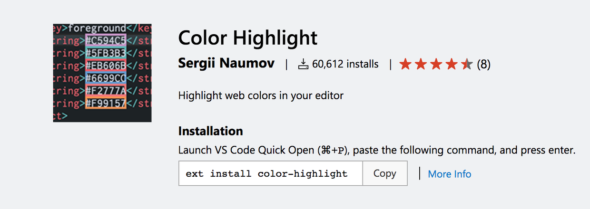


##  Auto Rename Tag

> 提高开发效率的插件，在 VS Code 中支持重命名 HTML/XML 对应标签。

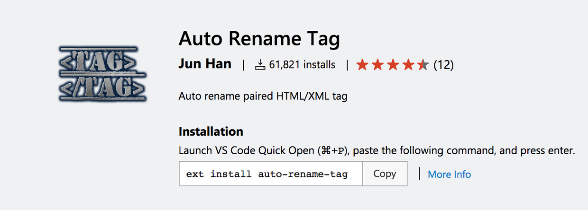


## Auto Close Tag

> 提高开发效率的插件，在 VS Code 中支持自动补全 HTML/XML 关闭标签。

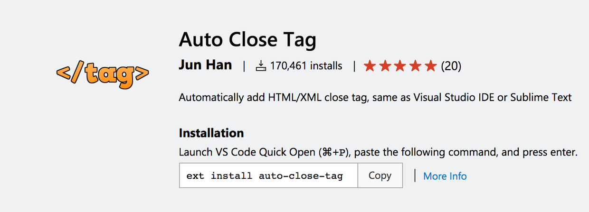


## Prettier 

> 每个公司每个团队都有自己的编码规范，而代码格式化功能是提高开发者输出符合规范代码效率的工具，这个插件是在 VS Code 中支持 Prettier 的插件，Prettier11 是一个 Javascript 代码的格式化工具。


https://prettier.io/ 

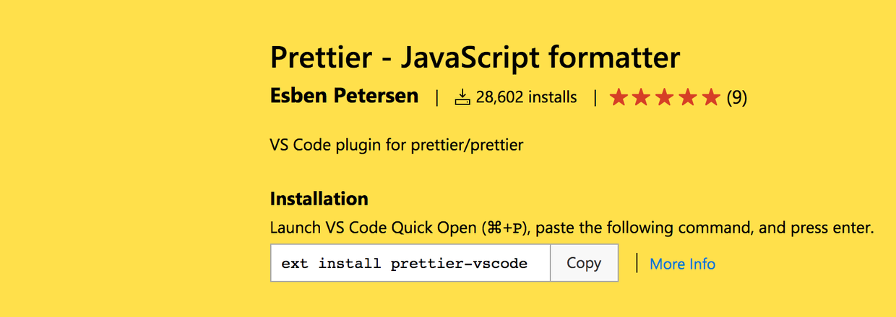


## ESLint
> 静态代码检查主要用来对代码的编程规范，语法错误等进行扫描，从而在代码执行之前发现可能存在的问题。

https://eslint.org/

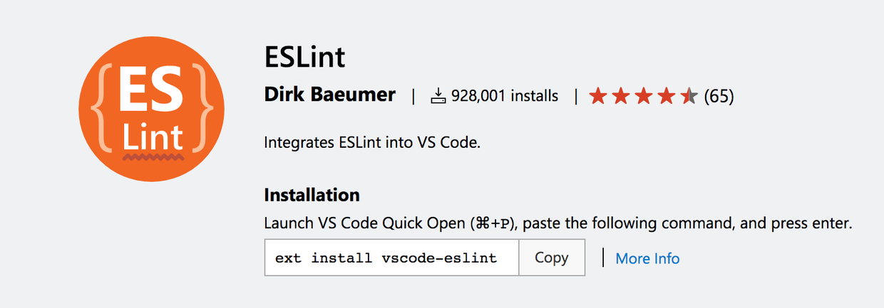


## React Native Tools

> 微软官方为 React Native 开发提供的专门的插件，按照官网的说明进行插件的安装即可。这个插件使得开发者可以在 VS Code 中调试 React Native 代码，快速执行 react-nativ命令，以及对 React Native 的 API 具备智能提醒功能


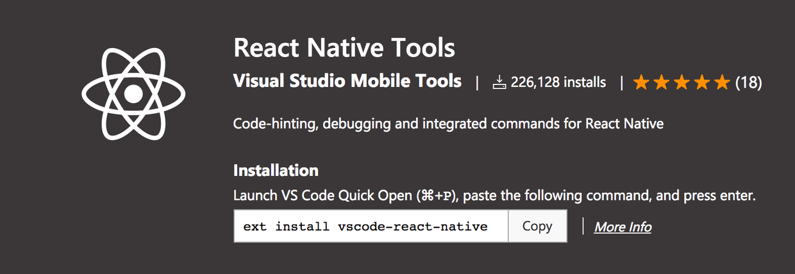


## codesnap

> 好看的代码截图


## 通义灵码

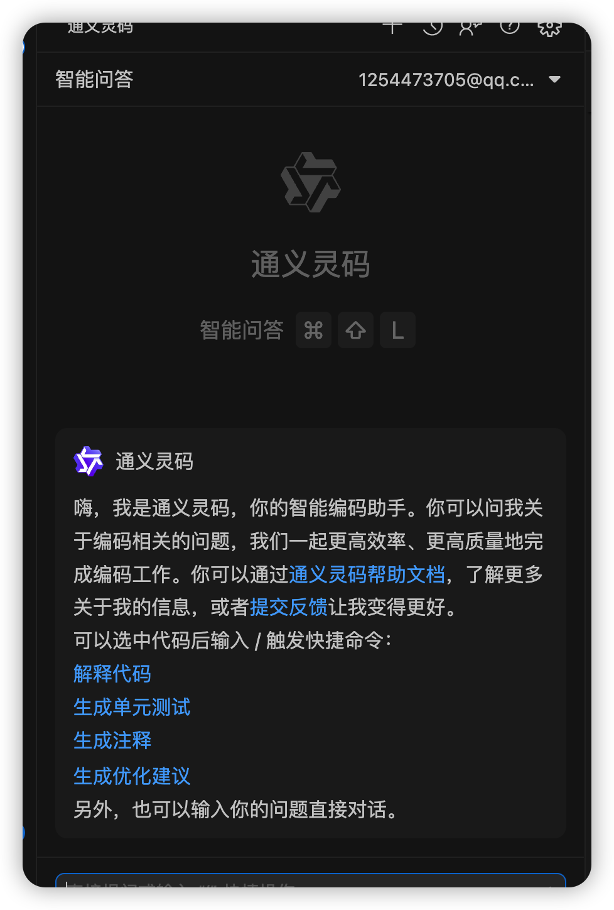


## TODO Highlight

> 在 VS Code 中支持 TODO:，FIXME: 等类型注释关键词高亮的插件。

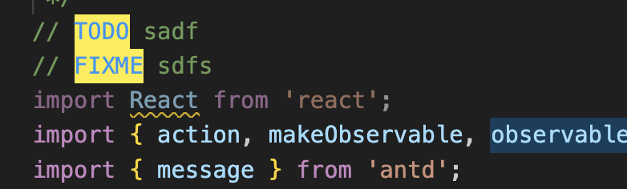

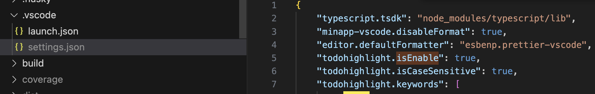


```json
{
    "typescript.tsdk": "node_modules/typescript/lib",
    "minapp-vscode.disableFormat": true,
    "editor.defaultFormatter": "esbenp.prettier-vscode",
    "todohighlight.isEnable": true,
    "todohighlight.isCaseSensitive": true,
    "todohighlight.keywords": [
        "DEBUG",
        "REVIEW",
        "FIXME",
        "TODO",
    ],
    "todohighlight.include": [
        "**/*.js",
        "**/*.jsx",
        "**/*.ts",
        "**/*.tsx",
        "**/*.html",
        "**/*.php",
        "**/*.css",
        "**/*.scss"
    ],
    "todohighlight.exclude": [
        "**/node_modules/**",
        "**/bower_components/**",
        "**/dist/**",
        "**/build/**",
        "**/.vscode/**",
        "**/.github/**",
        "**/_output/**",
        "**/*.min.*",
        "**/*.map",
        "**/.next/**"
    ],
}
```

插件开发：
[https://juejin.cn/post/7033293116585017374](https://juejin.cn/post/7033293116585017374)
