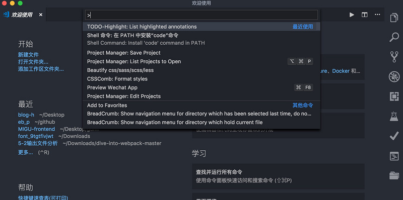

[toc]

# 1. 基础介绍

命令面板是 VSCode 快捷键的主要交互界面，可以使用 `Cmd+Shift+P` 打开。

在命令面板中你可以输入命令进行搜索（中英文都可以），然后执行。命名面板中可以执行各种命令，包括编辑器自带的功能和`插件`提供的功能。

# 2. 快捷键

- **全文搜索**：`command+shift+f`
- **当前文件搜索**：`command+f`
- **查看错误信息**：`command+shift+m`
- **启动调试**：`command+shift+d`
- **移动到行首**：`Cmd+左方向键`
- **移动到行尾**：`Cmd+右方向键`
- **移动到文档的开头和末尾**：`Cmd+上下方向键`
- **选择当前行光标左右内容**：`cmd+shift+左右方向键`
- **回到上一个光标的位置**：`Cmd+U`
- **在不同的文件之间回到上一个光标的位置**：`Control+-`
- **切换打开的文件**：`cmd+shift+[ 或 ]`

## 文本选择

- **选中单词**：`Cmd+D`
- 对于代码块的选择没有快捷键，可以使用 `cmd+shift+p` 打开命令面板，输入“`选择括号所有内容`” 或者“`select to bracket`”**

## 删除

- **删除方式是**：`Cmd+Shift+K`
- `ctrl+x`剪切

## 代码移动

- **移动当前光标所在行代码位置**：`Option+上下方向键`
- **代码移动的同时按住 shift 就可以实现代码复制**：`Option+Shift+上下`

## 添加注释

- **单行注释**：`Cmd+/`
- **块注释**：`Option+Shift+A`

## 代码格式化

- **对整个文档进行格式化**：`Option+Shift+F`
- **对选中代码进行格式化**：`Cmd+K 后再按下 Cmk+F`

## 代码缩进

- **选中代码缩进调节**：`Cmd+]`、`Cmd+[`分别是减小和增加缩进

## 使用键盘快捷键选择一竖行：

- Windows/Linux 系统可以使用键盘组合`Ctrl+Shift+Alt+方向键（上下左右）`来移动光标选择竖行。
- macOS 系统可以使用键盘组合`Option+Command+方向键（上下左右）`来移动光标选择竖行。
