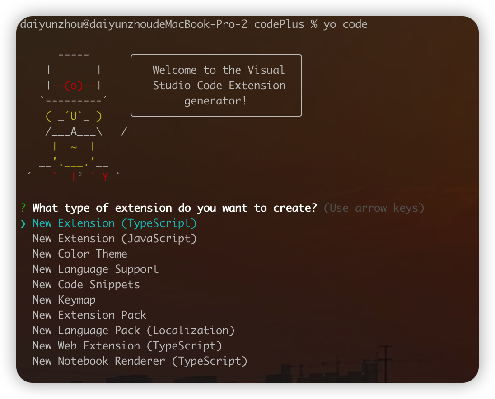
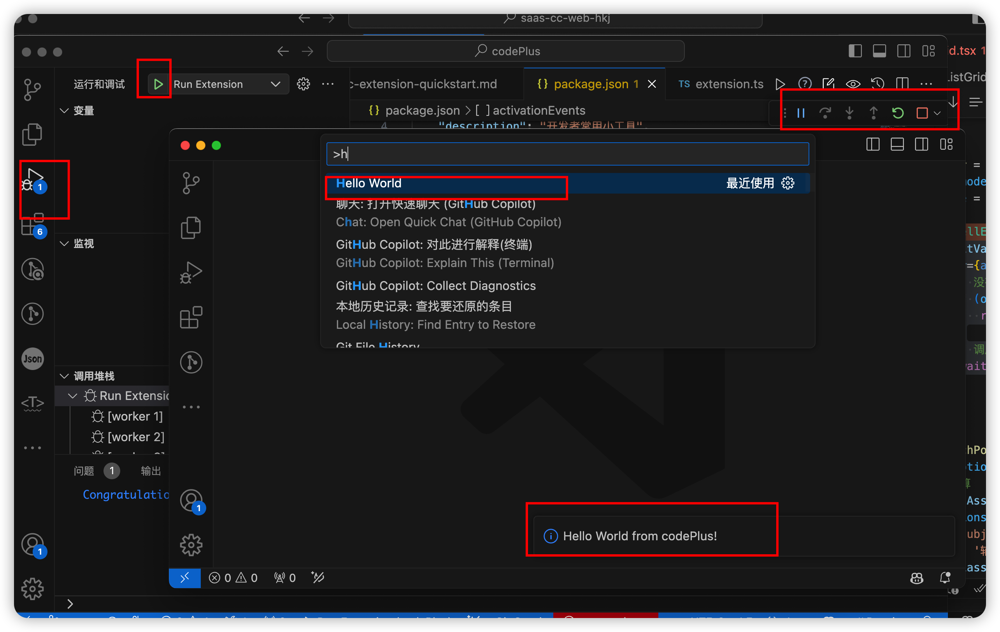

# 开发 codePlus 

参考：https://zhuanlan.zhihu.com/p/71693080

## 环境准备

+ nodejs 建议使用 LTS 版本
+ yeoman 脚手架工具

```sh
npm install -g yo
```

+ generator-code VSCode代码生成器

```sh
npm install -g generator-code
```
## 初始化插件目录

终端运行 **yo code**，按照提示生成目录即可。



推荐使用TypeScript

执行后会提示几个问题：
第一个问题我们选择 New Extension (TypeScript)，创建使用TypeScript开发的扩展插件。（可以使用 yo code 来创建插件、主题、语言支持、代码片段、语言支持、键盘映射、插件包）


## VSCode打开刚生成的插件项目

+ **extension.js** 是插件的入口文件

+ **package.json** 包含插件的配置信息（插件命令、快捷键、菜单均在此配置）

## 验证项目是否可以运行

在VSCode中运行Debug,如果你可以看到VSCode又启动了一个窗口运行插件项目,command+shift+p 输入Hello World如果在右下角能看到Hello World的提示信息就OK 了。




