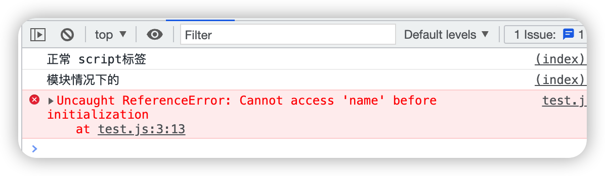

# 12. 前端模块化

## 一、模块化简述

把`复杂代码`按`功能`的不同`划分`成不同的模块`单独维护`，提高开发效率，降低维护成本`模块化只是思想、理论，不包含具体实现`;

## 二、模块化的演进

### **第一阶段**：

基于文件划分模块，将功能和相关状态数据放到不同文件中，每个文件就是一个独立模块。使用模块时，将其引入页面并直接调用其中的成员。

**缺点**：模块都在全局工作，没有私有空间，成员可在外部被访问或修改，易产生命名冲突，无法管理模块依赖关系。

### **第二阶段**
每个模块暴露一个全局对象，模块成员挂载到该对象中。
    - **缺点**：仍没有私有空间，成员可在外部被访问或修改，无法管理模块依赖关系。
### **第三阶段**
使用立即执行函数表达式为模块提供私有空间，将模块成员放在函数的私有作用域中，需要暴露的成员挂在到全局对象上。
**优点**：有了私有成员的概念，私有成员只能在模块内通过闭包访问。

### **第四阶段**
利用立即执行函数的参数传递模块依赖项。

**优点**：模块之间的关系更加明显。
### **第五阶段**
模块化规范出现，如 Require.js 的 AMD、CommonJS、CMD 等。

## 三、模块化规范的出现

### CommonJS 规范
> 由 Node.js 提出

`CommonJS` 主要运行于`服务器端`，该规范指出，一个单独的文件就是一个模块。

`Node.js`为主要实践者，它有四个重要的环境变量为模块化的实现提供支持：`module`、`exports`、`require`、`global`。

- `require` 命令用于输入其他模块提供的功能，`require` 引入模块的`位置不同`会对输出`结果产生影响`，并且会生成值的拷贝;
- `module.exports`命令用于规范模块的对外接口，输出的是一个值的拷贝，输出之后`就不能改变了`，会缓存起来,重复`引入的模块并不会重复执行`，再次获取模块只会获得之前获取到的`模块的缓存`;
- `CommonJS` 以`同步模式`加载模块，在 Node.js 中没问题，因为 `Node.js 是启动时加载模块`，执行过程中不需要加载只需使用。但在浏览器端，页面加载时会出现`大量同步请求`，`效率较低`。所以就有了 AMD  CMD 解决方案。

**案例：**
```js
// 模块 a.js
const name = 'sssss'
module.exports = {
    name,
    github: 'https://github.com/xxxx'
}
```
**使用：**
```js
// 模块 b.js
// 引用自定义模块可以省略.js
const { name, github } = require('./a');
console.log(name, github);
// 输出 sssss https://github.com/xxxx
```

#### **CommonJS 的值拷贝**

**a.js**
```js
const b = require('./b');
console.log(b.age);
setTimeout(() => {
  console.log(b.age);
  console.log(require('./b').age);
}, 100);
```
**b.js**
```js
let age = 1;
setTimeout(() => {
  age = 18;
}, 10);
module.exports = {
  age
}
```
**执行：node a.js**
```js
// 1
// 1
// 1
```
### AMD

`AMD`是`"Asynchronous Module Definition"`的缩写，意思就是`"异步模块定义"`。

它采用`异步方式加载模块`，模块的加载`不影响`它后面语句的运行。

所有`依赖`这个模块的语句，都定义在一个`回调函数`中，等到加载完成之后，这个回调函数才会运行。

其中`RequireJS` 是最佳实践者。

**模块功能主要的几个命令：**
- `define`
define是`全局函数`，用来定义模块,`define(id?, dependencies?, factory)`。
- `require`
require命令用于输入其他模块提供的功能
- `return`
return命令用于规范模块的对外接口
- `define.amd`。
define.amd属性是一个对象，此属性的存在来表明函数遵循AMD规范。

**优势：** 目前绝大多数第三方库都支持 AMD 规范。
**缺点：** 使用复杂，模块划分细致，模块 JS 文件请求频繁。

**依赖前置、提前执行，通过数组引入依赖 ，回调函数通过形参传入依赖**
```js
// 定义模块
define(['jquery'], function($) {
  // 模块定义函数
  function myModule() {
    console.log('Hello, AMD!');
  }
  return myModule;
});
```
### CMD

`CMD(Common Module Definition - 通用模块定义)`规范主要是`Sea.js`推广中形成的，一个文件就是一个模块，可以像`Node.js`一般书写模块代码。主要在浏览器中运行，当然也可以在`Node.js`中运行。

它与`AMD`很类似，不同点在于：
- AMD 推崇依赖前置、提前执行
- CMD 推崇依赖就近、延迟执行。

**推崇依赖就近、延迟执行**
```js
// 定义模块
define(function(require, exports, module) {
  // 加载依赖模块
  var $ = require('jquery');

  // 模块定义函数
  function myModule() {
    console.log('Hello, CMD!');
  }

  module.exports = myModule;
  // 或者（但不建议同时使用）
  // exports.myModule = myModule;
});
```
### UMD
`UMD(Universal Module Definition - 通用模块定义)模式`，该模式主要用来`解决CommonJS模式和AMD模式`代码不能通用的问题，并同时还支持老式的全局变量规范。

- 判断`module`是否为一个对象，并且是否存在`module.exports`来判断是否为`CommonJS`规范
- 判断`define`为函数，并且是否存在`define.amd`，来判断是否为`AMD`规范,
- 如果以上两种都没有，设定为`原始`的代码规范。

**示例:**
```js
// bundle.js
(function (global, factory) {
    typeof exports === 'object' && typeof module !== 'undefined' ? module.exports = factory() :
        typeof define === 'function' && define.amd ? define(factory) :
            (global = global || self, global.myBundle = factory());
}(this, (function () {
    'use strict';
    var main = () => {
        return 'hello world';
    };
    return main;
})));
```
**使用：**

```html
// index.html
<script src="bundle.js"></script>
<script>
  console.log(myBundle());
</script>
```

## 四、模块化默认规范

- 浏览器环境使用 ES Modules
- nodejs 使用 CommonJS

## 五、关于 ES Modules

通过给 script 添加 type = module 的属性，在浏览器中使用 ES Modules

```html
<script type="module" src="./main.mjs"></script>
<script type="module"></script>
```

1. `ESM` 自动采用`严格模式`，忽略 'use strict'
2. 每个 ES Module 都是运行在单独的`私有作用域`中
3. `ESM` 是通过 `CORS` 的方式请求外部 JS 模块的
4. `ESM` 的 `script` 标签会延迟执行脚本

对于我们前端平时开发，其实用得最多的是`es modules`，这里也简单介绍一下这种规范的一些常用写法

> 模块默认情况下是延迟的,因此你还可以使用 `defer` 的方式延迟你的 `nomodule` 脚本:

```html
<script type="module">
    console.log("模块情况下的");
</script>
<script src="./index.js"></script>
<script>
    console.log("正常 script标签");
</script>
```


```html
<script type="module">
    console.log("模块情况下的");
</script>
<script src="./index.js" defer></script>
<script>
    console.log("正常 script标签");
</script>
```


> 在浏览器中,引入相同的`nomodule` 脚本会被执行多次,而模块只会被执行一次:

```html
<script src="./foo.js"></script>
<script src="./foo.js"></script>

<script type="module" src="./main.js"></script>
<script type="module" src="./main.js"></script>
<script type="module" src="./main.js"></script>
```


## 六、 模块的默认延迟

> 默认情况下,`nomodule` 脚本会阻塞 `HTML` 解析。你可以通过添加 `defer` 属性来解决此问题,该属性是等到 `HTML` 解析完成之后才执行。


- `defer` 和 `async` 是一个可选属性,他们只可以选择其中一个,在 `nomodule` 脚本下,`defer` 等到 `HTML` 解析完才会解析当前脚本,而 `async` 会和 `HTML` 并行解析,不会阻塞 `HTML` 的解析,模块脚本可以指定 `async` 属性,但对于 `defer` 无效,因为模块默认就是延迟的。

- 对于`模块脚本`,如果存在 `async` 属性,模块脚本及其所有依赖项将于`解析并行获取`,并且模块脚本将在它可用时进行立即执行。

## 七、ES Modules 导出

> 单个导出

```js
export const name = 'foo module'
export function hello () {
    console.log('hello')
}
```

> 合并导出

```js
const name = 'foo module'
function hello () {
    console.log('hello')
}
class Person {}
export { name, hello, Person }
```

> 合并导出，且重命名

```js
const name = 'foo module'
function hello () {
    console.log('hello')
}
class Person {}
export {
    name1: name,
    hello2: hello,
    Person3: Person
}
```

> 默认导出

```js
const name = 'foo module'
function hello () {
    console.log('hello')
}
class Person {}

export default name;
```

> 导出语句必须在模块顶级,不能嵌套在某个块中（报错）:

```js
if(true){
  export {...};
}
```

- ⚠️`ES Modules` 导入导出的注意事项 导出字面量和导出模块的区别

**导出字面量(如:对象):**
```js
export default { name, age };
// 注意: 
import {name, age} from 'modulename'
// 导入模块无法使用到name和age的值

import modulename from 'modulename'
// 导入模块可以使用到name和age的值，modulename.name 和 modulename.age
```

**导出模块:**
```js
export { name, age };
import {name, age} from 'modulename';
// 导入模块可以使用到name和age的值
// 原因：import导入的是对模块内部的使用
```

**导出模块的引用**
> 注意：`export` 暴露的是模块的引用关系(地址)，并且`只读`不可修改(尝试修改会报错误---`Uncaught TypeError:Assignment to constant variable`)

#### ES modules 的值的引用
**a.js**
```js
import { age } from './b.js';

console.log(age);
setTimeout(() => {
    console.log(age);
    import('./b.js').then(({ age }) => {
        console.log(age);
    })
}, 100);
```
**b.js**
```js
export let age = 1;

setTimeout(() => {
    age = 2;
}, 10);
```
**执行a.js结果：**
```js
// 1
// 2
// 2
```
#### 注意点

1. `CommonJS` 中是先将模块整体导入为一个对象，然后从对象中结构出需要的成员
```js
const { name, age } = require('./module.js');
```
2. `ES Module` 中 `{}` 是固定语法，就是直接提取模块导出成员
```js
import { name, age } from './module.js';
```
3. 导入成员并不是复制一个副本，而是直接导入模块成员的引用地址，也就是说 `import` 得到的变量与 `export` 导入的变量在`内存中`是同一块空间。一旦模块中成员修改了，这里也会同时修改
4. 导入模块成员变量是只读的
```js
name = 'tom' // 报错
```
5. 导入的是一个对象，对象的属性读写不受影响 
```js
name.xxx = 'xxx' // 正常
```
如：


## 八、ES Modules 导入

#### 导入文件路径

1. 需要引用的名称
2. 相对路径上的`./`不能省略
3. 可以使用`绝对路径`和`完整的url`

#### 导入模块时是否提取模块成员

1. 导入模块并提取模块成员 
```js
import {} from './module.js';
```
2. 导入模块暂不提取模块成员;(导入不需要外界控制的子功能模块时很有用)
```js
import './module.js';
```

#### 同时导入模块多个成员或所有成员

```js
import * as mod from './module.js'
```
需要把所有提取成员放到一个对象当中，通过 `as`,导入的成员都会作为对象属性出现

#### 动态导入模块(在需要满足某些条件才能导入时可用)

- 标准用法的 `import` 导入的模块是`静态的`，会使所有被`导入的模块`，在`加载时就被编译`（无法做到按需编译，降低首页加载速度）。
- 有些场景中，你可能希望根据条件导入模块或者按需导入模块，这时你可以使用`动态导入代替静态导入`。
- 关键字`import` 可以像调用函数一样来动态的导入模块。以这种方式调用，将返回一个 `promise`。

> `import ('./module.js')` 返回的是 `promise` 取模块成员的方式:

```js
import('./module.js').then(function (module) {
    //所有模块成员都在module参数里
})
```

同时导入命名成员和默认成员

```js
import { name, age, default as other} from './module.js'
```

或者

```js
import other,{ name, age} from './module.js';
```

other 代表 module 模块`所有默认导出`的成员

> 由于 `import` 是静态执行，所以不能使用表达式和变量，这些只有在运行时才能得到结果的语法结构。

```js
// 错误
import { 'b' + 'ar' } from './foo.js';

// 错误
let module = './foo.js';
import { bar } from module;

// 错误
if (x === 1) {
  import { bar } from './foo.js';
} else {
  import { foo } from './foo.js';
}
```

#### ES Modules in Node.js

`ES Module` 中可以导入 `CommonJS` 模块

#### CommonJS 模块始终只会导出一个默认成员

**commonjs.js**

```js
module.exports = {
    foo: 'commonjs exports value'
}
exports.foo = 'commonjs exports value'
```

不能在 `CommonJS` 模块中通过 `require` 载入 `ES Module`

```js
const mod = require('./es-module.mjs')
console.log(mod);
```

#### ES Modules in Node.js - 与 CommonJS 的差异

示例:

```js
// 加载模块函数
console.log(require)

// 模块对象
console.log(module)

// 导出对象别名
console.log(exports)

// 当前文件的绝对路径
console.log(__filename)

// 当前文件所在目录
console.log(__dirname)
```

1、`ESM` 中无法引用 `CommonJS` 中的那些模块全局成员

2、`require`, `module`,`exports` 可通过 `import` 和 `export` 代替

3、`filename` 和`dirname` 通过 `import` 对象的 `meta` 属性获取

```js
const currentUrl = import.meta.url
console.log(currentUrl)
// 通过 url 模块的 fileURLToPath 方法转换为路径
import { fileURLToPath } from 'url'
import { dirname } from 'path'
const __filename = fileURLToPath(import.meta.url)
const __dirname = dirname(__filename)
console.log(__filename)
console.log(__dirname)
```

#### ES Modules in Node.js - 新版本进一步支持

1. Node v12 之后的版本，可以通过 `package.json` 中添加`type` 字段为 `module`， 将默认模块系统修改为 `ES Module` 此时就不需要修改文件扩展名为 `.mjs` 了

2. 如果需要在 `type=module` 的情况下继续使用 `CommonJS`， 需要将文件扩展名修改为 `.cjs`

package.json:

```js
{ "type": "module" }
```

#### ES Modules in Node.js - Babel 兼容方案

1. 安装 `babel:yarn add @babel/node @babel/core @babel/preset-env --dev`
2. 运行 `babel-node` 测试:`yarn babel-node index.js --presets=@babel/preset-env`

**.babelrc 配置**

```js
{ "plugins": [ "@babel/plugin-transform-modules-commonjs" ] }
```

#### Tree-shaking

> `Tree shaking` 是得益 `ES modules` 的发展的产物。

##### 什么是tree shaking
这个概念是Rollup提出来的。Rollup推荐使用ES2015 Modules来编写模块代码，这样就可以使用Tree-shaking来对代码做静态分析消除无用的代码。

- 1.没有使用额外的模块系统，直接定位import来替换export的模块
- 2.去掉了未被使用的代码

**tree shaking 的实际例子**

```js
// main.js
import * as utils from './utils';
const array = [1,2,3,1,2,3]
console.log(utils.arrayUnique(array));
```
`Tree shaking` 和 `没有Tree shaking` 打包对比。


`没有 Tree-shaking 的情况下`，会将 utils 中的所有文件`都进行打包`，使得体积暴增。

##### ES Modules 为什么能 Tree-shaking:
1. `import` 只能作为模块顶层的语句出现，不能出现在 `function` 里面或是 `if` 里面。
2. `import` 的模块名只能是字符串常量。
3. 不管 `import` 的语句出现的位置在哪里，在模块初始化的时候所有的 `import` 都必须已经导入完成。
4. `import binding` 是 `immutable` 的，类似 `const`。比如说你不能 `import { a } from ‘./a’` 然后给 `a` 赋值个其他什么东西。

##### tree shaking 应该注意"副作用"

**什么是副作用?**
```js
// effect.js
console.log(unused());
export function unused() {
    console.log(1);
}
```
```js
// index.js
import {unused} from './effect';
console.log(42);
```

此例子中 `console.log(unused()); 就是副作用`。

在 `index.js` 中`并不需要`这一句 console.log。而 `rollup` 并不知道这个全局的函数`去除是否安全`。因此在打包地时候你可以`显示`地指定`treeshake.moduleSideEffects` 为 `false`，可以显示地告诉 `rollup` 外部依赖项没有其他副作用。

不指定的情况下的打包输出。 
`npx rollup index.js --file bundle.js`

```js
console.log(unused());

function unused() {
    console.log(1);
}
console.log(42);
```
指定没有副作用下的打包输出。
`npx rollup index.js --file bundle-no-effect.js --no-treeshake.moduleSideEffects`
```js
console.log(42);
```
## 九. 总结

#### 什么是前端模块化吧?

模块化的开发方式可以提高代码复用率，方便进行代码的管理。通常一个文件就是一个模块，有自己的作用域，只向外暴露特定的变量和函数。

#### 模块化有哪几种标准？

目前流行的 js 模块化规范有 `CommonJS`、`AMD`、`CMD` 以及 `ES6` 的模块系统

#### ES Modules 和 CommonJS 的一些区别

1. `CommonJs` 导出的是一个`值拷贝`，会对加载结果进行缓存，一旦`内部再修改这个值`，则`不会同步到外部`;`ESModule` 是导出的一个`引用`，内部修改`可以同步到外部`;
2. `CommonJs` 是`运行时加载`模块，`ESModule` 是在`静态编译期间`就`确定`模块的`依赖`;
3. `CommonJS` 模块的 `require()` 是`同步加载`模块，`ES6` 模块的 `import` 命令是`异步加载`，`有`一个独立的`模块依赖的解析阶段`。
4. 使用语法层面，`CommonJs` 是通过 `module.exports，exports` 导出，`require` 导入；`ESModule` 则是 `export` 导出，`import` 导入;
5. `ESModule` 在编译期间会将所有 `import` 提升到顶部，`CommonJs` 不会提升 `require`;
6. `CommonJs` 中顶层的 `this` 指向这个`模块本身`，而 `ESModule` 中顶层 `this` 指向 `undefined`;
7. `CommonJS` 加载的是`整个模块`，将所有的接口全部加载进来，`ESModule` 可以单独加载其中的`某个接口`;

#### Es module 是如何解决循环引用的

在 `Es Module` 中有 `5 种状态`，分别为 `unlinked`、`linking`、`linked`、`evaluating` 和 `evaluated`，用`循环模块`记录(Cyclic Module Records)的 `Status` 字段来表示,正是通过这个字段来判断模块`是否被执行过`,每个模块`只执行一次`。

这也是`为什么`会使用 `Module Map` 来进行`全局缓存` `Module Record` 的原因了,如果一个模块的状态为 `evaluated`,那么下次执行则会`自动跳过`,从而包装`一个模块只会执行一次`。 

`Es Module` 采用 **深度优先** 的方法对`模块图`进行`遍历`,每个`模块只执行一次,这也就避免了死循环的情况了`。

**深度优先搜索算法:**

**深度优先搜索算法**（英语：Depth-First-Search，DFS）是一种用于`遍历或搜索树或图`的算法。这个算法会尽`可能深地搜索树的分支`。当节点 `v` 的所在边都己被探寻过，搜索将回溯到发现节点 `v` 的那条边的起始节点。这一过程一直进行到已发现从源节点可达的所有节点为止。如果还存在未被发现的节点，则选择其中一个作为源节点并重复以上过程，整个进程反复进行直到`所有节点都被访问为止`。


循环引用：initialization 错误,防止死循环



#### CommonJs 特性

1. 模块代码只在加载后运行;
2. 模块只能加载一次;
3. 模块可以请求加载其他模块;
4. 支持循环依赖;
5. 模块可以定义公共接口,其他模块可以基于这个公共接口观察和交互;

#### es module 特性

- `Es Module` 的独特之处在于,既可以通过`浏览器原生加载`,也可以与第三方加载器和构建工具一起加载。
- 支持 `Es module` 模块的浏览器可以从`顶级模块加载整个依赖图`,且是`异步完成`。浏览器会解析入口模块,确定依赖,并发送对依赖模块的请求。这些文件通过网络返回后,浏览器就会解析它们的依赖,如果这些二级依赖还没有加载,则会发送更多请求。
- 这个`异步递归加载过程会持续到整个应用程序的依赖图都解析完成`。解析完成依赖图,引用程序就可以正式加载模块了。
- `Es Module` 不仅借用了 `CommonJs` 和 `AMD` 的很多优秀特性,还增加了一些新行为:

1. Es Module `默认在严格模式`下执行;
2. Es Module `不共享全局命名`;
3. Es Module 顶级的 `this` 的值是 `undefined`(常规脚本是 window);
4. 模块中的 `var` 声明不会添加到 `window` 对象;
5. `Es Module` 是异步加载和执行的;

#### 
CommonJS 同步加载， AMD 异步加载， UMD = CommonJS + AMD , ES Module 是标准规范, 取代 UMD，是大势所趋。Tree-shaking 牢记副作用。
