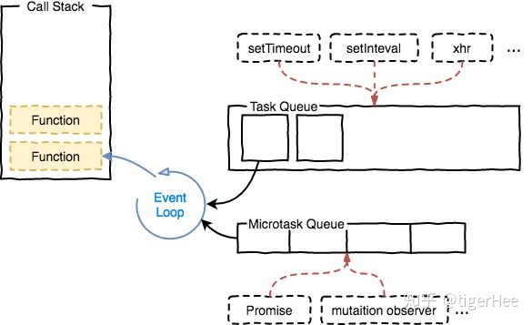
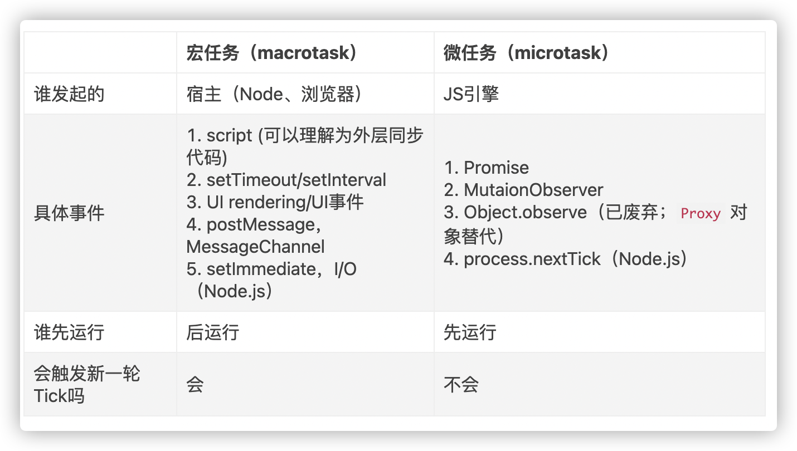
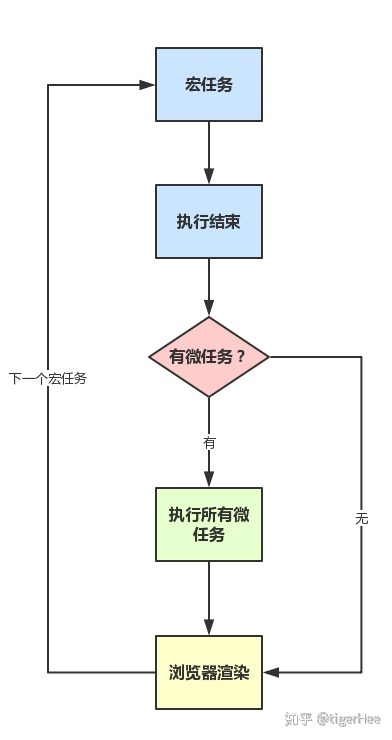

# 14. 宏任务和微任务

[https://zhuanlan.zhihu.com/p/78113300](https://zhuanlan.zhihu.com/p/78113300)
[https://zhuanlan.zhihu.com/p/136366037]
[深入：微任务与 Javascript 运行时环境
](https://zhuanlan.zhihu.com/p/136366037)

https://developer.mozilla.org/zh-CN/docs/Web/API/HTML_DOM_API/Microtask_guide/In_depth

我们先看一到常见的前端面试题：

```
var p1 = new Promise(function(resolve, reject){
    resolve(1);
})
setTimeout(function(){
  console.log("will be executed at the top of the next Event Loop");
},0)
p1.then(function(value){
  console.log("p1 fulfilled");
})
setTimeout(function(){
  console.log("will be executed at the bottom of the next Event Loop");
},0)
```
上例代码执行输出顺序如何？这道题也是本文创作的源泉，其答案是：
```
p1 fulfilled
will be executed at the top of the next Event Loop
will be executed at the bottom of the next Event Loop
```
接下来展开解释输出结果原因，看完本文应该能了解setTimeout和Promise的区别。

### 事件循环
JavaScript 语言的一大特点就是`单线程`，也就是说，同一个时间只能做一件事。为了协调事件、用户交互、脚本、UI 渲染和网络处理等行为，防止主线程的不阻塞，Event Loop 的方案应用而生。Event Loop 包含两类：一类是基于 [Browsing Context](https://link.zhihu.com/?target=https%3A//html.spec.whatwg.org/multipage/browsers.html%23browsing-context)，一种是基于 [Worker](https://link.zhihu.com/?target=https%3A//www.w3.org/TR/workers/%23worker)。二者的运行是独立的，也就是说，`每一个 JavaScript 运行的"线程环境"都有一个独立的 Event Loop`，每一个 Web Worker 也有一个独立的 Event Loop。

## 可执行代码
思考一下，JavaScript代码是如何执行的呢？是一行一行代码执行的吗？当然不是，`JavaScript 引擎一块一块地解析，执行JavaScript代码，而非一行一行进行。`在解析，执行代码块时，会需要有一个前期工作，如变量／函数提升，定义变量／函数。这里所说的代码块，通常称作`可执行代码（execuable code），通常包括全局代码，函数代码，eval执行代码`。而所做的前期工作就是`创建执行上下文`（execution context）。

## 执行上下文栈
每当JavaScript引擎开始执行应用程序时，都会`创建一个执行上下文栈（后进先出）`，用以管理执行上下文。在执行一段可执行代码时，会创建一个执行上下文，然后将其压入栈，执行完毕便将该上下文退栈。

```
function funA() {
    console.log('funA')
}

function funB() {
    funA();
}

function funC() {
    funB();
}

funC();
ECStack.push(<funC> functionContext);

// funC中调用funB，需创建funB执行上下文，入栈
ECStack.push(<funB> functionContext);

// funB内调用funA，入栈上下文
ECStack.push(<funA> functionContext);

// funA执行完毕，退栈
ECStack.pop();

// funB执行完毕，退栈
ECStack.pop();

// funC执行完毕，退栈
ECStack.pop();

// javascript继续执行后续代码
```
另外，所有的代码都是从全局环境开始执行，所以，`必然栈底是全局执行上下文`。

## 异步任务
回顾JavaScript事件循环并发模型，我们了解了`setTimeout`和`Promise`调用的都是`异步任务`，这一点是它们共同之处，也即都是通过`任务队列进行管理／调度`。那么它们有什么区别吗？下文继续介绍。

## 任务队列
`JavaScript通过任务队列管理所有异步任务`，而任务队列还可以细分为`MacroTask Queue`和`MicoTask Queue`两类。

根据规范`事件循环是通过任务队列的机制来进行协调的`。一个 `Event Loop` 中，`可以有一个或者多个任务队列(task queue)`，一个任务队列便是一系列有序任务(task)的集合；每个任务都有一个任务源(task source)，源自`同一个任务源的 task 必须放到同一个任务队列`，`从不同源来的则被添加到不同队列`。`setTimeout/Promise` 等API便`是任务源`，而进入任务队列的是他们指定的具体执行任务。
在事件循环中，每进行一次循环操作称为 `tick`，每一次 `tick` 的任务处理模型是比较复杂的，但关键步骤如下：

- 在此次`tick`中选择最先进入队列的任务(oldest task)，如果有则执行(一次)
- 检查是否存在 `Microtasks`，如果存在则`不停地执行，直至清空 Microtasks Queue`
- 更新 `render`
- 主线程`重复执行`上述步骤

**在上诉tick的基础上需要了解几点：**

- ⚠️JS分为`同步任务`和`异步任务`
- ⚠️**`同步任务都在主线程上执行，形成一个执行栈`**
- 主线程之外，`事件触发`线程`管理着一个任务队列`，只要异步任务`有了运行结果`，就在任务队列之中`放置一个事件`。
- 一旦`执行栈`中的所有`同步任务`执行`完毕（此时JS引擎空闲）`，系统就会`读取任务队列`，将可运行的`异步任务添加到可执行栈中`，开始执行。




#### 宏任务和微任务
ES6 规范中，`microtask[ˈmaɪkrəʊ]` 称为 `jobs`，`macrotask [ˈmækrəʊ]`  称为 `task`;

`宏任务是由宿主发起的，而微任务由JavaScript自身发起。`


## MACROTASK QUEUE宏任务队列

MacroTask Queue（宏任务队列）主要包括`setTimeout`, `setInterval`, `setImmediate`, NodeJS中的`I/O`等。

`requestAnimationFrame`的回调函数可以被看作是与渲染任务紧密相关的一种特殊任务类型，它在渲染流程中起到了关键作用，但并不是严格意义上直接调用 GUI 引擎的渲染任务。既不是宏任务也不是微任务。

```js
script(整体代码)
setTimeout
setInterval
I/O
UI交互事件
postMessage
MessageChannel
setImmediate(Node.js 环境)
```
(macro)task，可以理解是`每次执行栈执行的代码就是一个宏任务`（包括每次`从事件队列中获取一个事件回调并放到执行栈中执行`）。

浏览器为了能够使得JS内部(macro)task与DOM任务能够有序的执行，会`在一个(macro)task执行结束后，在下一个(macro)task 执行开始前，对页面进行重新渲染`，流程如下：

```js
(macro)task->渲染->(macro)task->...
```

## MICROTASK QUEUE

`microtask(微任务)`,可以理解是`在当前 task 执行结束后立即执行的任务`。

也就是说，在`当前task任务后，下一个task之前，在渲染之前`。

所以它的`响应速度相比setTimeout`（setTimeout是task）`会更快`，因为`无需等渲染`。

也就是说`在某一个macrotask执行完后，就会将在它执行期间产生的所有microtask都执行完毕（在渲染前）`。

### MicroTask Queue（微任务队列）主要包括两类：

1. `独立回调microTask`：如Promise，其成功／失败回调函数相互独立；
2. `复合回调microTask`：如 Object.observe, MutationObserver 和NodeJs中的 process.nextTick，不同状态回调在同一函数体；

```js
Promise.then
Object.observe
MutationObserver
process.nextTick(Node.js 环境)
```


## MACROTASK和MICROTASK
> JavaScript将异步任务分为MacroTask和MicroTask，那么它们区别何在呢？

1. 依次`执行同步代码直至执行完毕`；
2. `检查MacroTask 队列`，若`有触发的异步任务`，则`取第一个`并调用其事件处理函数，然后`跳至第三步`，若`没有需处理的异步任务`，则`直接跳至第三步`；
3. 检查MicroTask队列，然后`执行所有已触发的异步任务`，依次执行事件处理函数，直至`执行完毕`，然后`跳至第二步`，若没有需处理的异步任务中，则直接返回第二步，依次执行后续步骤；
4. 最后返回第二步，继续检查MacroTask队列，依次执行后续步骤；
5. 如此往复，若所有异步任务处理完成，则结束；


### 运行机制
在事件循环中，每进行一次循环操作称为 `tick`，每一次 `tick` 的任务处理模型是比较复杂的，但关键步骤如下：

- `执行一个宏任务（栈中没有就从事件队列中获取）`
- 执行过程中如果`遇到微任务，就将它添加到微任务的任务队列中`
- `宏任务执行完毕后，立即执行当前微任务队列中的所有微任务（依次执行）`
- 当前`宏任务执行完毕，开始检查渲染，然后GUI线程接管渲染`
- `渲染完毕后，JS线程继续接管，开始下一个宏任务（从事件队列中获取）`




## 回顾
本文内容介绍基本结束，那么前文第一个题目输出顺序是为什么呢？简单解释一下：

1. 开始执行JavaScript脚本，将任务JavaScript Run入栈macroTask队列；
2. 同步resolve Promise后；
3. 入栈第一个setTimeout任务进入macroTask队列（0ms间隔）;
4. 入栈Promise.then()任务进入microTask队列；
5. 入栈第二个setTimeout任务进入macroTask队列（0ms间隔）；
6. 同步执行代码完毕，退出第一个macroTask，即JavaScript Run;
7. 执行清空microTask；
8. 执行下一个macroTask；

最后，我们以一个题目再次回顾一下内容：

```
setTimeout(function(){
  console.log("will be executed at the top of the next Event Loop")
},0)
var p1 = new Promise(function(resolve, reject){
    setTimeout(() => { resolve(1); }, 0);
});
setTimeout(function(){
    console.log("will be executed at the bottom of the next Event Loop")
},0)
for (var i = 0; i < 100; i++) {
    (function(j){
        p1.then(function(value){
           console.log("promise then - " + j)
        });
    })(i)
}
```
代码输出结果是什么呢？快点确认一下吧：
```
will be executed at the top of the next Event Loop
promise then - 0
promise then - 1
promise then - 2
...
promise then - 99
will be executed at the bottom of the next Event Loop
```

1. 首先`同步执行完所有代码`，其间`注册`了三个`setTimeout异步任务`，`100个Promise异步任务`；
2. 然后`检查MacroTask队列`，取第一个`到期的MacroTask`，执行输出will be executed at the top of the next Event Loop;
3. 然后`检查MicroTask队列`，发现`没有到期的MicroTask，进入第4步`；
4. 再次检查`MacroTask`，`执行第二个setTimeout`处理函数，`resolve Promise`；
5. 然后`检查MicroTask队列`，发现`Promise`已解决，其`异步处理函数均可执行`，依次执行，输出promise then - 0 至promise then - 99；
6. 最后`再次检查MacroTask队列`，执行输出will be executed at the bottom of the next Event Loop
7. 交替往复检查两个异步任务队列，直至执行完毕；
