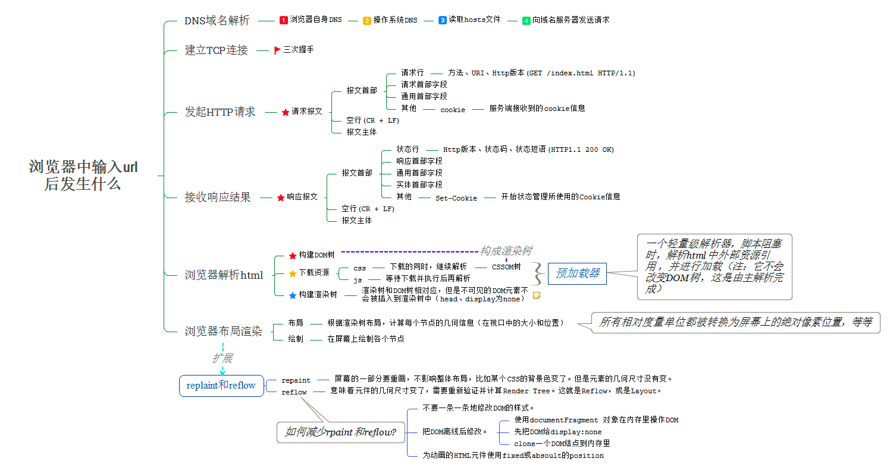

# 15. 在浏览器中输入URL并回车后都发生了什么？

## 一次完整的HTTP事务是怎样的一个过程？（在浏览器中输入 URL 并回车后发生的过程）

**在浏览器中输入 URL 并回车后发生的过程**：

1. **解析 URL**：浏览器对输入的 URL 进行识别，抽取出域名字段；

2. **DNS 解析**：
    - 查询浏览器缓存，若未找到则检查系统缓存和 hosts 文件。
    - 若仍未找到则检查路由器缓存，接着查询 ISP DNS 缓存。
    - 若都不行则进行递归查询，从根域名服务器到顶级域名服务器再到极限域名服务器依次搜索对应目标域名的 IP。

3. **浏览器与网站建立 TCP 连接（三次握手）**：
    - 第一次握手：客户端向服务器端发送请求（SYN=1）等待服务器确认。
    - 第二次握手：服务器收到请求并确认，回复一个指令（SYN=1，ACK=1）。
    - 第三次握手：客户端收到服务器的回复指令并返回确认（ACK=1）。

4. **请求和传输数据**：通过特定请求方法（如 GET）向服务器请求数据，服务器响应后传输相关文件，其中 cookie 可用于保存信息，如首次访问建立用户缓存信息等。

5. **浏览器渲染页面**：
    - 浏览器解析 html 源码，创建 DOM 树，每一个 HTML 标签和文本都有对应节点。
    - 解析 CSS 代码，形成 CSSOM，按照特定顺序渲染样式。
    - 利用 DOM 和 CSSOM 构建渲染树，它与 DOM 树有区别，会忽略一些不需要渲染的元素且每一行文本都是独立节点并存储相应 css 属性。
    - 浏览器根据渲染树将页面绘制到屏幕上。
