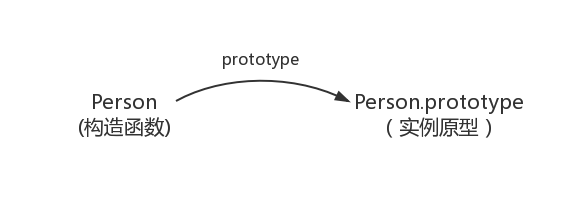
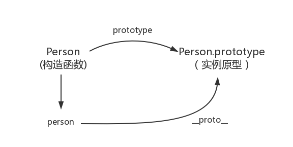
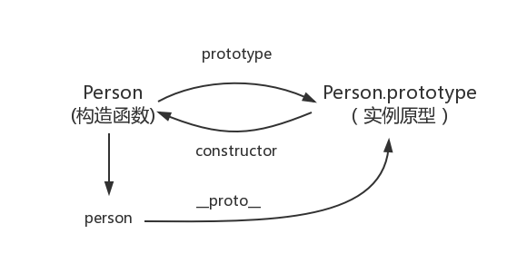
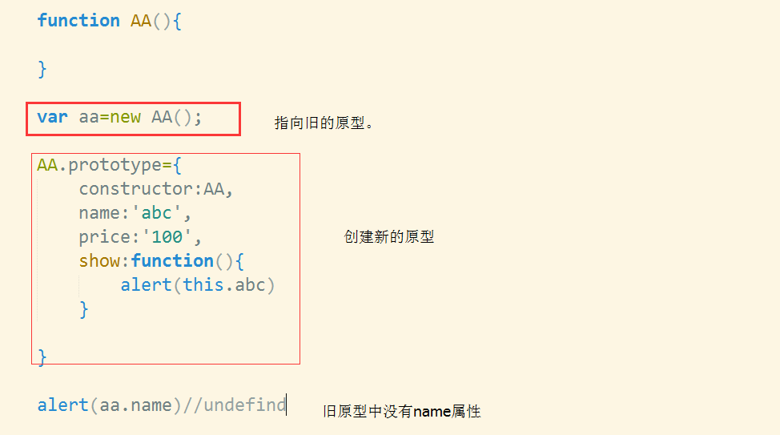
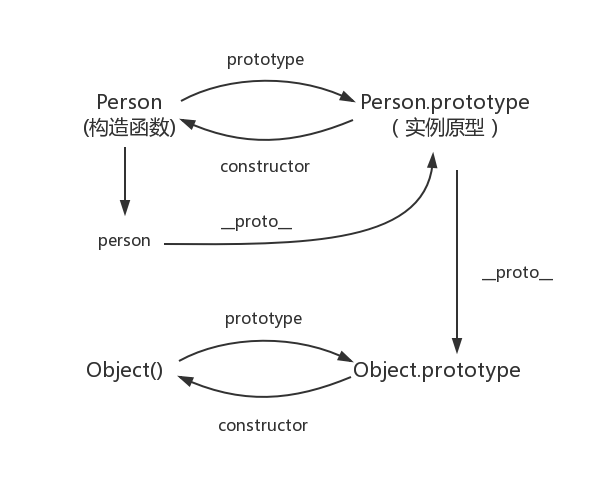
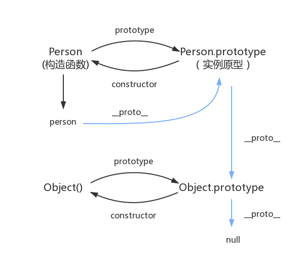

# 5. JavaScript深入之从原型到原型链
原文：[https://github.com/mqyqingfeng/Blog/issues/2](https://github.com/mqyqingfeng/Blog/issues/2)
参考：[https://developer.mozilla.org/zh-CN/docs/Web/JavaScript/Inheritance_and_the_prototype_chain](https://developer.mozilla.org/zh-CN/docs/Web/JavaScript/Inheritance_and_the_prototype_chain)

#### 什么是原型链？

原型链是 js 中实现对象继承和属性共享的机制。每个对象都有一个原型对象，通过`__proto__`属性指向它。当访问对象的属性时，js 会`首先在对象本身查找`，如果找不到，就会`沿着原型链向上查找`，直到`找到属性`或到达原型链的顶端`null`;

#### 构造函数创建对象

我们先使用构造函数创建一个对象：
```javascript
function Person() {

}
var person = new Person();
person.name = 'Kevin';
console.log(person.name) // Kevin
```
在这个例子中，`Person` 就是一个构造函数，我们使用 `new` 创建了一个实例对象 `person`。

#### prototype原型对象

⚠️ **`prototype` 是函数才会有的属性**

在 JavaScript 中，每个函数都有一个 `prototype` 属性，这个属性是一个对象，包含了可以由特定类型的所有实例共享的属性和方法。原型对象用于实现 JavaScript 的继承机制。

当你创建一个对象实例时，这个实例会继承其构造函数的原型对象上的属性和方法。这种继承机制允许多个对象实例共享相同的方法和属性，从而节省内存空间。

比如：

```javascript

// 构造函数 Person
function Person() {}
// 虽然写在注释里，但是你要注意 prototype是函数才会有的属性
Person.prototype.name = 'Kevin';

// 实例对象 person1 & person2
var person1 = new Person();
var person2 = new Person();
console.log(person1.name) // Kevin
console.log(person2.name) // Kevin
```

##### 那这个函数的 `prototype` 属性到底指向的是什么呢？是这个函数的原型吗？

其实，函数的 `prototype` 属性指向了一个`对象`，这个对象正是调用该构造函数而创建的**实例原型**，也就是这个例子中的 person1 和 person2 的原型。

##### 那什么是原型呢？

**你可以这样理解：**

`每一个JavaScript对象(null除外)在创建的时候就会与之关联另一个对象，这个对象就是我们所说的原型，每一个对象都会从原型"继承"属性。`

让我们用一张图表示构造函数和实例原型之间的关系：



在这张图中我们用 `Object.prototype` 表示实例原型。
那么我们该怎么表示实例与实例原型，也就是 `person` 和 `Person.prototype` 之间的关系呢，这时候我们就要讲到第二个属性：

#### `__proto__`

这是每一个JavaScript对象(除了 null )都具有的一个属性，叫`__proto__`，这个属性会指向该对象的原型。

为了证明这一点,我们可以在浏览器控制台中输入：

```javascript
function Person() {}
var person = new Person();
console.log(person.__proto__ === Person.prototype); // true
```
于是我们更新下关系图：


既然`实例对象`和`构造函数`都可以指向原型，那么`原型是否有属性指向构造函数或者实例呢？`

#### constructor

+ 指向实例倒是没有，因为一个构造函数可以生成多个实例;
+ 但是原型指向构造函数倒是有的，这就要讲到第三个属性：`constructor`
+ 每个原型都有一个 `constructor` 属性指向关联的构造函数。


为了验证这一点，我们可以尝试：

```javascript
function Person() {}
const person1 = new Person();

console.log(Person === Person.prototype.constructor); // true

console.log(Person === person1.__proto__.constructor); // true

console.log(person1.__proto__ === Person.prototype); // true

console.log(person1.__proto__.constructor === Person.prototype.constructor); // true

```
所以再更新下关系图：


综上我们已经得出：
```javascript
function Person() {}
var person = new Person();

console.log(person.__proto__ == Person.prototype) // true

console.log(Person.prototype.constructor == Person) // true

// 顺便学习一个ES5的方法,可以获得对象的原型
console.log(Object.getPrototypeOf(person) === Person.prototype) // true
```
了解了构造函数、实例原型、和实例之间的关系，接下来我们讲讲实例和原型的关系：

##### 重置`constructor`:



这个问题也很容易理解， 但是类似的问题会经常性的出现在我们的开发过程中， 所以，当我们创建一个实例的时候一定要注意指向的原型。 也一定要记得，修改原型之后要让实例指针重置

#### 实例与原型

> 当读取实例的属性时，如果找不到，就会查找与对象关联的原型中的属性，如果还查不到，就去找原型的原型，一直找到最顶层为止。

举个例子：
```javascript
function Person() {}

Person.prototype.name = 'Kevin';

// 创建实例对象
var person = new Person();

person.name = 'Daisy';
console.log(person.name) // Daisy

delete person.name;
console.log(person.name) // Kevin
```
在这个例子中，我们给实例对象 `person` 添加了 `name` 属性，当我们打印 `person.name` 的时候，结果自然为 `Daisy`。

但是当我们删除了 `person` 的 `name` 属性时，读取 `person.name`，从 `person` 对象中找不到`name` 属性就会从 `person` 的原型也就是 `person.__proto__` ，也就是 `Person.prototype`中查找，幸运的是我们找到了 `name` 属性，结果为 `Kevin`。

但是万一还没有找到呢？原型的原型又是什么呢？

#### 原型的原型

在前面，我们已经讲了原型也是一个对象，既然是对象，我们就可以用最原始的方式创建它，那就是：

```javascript
var obj = new Object();
obj.name = 'Kevin'
console.log(obj.name) // Kevin
```

证明原型的原型是原生的Object：
```js
Person() {};
console.log(Person.prototype.__proto__.constructor); // ƒ Object() { [native code] }

console.log(Person.prototype.__proto__.constructor.prototype.__proto__
 === null); // true
```

其实`原型对象就是通过 Object 构造函数生成的`，结合之前所讲，实例的 `__proto__` 指向构造函数的 `prototype` ，所以我们再更新下关系图：



#### 原型链

那 Object.prototype 的原型呢？
null，我们可以打印：
```javascript
console.log(Object.prototype.__proto__ === null) // true
```

然而 null 究竟代表了什么呢？
引用阮一峰老师的 [《undefined与null的区别》](http://www.ruanyifeng.com/blog/2014/03/undefined-vs-null.html) 就是：
> null 表示“没有对象”，即该处不应该有值。
> undefined表示"缺少值"，就是此处应该有一个值，但是还没有定义。

所以 `Object.prototype.__proto__` 的值为 `null` 跟 `Object.prototype` 没有原型，其实表达了一个意思。

所以查找属性的时候查到 `Object.prototype` 就可以停止查找了。

最后一张关系图也可以更新为：


顺便还要说一下，图中由相互关联的原型组成的链状结构就是原型链，也就是蓝色的这条线。

#### 补充

最后，补充三点大家可能不会注意的地方：

##### constructor
首先是 constructor 属性，我们看个例子：

```javascript
function Person() {}
var person = new Person();
console.log(person.constructor === Person); // true
```
当获取 `person.constructor` 时，其实 `person` 中并没有 `constructor` 属性,当不能读取到`constructor` 属性时，会从 `person` 的原型也就是 `Person.prototype` 中读取，正好原型中有该属性，所以：

```javascript
person.constructor === Person.prototype.constructor
```
##### `__proto__`

其次是 `__proto__` ，绝大部分浏览器都支持这个非标准的方法访问原型，然而它并不存在于 `Person.prototype` 中，实际上，它是来自于 `Object.prototype` ，与其说是一个属性，不如说是一个 `getter/setter`，当使用 `obj.__proto__` 时，可以理解成返回了 `Object.getPrototypeOf(obj)`。

#### 真的是继承吗？

最后是关于继承，前面我们讲到“每一个对象都会从原型‘继承’属性”，实际上，继承是一个十分具有迷惑性的说法，引用《你不知道的JavaScript》中的话，就是：

继承意味着复制操作，然而 JavaScript 默认并不会复制对象的属性，相反，JavaScript 只是在两个对象之间创建一个关联，这样，一个对象就可以通过委托访问另一个对象的属性和函数，所以与其叫继承，委托的说法反而更准确些。

##### JavaScript 中的继承

在 JavaScript 中，继承主要是通过原型链来实现的。JavaScript 中的对象和函数都有一个特殊的属性，称为 `prototype`，用于实现继承机制。通过原型链，JavaScript 对象可以`共享属性和方法`，而`不是将这些属性和方法复制到每个实例中`。
