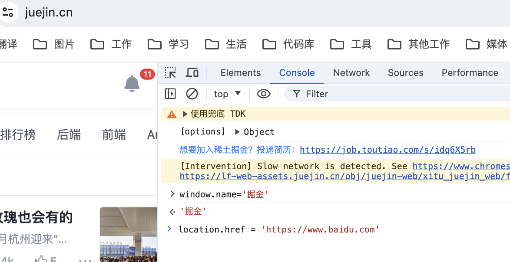
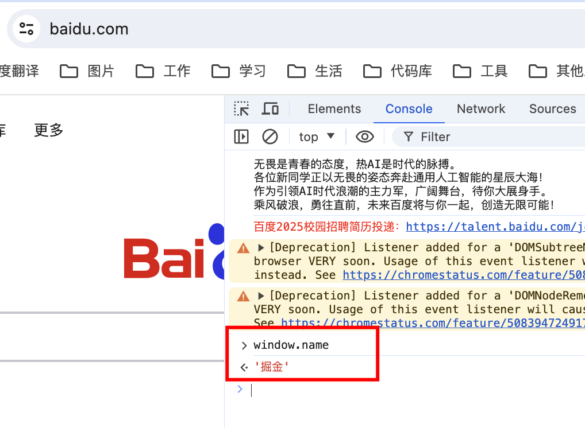

# 9. 如何解决跨域问题

## 什么是跨域

`同源策略`是一个重要的安全策略，它用于限制一个origin的文档或者它加载的脚本如何能与另一个源的资源进行交互。它能帮助阻隔恶意文档，减少可能被攻击的媒介。

> 只要协议、域名、端口有任何一个不同，都被当作是不同的域。

下面给出了与 URL 
`http://store.company.com/dir/page.html` 的源进行对比的示例:

+ 同源、 只有路径不同
`http://store.company.com/dir2/other.html`

+ 同源、 只有路径不同
`http://store.company.com/dir/inner/another.html`

+ 失败、协议不同
`https://store.company.com/secure.html`

+ 失败、 端口不同 ( http:// 默认端口是80)
`http://store.company.com:81/dir/etc.html`

+ 失败、 子域不同
`http://news.company.com/dir/other.html`

## 1. 通过jsonp跨域
在js中，我们直接用`XMLHttpRequest`请求不同域上的数据时，是不可以的。

但是，在页面上引入不同域上的js脚本文件却是可以的，jsonp正是利用这个特性来实现的。

`<script>` 标签的 `src` 属性不会被同源策略所约束，可以获取任意服务器上的脚本并执行。 `jsonp` 通过插入 `script` 标签的方式来实现跨域，参数只能通过 `url` 传入，仅能支持 `get` 请求。

```js
<script>
    function handleResponse(data) {
        // 处理返回的数据
        console.log(data);
    }
</script>
<script src="https://example.com/api?callback=handleResponse"></script>
```

## 2. 使用window.name来进行跨域

在源页面（https://juejin.cn/）中设置 `window.name` 的值:

```js
// 设置 window.name 的值
window.name = "掘金";
// 跳转到目标页面
window.location.href = "https://www.baidu.com";
```


在目标页面（https://www.baidu.com）中获取 `window.name` 的值:
```js
window.name // 掘金
```


## 3. 通过修改document.domain+ iframe来跨子域

`document.domain` 属性用于设置或获取当前文档的域名。

当两个页面的`域名不同`，但`属于同一个主域名下的子域名时`，可以通过将它们的`document.domain` 属性设置为相同的值，来实现跨子域通信。

**示例 1：**

在源页面（http://subdomain1.example.com/source.html）中设置 `document.domain` 的值：

> 如果直接获取document.domain，此时为 `subdomain1.example.com`

```js
// 设置 document.domain 的值
document.domain = "example.com";
// 创建一个新的 iframe，并设置其 src 属性为目标页面的 URL
var iframe = document.createElement("iframe");
iframe.src = "http://subdomain2.example.com/target.html";
// 将 iframe 添加到页面中
document.body.appendChild(iframe);
```

在目标页面（http://subdomain2.example.com/target.html）中获取源页面传递的数据：

```js
// 获取源页面传递的数据
var data = window.parent.document.getElementById("data");
// 处理获取到的数据
console.log("Received data:", data.innerHTML);
```

## 4. 使用window.postMessage方法来跨域

在 HTML5 中，`window.postMessage` 方法提供了一种在`不同源`的窗口之间`安全地`发送和接收数据的机制。它允许在一个窗口（发送方）中向另一个窗口（接收方）发送消息，并在接收方处理这些消息。

**发送消息：**
在`发送方`窗口中，可以使用 `postMessage` 方法将数据发送到`目标窗口`。需要`指定目标窗口的源（origin）和要发送的数据`。

```js
// 发送方窗口
var targetOrigin = "http://example.com"; // 目标窗口的源
var data = { key1: "value1", key2: "value2" }; // 要发送的数据
window.postMessage(data, targetOrigin);
```
**接收消息：**
在接收方窗口中，需要`监听 message` 事件来`接收`发送方发送的`消息`。可以在事件处理函数中获取发送的数据，并进行相应的处理。

```js
// 接收方窗口
window.addEventListener("message", function (event) {
    var data = event.data; // 接收到的数据
    var origin = event.origin; // 发送方的源

    // 处理接收到的数据
    console.log("Received data:", data);
});
```

需要注意以下几点：

1. **origin参数**：在`发送消息`时，需要`指定目标窗口的源`。只有与指定源匹配的窗口才能接收到消息。这样可以确保消息只被发送到预期的目标。使用 `*` 表示可以发送到任何源的窗口。

2. **数据格式**：发送的数据可以是任何可序列化的对象，例如字符串、数字、对象等。在接收方，可以根据需要对数据进行解析和处理。

3. **安全性考虑**：由于 `postMessage` 允许在不同源的窗口之间通信，因此需要注意安全性问题。`确保只接收来自可信源的消息`，并对接收的数据进行适当的验证和处理，以防止跨站脚本攻击（XSS）等安全风险。

4. **兼容性**：`postMessage` 方法在现代浏览器中广泛支持，但在一些较旧的浏览器中可能不支持。在使用之前，需要检查浏览器的兼容性。


## 5. CORS(跨域资源共享)

`CORS`（Cross-Origin ResourceSharing）跨域资源共享，定义了必须在访问跨域资源时，浏览器与服务器应该如何沟通。

服务器端对于`CORS`的支持，主要就是通过设置`Access-Control-Allow-Origin`来进行的。

## 6. nginx代理跨域

同源策略是浏览器的安全策略，不是`HTTP`协议的一部分。`服务器端`调用HTTP接口只是使用HTTP协议，不会执行JS脚本，不需要同源策略，也就`不存在跨越问题`。

**案例：**

实现了将请求从`www.domain1.com`反向代理到`www.domain2.com:8080`，并设置了相应的跨域头部信息，允许来自`http://www.domain1.com`的跨域请求，并允许携带 `cookie`。
```nginx
#proxy服务器
server {
    listen       81;
    server_name  www.domain1.com;

    location / {
        proxy_pass   http://www.domain2.com:8080;  #反向代理
        proxy_cookie_domain www.domain2.com www.domain1.com; #修改cookie里域名
        index  index.html index.htm;

        # 当用webpack-dev-server等中间件代理接口访问nignx时，此时无浏览器参与，故没有同源限制，下面的跨域配置可不启用
        add_header Access-Control-Allow-Origin http://www.domain1.com;  #当前端只跨域不带cookie时，可为*
        add_header Access-Control-Allow-Credentials true;
    }
}
```
## 7. nodejs中间件代理跨域

node中间件实现跨域代理，原理大致与`nginx`相同，都是通过启一个代理服务器，实现数据的转发。

## 8. WebSocket协议跨域

`WebSocket protocol`是`HTML5`一种新的协议。它实现了浏览器与服务器`全双工通信`，同时允许`跨域通讯`，是`server push`技术的一种很好的实现。
原生WebSocket API使用起来不太方便，我们使用`Socket.io`，它很好地封装了`webSocket`接口，提供了更简单、灵活的接口，也对不支持`webSocket`的浏览器提供了向下兼容。

**前端代码：**

```html
<div>user input：<input type="text"></div>
<script src="https://cdn.bootcss.com/socket.io/2.2.0/socket.io.js"></script>
<script>
var socket = io('http://www.domain2.com:8080');

// 连接成功处理
socket.on('connect', function() {
    // 监听服务端消息
    socket.on('message', function(msg) {
        console.log('data from server: ---> ' + msg); 
    });

    // 监听服务端关闭
    socket.on('disconnect', function() { 
        console.log('Server socket has closed.'); 
    });
});

document.getElementsByTagName('input')[0].onblur = function() {
    socket.send(this.value);
};
</script>
```

**Nodejs socket后台：**

```js
var http = require('http');
var socket = require('socket.io');

// 启http服务
var server = http.createServer(function(req, res) {
    res.writeHead(200, {
        'Content-type': 'text/html'
    });
    res.end();
});

server.listen('8080');
console.log('Server is running at port 8080...');

// 监听socket连接
socket.listen(server).on('connection', function(client) {
    // 接收信息
    client.on('message', function(msg) {
        client.send('hello：' + msg);
        console.log('data from client: ---> ' + msg);
    });

    // 断开处理
    client.on('disconnect', function() {
        console.log('Client socket has closed.'); 
    });
});
```

