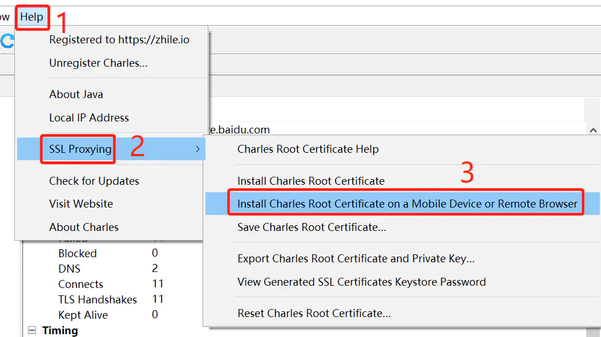
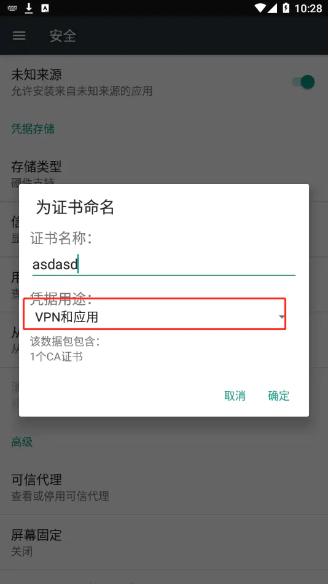
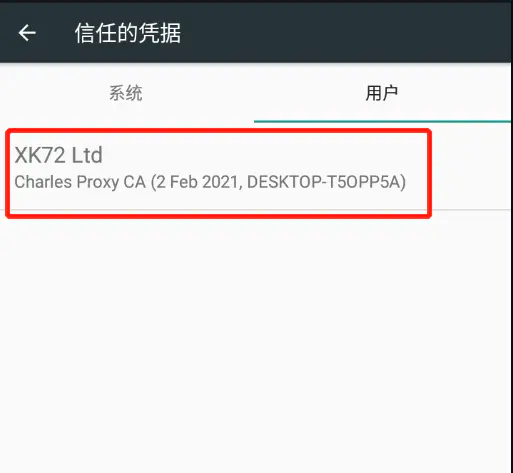

# 华为手机安卓Charles证书

手机端下载证书，charlse顶部菜单：`Help`->`SSL Proxying`->`Install Charles Root Certificate on a Mobile Device or Remote Browser`，如图：

此时，到手机端浏览器输入地址`chls.pro/ssl`，下载证书，在浏览器回车后开始下载，等待下载完成。

下载完成后手机端安装证书，在华为手机`设置`->`隐私和安全`->`更多安全设置`->`加密和凭据`->`从存储设备安装`。

然后在`受信任的凭据`查看，找到下载文件，开始安装，安装时随便给证书起个名字，其他默认`VPN/应用`就好，不需要修改，点击确定，开始安装

安装成功显示已安装：
验证是否安装成功，`手机设置`->`安全`->`信任的凭据`->`用户`，进入目录中看是否已安装成功：

