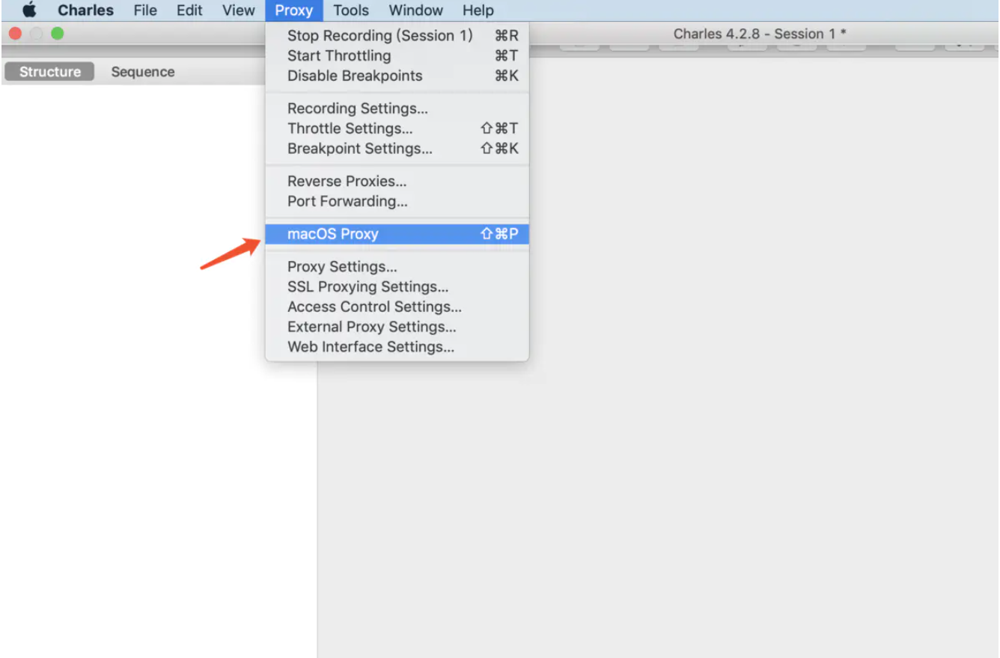
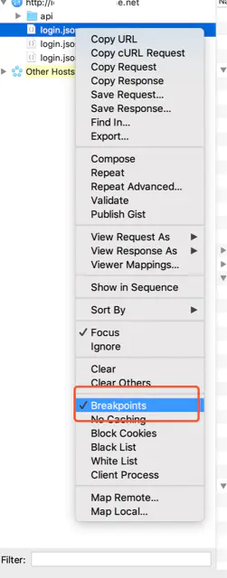
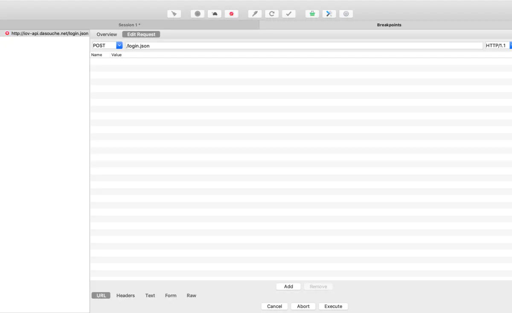
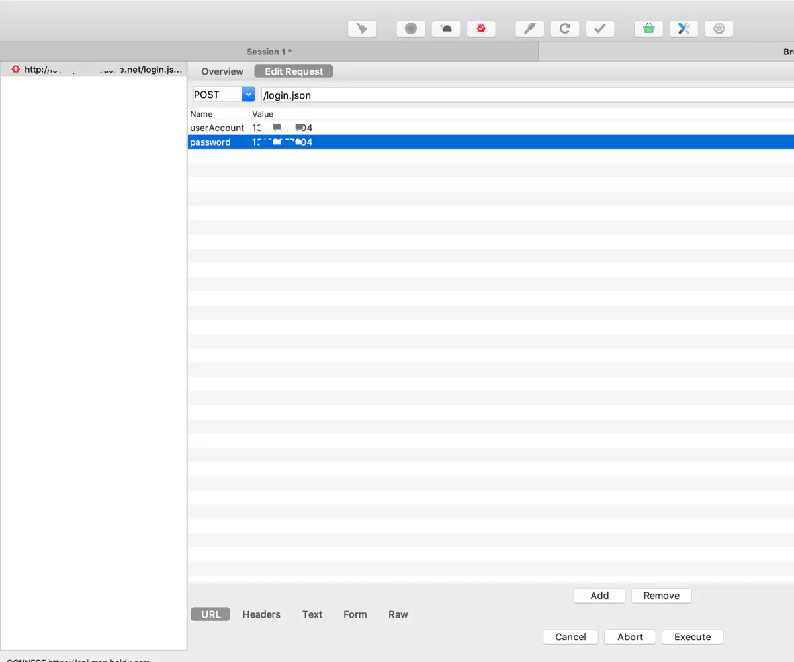
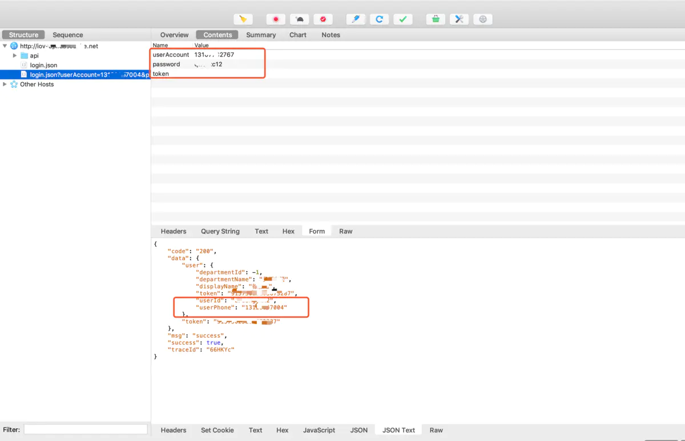
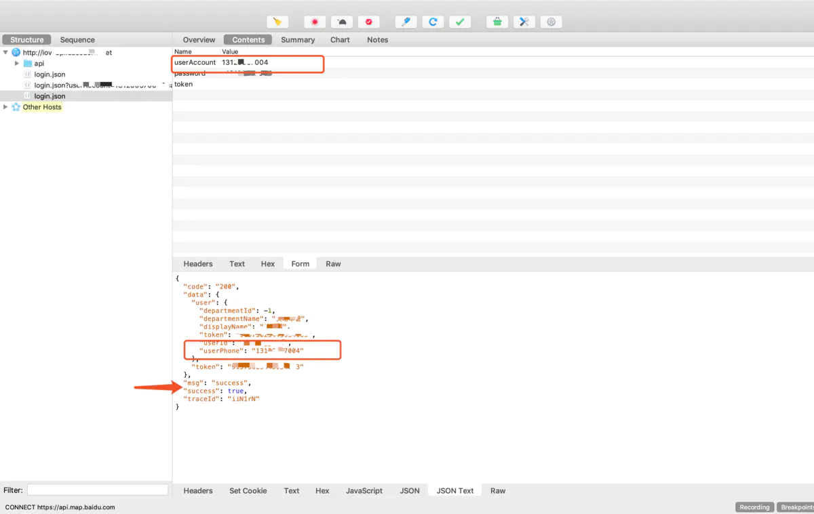
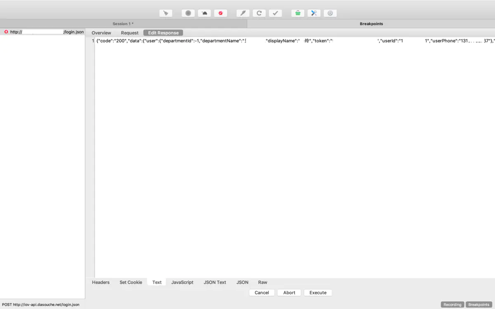
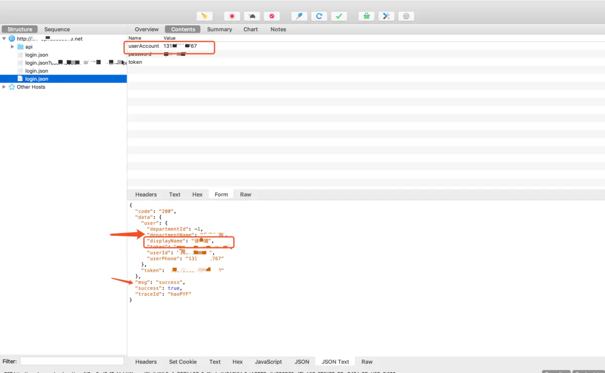

# Charles拦截接口请求

最近工作需要拦截接口做一些修改，记录一下用Charles的一些操作。以拦截登录接口场景举个例。

##### 1、设置代理自己的电脑

启动 Charles 后，需要将 Charles 设置成系统代理，选择菜单中的 `Proxy` –> `macOS Proxy` 来将 `Charles 设置成系统代理`。如下所示：

##### 2、请求接口，给要拦截的接口设置断点。

选择接口，`右击`->`Breakpoints`如下所示：

##### 3、拦截接口

我以登录结果为例的，`设置断点的接口重新发起接口请求时，会弹起Charles这个页面`，成功拦截到了接口，如下所示：

##### 4、修改接口入参

切换到`Edit Request`，改变接口请求方法或者改变入参;修改入参两个方式：
第一种：直接URL页面add参数；
第二种：切换到text页面，按照格式改变相应的参数。修改之后点击Execute，如下所示：

##### 5、点击`Execute`之后，会拦截`Response`。

也可以对返回参数做修改，先不做修改直接点击`Execute`，看接口请求成功的返回数据是我们修改的账号登录成功，如图所示：

##### 6、拦截Response

对返回参数值做修改，比如修改`displayName`字段的值，如图所示：

