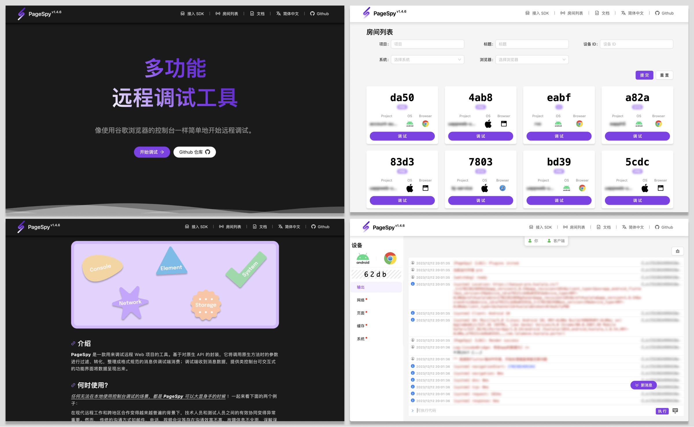
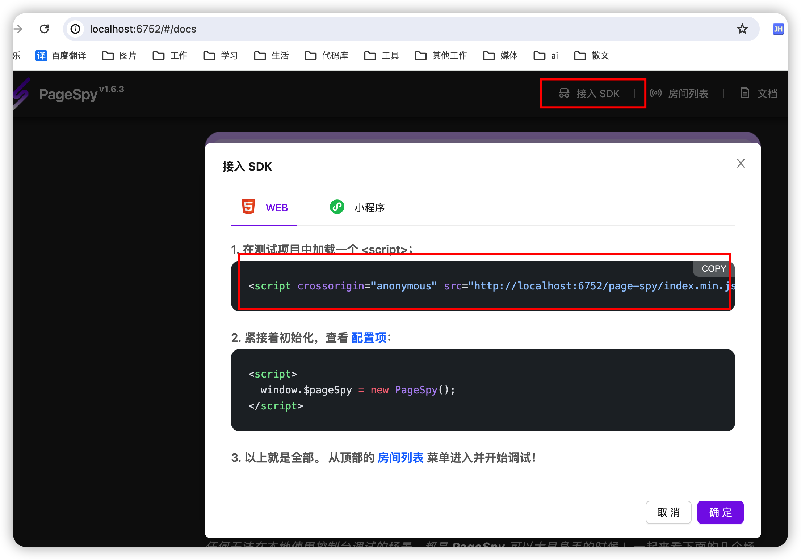
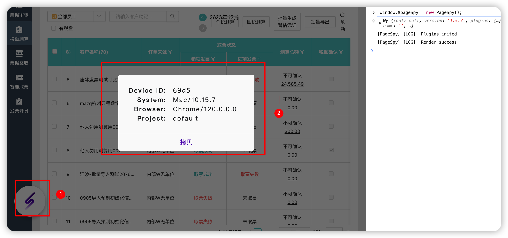
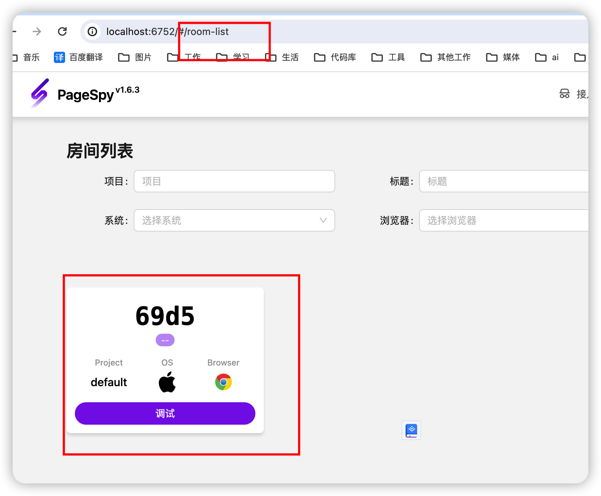
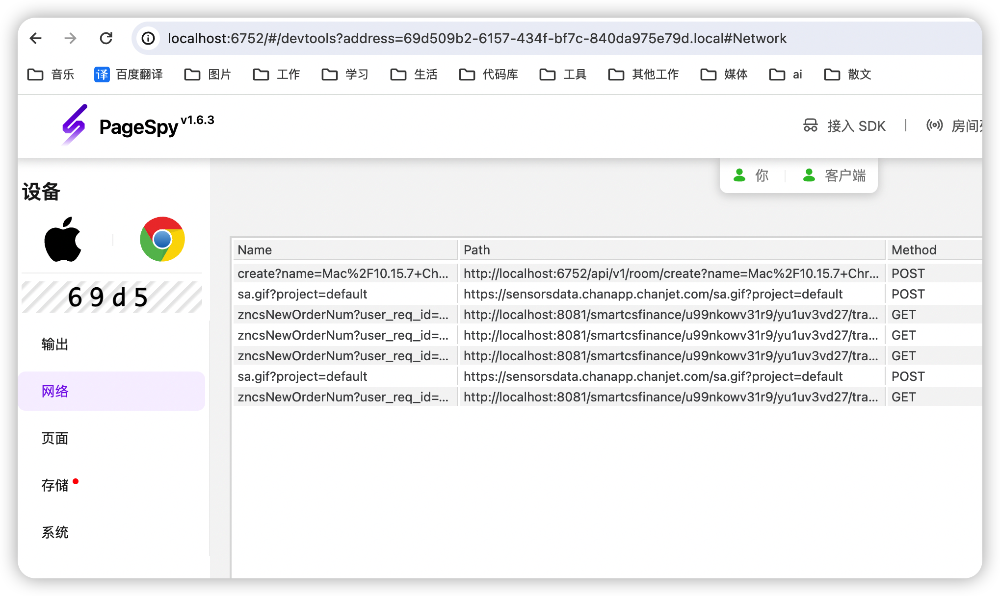

# PageSpy远程调试

### 介绍

PageSpy 是一款用来调试远程 Web 项目的工具。

基于对原生 API 的封装，它将调用原生方法时的参数进行过滤、转化，整理成格式规范的消息供调试端消费；调试端收到消息数据，提供类控制台可交互式的功能界面将数据呈现出来。




### 参考地址
|文档|地址|
|--|--|
|官网地址|https://www.pagespy.org|
|中文使用地址|https://github.com/HuolalaTech/page-spy-web/blob/main/README_ZH.md|

### 使用案例

```sh
yarn global add @huolala-tech/page-spy-api@latest
```
stdout

```sh
daiyunzhou@daiyunzhoudeMacBook-Pro-2 ydz-workbench % yarn global add @huolala-tech/page-spy-api@latest

yarn global v1.22.17
[1/4] 🔍  Resolving packages...
[2/4] 🚚  Fetching packages...
[###################################################################################################################################################################################-] 2016/2032^C
daiyunzhou@daiyunzhoudeMacBook-Pro-2 ydz-workbench % yarn global add @huolala-tech/page-spy-api@latest

yarn global v1.22.17
[1/4] 🔍  Resolving packages...
[2/4] 🚚  Fetching packages...
[3/4] 🔗  Linking dependencies...
warning "@chanjet/cjet-cmd > eslint-plugin-unused-imports@1.1.4" has incorrect peer dependency "eslint@^7.19.0".
warning "dingtalk-design-cli > tsc-watch@4.4.0" has unmet peer dependency "typescript@*".
warning "dingtalk-design-cli > dingtalk-miniapp-opensdk > ali-oss > co-defer@1.0.0" has unmet peer dependency "co@4".
[4/4] 🔨  Building fresh packages...
success Installed "@huolala-tech/page-spy-api@1.6.3" with binaries:
      - page-spy-api
✨  Done in 104.54s.
```

检查是否全局安装成功

```sh
npm list -g
```
stdout
```sh
daiyunzhou@daiyunzhoudeMacBook-Pro-2 lib % npm list -g
/Users/daiyunzhou/.nvm/versions/node/v16.14.0/lib
├── @huolala-tech/page-spy-api@1.6.3
└── yunzhou-cli@0.0.1 -> ./../../../../../code/project/yunzhou-cli
```
发现全局有了**page-spy-api**，表示全局安装成功

### 运行

```sh
page-spy-api
```
stdout
```sh
daiyunzhou@daiyunzhoudeMacBook-Pro-2 ~ % page-spy-api
{"time":"2024-01-09T20:14:54.852952+08:00","level":"WARN","prefix":"-","file":"load.go","line":"29","message":"config file config.json not exist"}
INFO[0000] local room manager start                      module=LocalRoomManager
INFO[0000] remote rpc room manager start
INFO[0000] 启动 rpc serve local ok
INFO[0000] local ip 10.1.172.165:6752
INFO[0000] 远程访问地址 http://10.1.172.165:6752               module=core
INFO[0000] 本地访问地址 http://localhost:6752                  module=core

   ____    __
  / __/___/ /  ___
 / _// __/ _ \/ _ \
/___/\__/_//_/\___/ v4.9.0
High performance, minimalist Go web framework
https://echo.labstack.com
____________________________________O/_______
                                    O\
⇨ http server started on [::]:6752
```
### 项目中使用

控制台运行后可以看到本地的链接，打开后查看“接入sdk”查看使用方法





在房间列表就能看到当前用到的网站


点击进入就可以查看了


