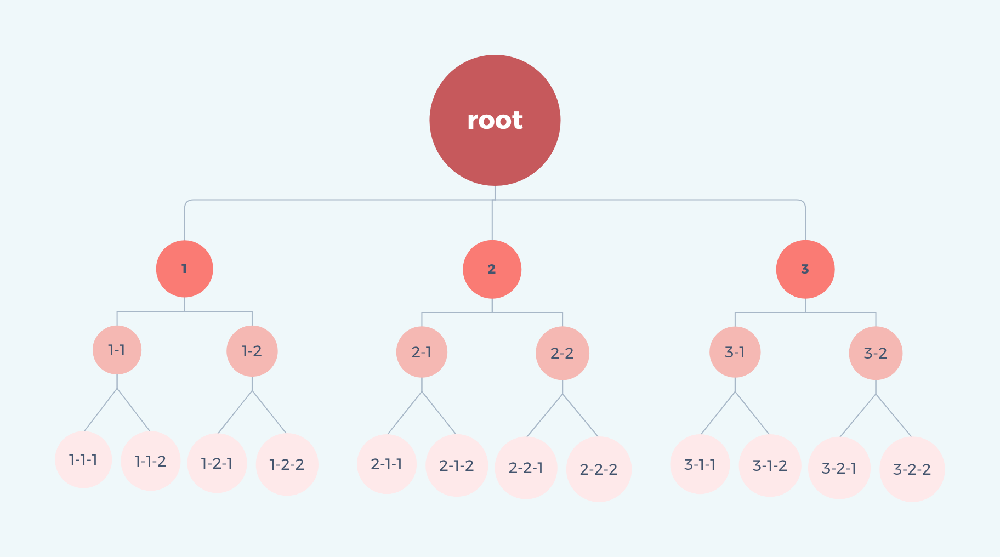

# 13. 广度优先搜索算法

> 广度优先搜索（breadth first search），从图中也可以看出来，是从根节点开始，沿树的宽度进行搜索，如果所有节点都被访问，则算法中止。

## 1. 动画展示


## 2.数据

```bash
const root = [
  {
    id: '1',
    children: [
      {
        id: '1-1',
        children: [{ id: '1-1-1' }, { id: '1-1-2' }],
      },
      {
        id: '1-2',
        children: [{ id: '1-2-1' }, { id: '1-2-2' }],
      },
    ],
  },
  {
    id: '2',
    children: [
      {
        id: '2-1',
        children: [{ id: '2-1-1' }, { id: '2-1-2' }],
      },
      {
        id: '2-2',
        children: [{ id: '2-2-1' }, { id: '2-2-2' }],
      },
    ],
  },
  {
    id: '3',
    children: [
      {
        id: '3-1',
        children: [{ id: '3-1-1' }, { id: '3-1-2' }],
      },
      {
        id: '3-2',
        children: [{ id: '3-2-1' }, { id: '3-2-2' }],
      },
    ],
  },
];

const target = '2-2-2';
```


## 3. 代码实现

```bash
interface IItem {
  id: string;
  children?: IItem[];
}
const breadthFirstSearch = (source: IItem[]) => {
  const result = []; // 存放结果的数组
  // 当前队列为全部数据
  const queue = JSON.parse(JSON.stringify(source));
  // 循环条件，队列不为空
  while (queue.length > 0) {
    // 第一个节点出队列
    const node = queue.shift();
    // 存放结果数组
    result.push(node.id);
    // 当前节点有子节点则将子节点存入队列，继续下一次的循环
    const len = node.children && node.children.length;
    for (let i = 0; i < len; i += 1) {
      queue.push(node.children[i]);
    }
  }
  return result;
};
breadthFirstSearch(root);
```
