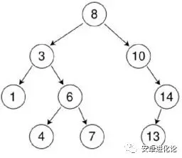
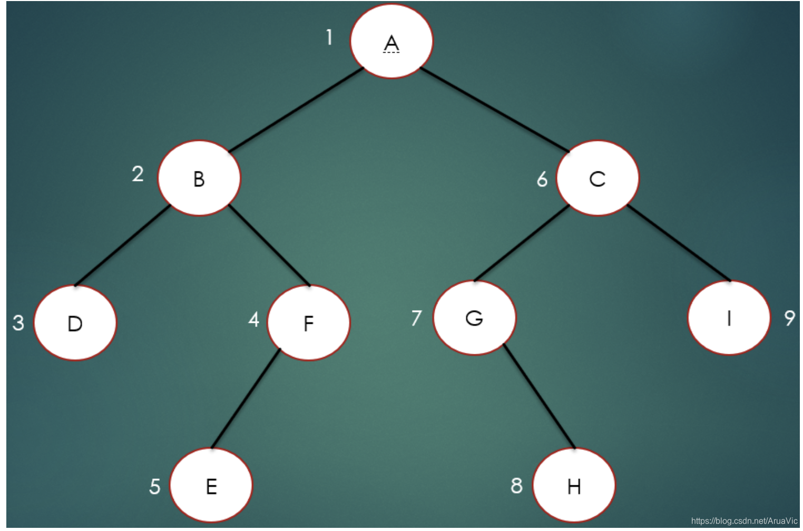
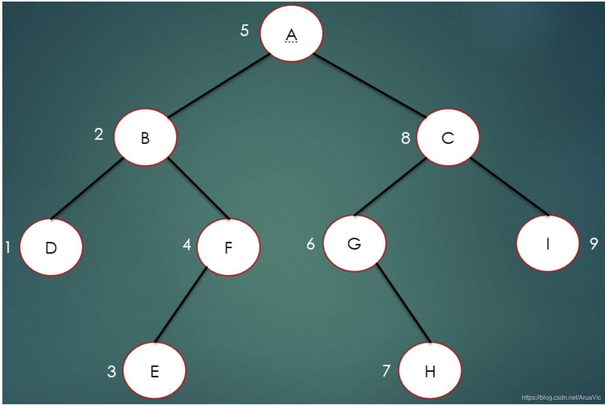
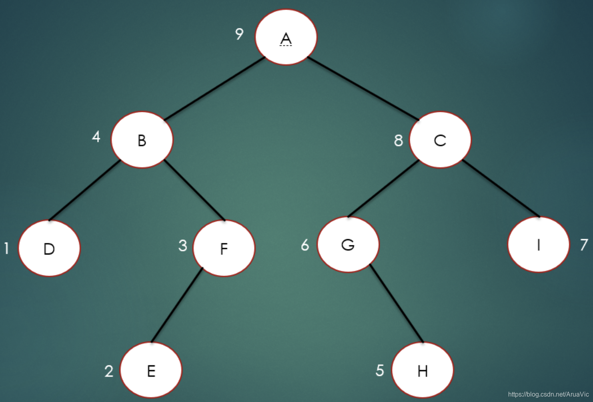
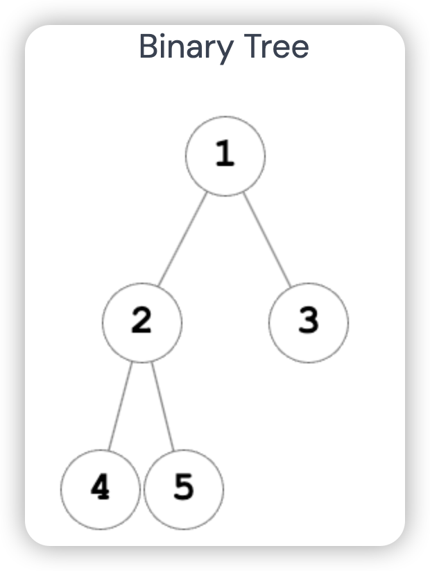
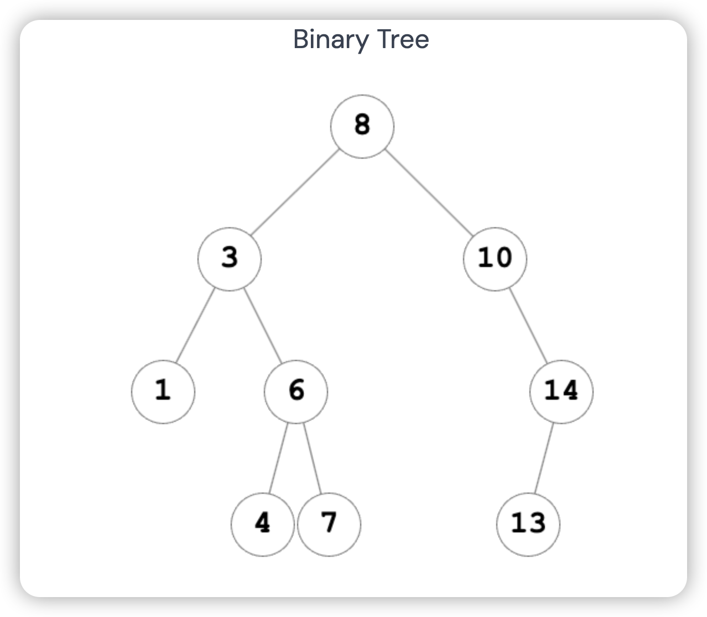

# 5. 二叉树和有序二叉树和二叉查找树

一般叫全部写完的概率比较少，但是重点考察你对它的理解和一些基本特点的实现。 

## 一、二叉树的概念

在线生成二叉树的网站: `https://binarytree-visual.vercel.app/`

**二叉树**是一种重要的**数据结构**，它由`节点`组成，每个节点`最多有两个子节点`，分别称为`左子节点`和`右子节点`。二叉树具有以下特点：

- 每个节点最多有两个子节点。
- 子节点分为左子节点和右子节点。
- 二叉树可以是空树，即没有节点,也可以是由一个根节点和若干个子树组成的。

### 完全二叉树
> 完全二叉树是一种非常“饱满”的二叉树，除了最后一层可能有一些空位外，其他层的节点都填满了。

- 除了最后一层外，每一层的节点数都达到最大值。
- 最后一层的节点都集中在左侧，可能存在一些右侧的空位。

## 二、有序二叉树的概念

`有序二叉树`（ordered binary tree）是一种特殊的二叉树,具有下列性质：

- 任意节点的`左子树不空`，则左子树上所有`结点`的值都`小于`它的`根结点`的值；
- 任意节点的`右子树不空`，则右子树上所有`结点`的值都`大于`它的`根结点`的值；
- 任意节点的左、右子树也分别为有序二叉树；



也就是说，有序二叉树中，左子树都比节点小，右子树都比节点大，递归定义。

根据有序二叉树这个特点我们可以知道：`有序二叉树的中序遍历一定是从小到大的。`

**当系统需要高效的执行：**
`搜索、排序、插入、删除、范围查询 等操作时均可考虑使用有序二叉树。`

## 三、二叉树遍历方法

> 二叉树的遍历是指按照一定的顺序`访问`二叉树中的每个节点。

⚠️`前序遍历、中序遍历和后序遍历`的主要`区别`在于`访问根节点的时机不同`，且左子节点和右子节点的`遍历顺序可以根据具体情况进行调整`。

常见的二叉树遍历方法有`前序遍历`、`中序遍历`和`后序遍历`。

1. **前序遍历（Preorder Traversal）**：
    - 访问根节点。
    - 先序遍历左子树。
    - 先序遍历右子树。



2. **中序遍历（Inorder Traversal）**：
    - 中序遍历左子树。
    - 访问根节点。
    - 中序遍历右子树。



3. **后序遍历（Postorder Traversal）**：
    - 后序遍历左子树。
    - 后序遍历右子树。
    - 访问根节点。



## 四、二叉树的简单案例

> 我们首先定义了一个`TreeNode`类来表示二叉树的节点。然后，我们创建了一个二叉树，并实现了`前序遍历`、`中序遍历`和`后序遍历`的函数。最后，我们通过调用这些函数来遍历二叉树，并将结果输出到控制台。

```js
// 定义二叉树节点类
class TreeNode {
  constructor(value) {
    this.value = value;
    this.left = null;
    this.right = null;
  }
}

// 创建二叉树
const root = new TreeNode(1);
const node2 = new TreeNode(2);
const node3 = new TreeNode(3);
const node4 = new TreeNode(4);
const node5 = new TreeNode(5);

root.left = node2;
root.right = node3;
node2.left = node4;
node2.right = node5;

```
**示例代码输出如下结构二叉树：**



```js
// 前序遍历
function preOrderTraversal(root) {
  if (root === null) {
    return;
  }

  console.log(root.value); // 访问根节点
  preOrderTraversal(root.left);
  preOrderTraversal(root.right);
}

preOrderTraversal(root); // 输出：1,2,4,5,3

// 中序遍历
function inOrderTraversal(root) {
  if (root === null) {
    return;
  }

  inOrderTraversal(root.left);
  console.log(root.value);// 访问根节点
  inOrderTraversal(root.right);
}
inOrderTraversal(root);// 输出：4,2,5,1,3

// 后序遍历
function postOrderTraversal(root) {
  if (root === null) {
    return;
  }

  postOrderTraversal(root.left);
  postOrderTraversal(root.right);
  console.log(root.value);// 访问根节点
}
postOrderTraversal(root); // 4,5,2,3,1
```
## 五、有序二叉树的简单案例

> 在上述代码中，我们首先定义了一个BinarySearchTreeNode类来表示有序二叉树的节点。然后，我们实现了一个insertNode函数来插入节点，并保持有序二叉树的性质。最后，我们通过调用inOrderTraversal函数来中序遍历有序二叉树，并将结果输出到控制台。

```js
// 定义有序二叉树节点类
class BinarySearchTreeNode {
  constructor(value) {
    this.value = value;
    this.left = null;
    this.right = null;
  }
}

// 插入节点
function insertNode(root, value) {
  if (root === null) {
    root = new BinarySearchTreeNode(value);
    return root;
  }

  if (value < root.value) {
    root.left = insertNode(root.left, value);
  } else if (value > root.value) {
    root.right = insertNode(root.right, value);
  }

  return root;
}
```



```js
// 测试
let root = null;
const values = [8, 3, 10, 1, 6, 14, 4, 7, 13];

for (let value of values) {
  root = insertNode(root, value);
}

console.log('====前序遍历=====');
preOrderTraversal(root); // 8,3,1,6,4,7,10,14,13
console.log('====中序遍历=====');
inOrderTraversal(root); // 1,3,4,6,7,8,10,13,14
console.log('====后遍历=====');
postOrderTraversal(root);// 1,4,7,6,3,13,14,10,8

```

## 六、二叉树和有序二叉树的用途

二叉树和有序二叉树在计算机科学中有广泛的应用，以下是一些常见的用途：
- `搜索和排序`：二叉树和有序二叉树可以用于实现高效的搜索和排序算法，例如二叉搜索树可以在 O(log n)的时间复杂度内完成搜索和插入操作。
- `数据压缩`：二叉树可以用于实现`哈夫曼编码`等数据压缩算法，通过构建二叉树来表示字符的出现频率，并生成相应的编码。
- `数据库索引`：在数据库中，`二叉树`和`有序二叉树`可以用于构建索引，提高数据的查询效率。
- `表达式求值`：二叉树可以用于表示表达式，并进行求值操作，例如二叉表达式树可以用于解析和计算数学表达式。
- `路由选择`：在网络中，二叉树可以用于实现路由选择算法，根据目标地址选择最佳的路径。


## 七、使用JS实现二叉查找树(Binary Search Tree)


二叉查找树相比于其他数据结构的优势在于查找、插入的时间`复杂度较低`。为O(log n)。

`树`是有`节点构成`，由根节点逐渐延生到各个子节点，因此它具备基本的结构就是具备一个根节点，具备`添加`，`查找`和`删除`节点的方法.

`二叉查找树`具有`查找`、`插入`和`删除`节点等操作。

### 定义二叉搜索树节点类
```js
// 定义二叉搜索树节点类
class BinarySearchTreeNode {
  constructor(value, left = null, right = null) {
    this.value = value;
    this.left = left;
    this.right = right;
  }
}
```

### 定义二叉搜索树类
```js
// 定义二叉搜索树类
class BinarySearchTree {
  constructor() {
    this.root = null;
  }

  /**
   * 插入节点
   * - 如果在插入时，root节点为空，则直接将新节点赋给root节点即可。
   * - 如果新的节点值小于当前节点值，说明待插入的位置应在在当前节点的左子树上，那么在大于时，就应该在当前节点的右子树上。进而更新当前节点所指向的节点，直到当前节点为空时，说明找到了正确的插入位置。
   * @param {*} value
   */
  insert(value) {
    const newNode = new BinarySearchTreeNode(value);
    // 如果在插入时，root节点为空，则直接将新节点赋给root节点即可。
    if (!this.root) {
      this.root = newNode;
      return;
    }
    // 已经存在 root 根节点，开始进行递归插入
    BinarySearchTree.insertNode(this.root, newNode);
  }

  /**
   * 内部方法：插入节点到指定位置
   * @param {*} node 递归传入的节点
   * @param {*} newNode 要插入的新节点
   * @returns
   */
  static insertNode(node, newNode) {
    // 新节点如果小于当前节点，则插入到左子树
    if (newNode.value < node.value) {
      // 只有左子节点不存在时，才能放到左树，否则要继续递归查找左子树为 null 的 node 节点
      if (node.left === null) {
        node.left = newNode;
      } else {
        BinarySearchTree.insertNode(node.left, newNode);
      }
      return;
    }
    // 新节点大于当前节点，插入到右子树
    if (newNode.value > node.value) {
      // 只有右子节点不存在时，才能放到右树，否则要继续递归查找右子树为 null 的 node 节点
      if (node.right === null) {
        node.right = newNode;
      } else {
        BinarySearchTree.insertNode(node.right, newNode);
      }
      return;
    }
    // 不符合有序二叉树，不可重复
    throw new Error('不能插入重复节点');
  }

  /**
   * 查找节点
   * @param {*} value
   * @returns
   */
  find(value) {
    return BinarySearchTree.findNode(this.root, value);
  }

  /**
   * 内部方法：查找指定节点
   * @param {*} node
   * @param {*} value
   * @returns
   */
  static findNode(node, value) {
    // 节点为空，说明没有找到，返回null
    if (node === null) {
      return null;
    }
    // 如果 value和当前节点的 value相等，返回当前节点，结束递归
    if (value === node.value) {
      return node;
    }
    // 如果 value 比当前节点小，则继续递归查找节点的左子节点
    if (value < node.value) {
      return BinarySearchTree.findNode(node.left, value);
    }
    // 如果 value 比当前节点大，则继续递归查找节点的右子节点
    return BinarySearchTree.findNode(node.right, value);
  }
  /**
   * 获得最小值的节点（最末端的左子节点最小）
   * @param {*} node 当前查找的节点
   * @returns
   */
  findMin(node = this.root) {
    return BinarySearchTree.findMinNode(node);
  }

  static findMinNode(node) {
    // 递归查找，知道 left 为 null，说明是左子树最后一个节点了，这个是最小的
    if (node.left === null) {
      return node;
    }
    return BinarySearchTree.findMinNode(node.left);
  }

  /**
   * 获得最大值的节点（最末端的右子节点最大）
   * @param {*} node 当前查找的节点
   * @returns
   */
  findMax(node = this.root) {
    return BinarySearchTree.findMaxNode(node);
  }

  static findMaxNode(node) {
    // 递归查找，知道 right 为 null，说明是右子树最后一个节点了，这个是最大的
    if (node.right === null) {
      return node;
    }
    return BinarySearchTree.findMaxNode(node.right);
  }

  /**
   * 删除节点的 node.value 为 value 的节点
   * @param {*} value
   */
  remove(value) {
    this.root = BinarySearchTree.removeNode(this.root, value);
  }

  /**
   * 内部方法：删除指定节点
   * 1. 待删除的节点是叶子节点，没有左子节点和右子节点。
   * 2. 待删除的节点没有左子节点，或者没有右子节点。
   * 3. 待删除的节点的左右子节点均存在。
   * @param {*} node
   * @param {*} value
   * @returns
   */
  static removeNode(node, value) {
    // 如果没有节点，直接结束
    if (node === null) {
      return null;
    }
    // 如果value比当前节点的 value小，需要继续递归查找左子树
    if (value < node.value) {
      node.left = BinarySearchTree.removeNode(node.left, value);
      return node;
    }
    // 如果value比当前节点value大，需要继续递归查找右子树
    if (value > node.value) {
      node.right = BinarySearchTree.removeNode(node.right, value);
      return node;
    }
    // 如果 value和当前节点 value相等，需要坚持当前节点的left和 right节点
    if (value === node.value) {
      // 1. 待删除的节点是叶子节点，没有左子节点和右子节点。直接将当前节点设置成 null，移除掉当前的节点
      if (node.left === null && node.right === null) {
        // eslint-disable-next-line no-param-reassign
        node = null;
        return node;
      }
      // 2. 待删除的节点没有左子节点，或者没有右子节点。
      //  2.1 只有左子节点，直接将当前节点设置成左子节点，替换掉当前节点
      if (node.right === null) {
        // eslint-disable-next-line no-param-reassign
        node = node.right;
        return node;
      }
      // 2.2 只有右子节点,直接将当前节点设置成右子节点，替换掉当前节点
      if (node.left === null) {
        // eslint-disable-next-line no-param-reassign
        node = node.right;
        return node;
      }
      // 3. 待删除的节点的左右子节点均存在。
      // 寻找右子树上的最小值,放到当前节点，移出掉当前节点
      const minRightNode = BinarySearchTree.findMinNode(node.right);
      node.value = minRightNode.value;
      // 右节点必须比当前节点大的，所以继续递归，删除掉minRightNode（小的已经赋值给当前节点了，大的需要继续依次设置排序）
      node.right = BinarySearchTree.removeNode(node.right, minRightNode.value);
      return node;
    }
  }
}
```

### 创建二叉搜索树实例对象

```js
// 创建二叉搜索树对象
const binarySearchTree = new BinarySearchTree();

// 中序遍历二叉树
const inorderTraversal = (node) => {
  if (node !== null) {
    inorderTraversal(node.left);
    console.log(node.value);
    inorderTraversal(node.right);
  }
};

// 插入节点
for (let value of [8, 3, 10, 1, 6, 14, 4, 7, 13]) {
  binarySearchTree.insert(value);
}
console.log('==== binarySearchTree.insert ====', binarySearchTree);
// 中序遍历
inorderTraversal(binarySearchTree.root); // 1,3,4,6,7,8,10,13,14
// 查找最小节点
console.log('findMin:', binarySearchTree.findMin()); // BinarySearchTreeNode {value: 1, left: null, right: null}
// 查找最大节点
console.log('findMax:', binarySearchTree.findMax()); // BinarySearchTreeNode {value: 14, left: BinarySearchTreeNode, right: null}
// 查找指定值
console.log('find:', binarySearchTree.find(4)); // BinarySearchTreeNode {value: 4, left: null, right: null}
// 删除节点
binarySearchTree.remove(6);
// 中序遍历
inorderTraversal(binarySearchTree.root); // 1,3,4,7,8,10,13,14
```
