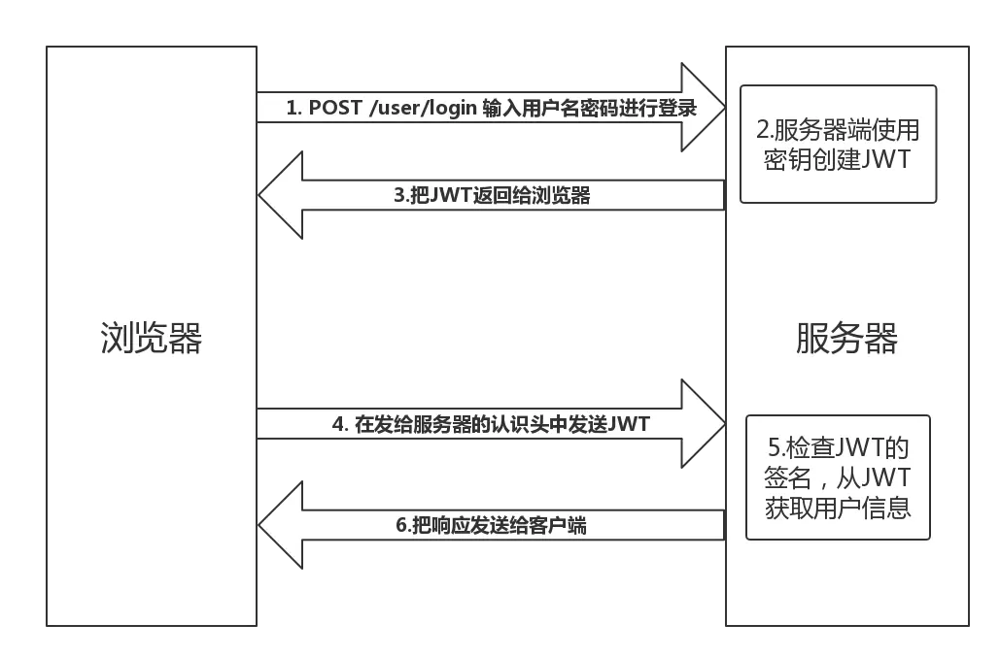
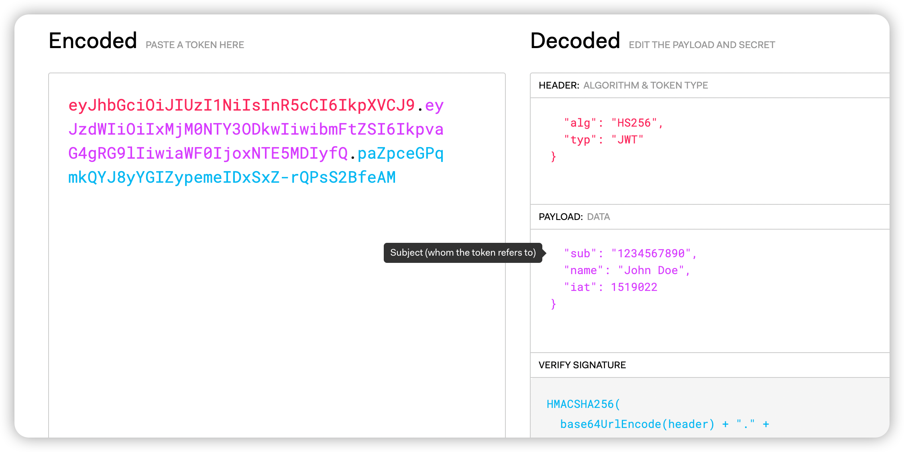

# 3. 什么是JWT

JWT 的全称是 Json Web Token。是基于 RFC 7519 开放标准的，它定义了一种紧凑且独立的方式，用于在各方之间以 JSON 对象的形式安全地传输信息。此信息可以用作验证和相互信任，因为它是经过数字签名的。JWT 可以使用密钥（使用 HMAC 算法）或使用 RSA 或 ECDSA 的公钥/私钥对进行签名。

## 一、 JWT 是为了解决什么问题？

互联网用户认证一般流程如下，都是根据前端（cookie），后端（session），前后端通过 cookie 中的 sessionId 关联：

```
1、用户向服务器发送用户名和密码。

2、服务器验证通过后，在当前对话（session）里面保存相关数据，比如用户角色、登录时间等等。

3、服务器向用户返回一个 session_id，写入用户的 Cookie。

4、用户随后的每一次请求，都会通过 Cookie，将 session_id 传回服务器。

5、服务器收到 session_id，找到前期保存的数据，由此得知用户的身份。
```

因为主要通过 session 存储用户信息，随着用户数量的增多，服务端就需要存一堆用户的认证信息，这种方式会不断增加服务端的压力。

如果是分布式系统，用 session 存储用户信息就太拘束了。因为分布式系统一般都会做负载均衡，如果这次认证成功了，那么意味着下次请求必须仍要访问这台服务器才能认证成功。

如果是前后端分离的系统就更难受了，因为前端代码和后端代码放在不同的服务器上，除了会增加服务器的压力，还会产生跨域等一系列问题，有点得不偿失。

## 二、JWT 的原理

JWT 的原理是，服务器认证以后，生成一个 JSON 对象，发回给用户，就像下面这样。

```jsx | pure
{
  "姓名": "张三",
  "角色": "管理员",
  "到期时间": "2018年7月1日0点0分"
}
```

以后，用户与服务端通信的时候，都要发回这个 JSON 对象。服务器完全只靠这个对象认定用户身份。为了防止用户篡改数据，服务器在生成这个对象的时候，会加上签名（详见后文）。

服务器就不保存任何 session 数据了，也就是说，服务器变成无状态了，从而比较容易实现扩展。




## 三、 JWT 的数据结构

结构：**Bearer Header.Payload.Signature**

```sh
Bearer
eyJhbGciOiJIUzI1NiIsInR5cCI6IkpXVCJ9.
eyJ1c2VyX2lkIjozOTE2NjYxNDU5ODgxNjksInRlN2NmNWFhOWMwYiIsImlhdCI6MTY5NzUwOTA1MSwiZXhwIjoxNjk4MTEzODUxfQ.
VJ-YYM5x0ldq6zwZ7PbpK2BAHLw124V6wN9cfCXDljU
```

它是一个很长的字符串，中间用点（.）分隔成三个部分。注意，JWT 内部是没有换行的，这里只是为了便于展示，将它写成了几行。

JWT 的三个部分依次如下。

```sh
Header（头部）
Payload（负载）
Signature（签名）
```

### 1. Header

Header 部分是一个 JSON 对象，描述 JWT 的元数据，通常是下面的样子。

```sh
{
  "alg": "HS256",
  "typ": "JWT"
}
```

上面代码中，alg 属性表示签名的算法（algorithm），默认是 HMAC SHA256（写成 HS256）；typ 属性表示这个令牌（token）的类型（type），JWT 令牌统一写为 JWT。

最后，将上面的 JSON 对象使用 Base64URL 算法（详见后文）转成字符串。

### 2. Payload

Payload 部分也是一个 JSON 对象，用来存放实际需要传递的数据。JWT 规定了 7 个官方字段，供选用。

- iss (issuer)：签发人
- exp (expiration time)：过期时间
- sub (subject)：主题
- aud (audience)：受众
- nbf (Not Before)：生效时间
- iat (Issued At)：签发时间
- jti (JWT ID)：编号

除了官方字段，你还可以在这个部分定义私有字段，下面就是一个例子。

```sh
{
  "sub": "1234567890",
  "name": "John Doe",
  "admin": true
}
```

注意，JWT 默认是不加密的，任何人都可以读到，所以不要把秘密信息放在这个部分。

这个 JSON 对象也要使用 Base64URL 算法转成字符串。

### 3. Signature

Signature 部分是对前两部分的签名，防止数据篡改。

首先，需要指定一个密钥（secret）。这个密钥只有服务器才知道，不能泄露给用户。然后，使用 Header 里面指定的签名算法（默认是 `HMACSHA256`），按照下面的公式产生签名。

**HMACSHA256(base64UrlEncode(header) + "." + base64UrlEncode(payload), secret)**

算出签名以后，把 Header、Payload、Signature 三个部分拼成一个字符串，每个部分之间用"点"（.）分隔，就可以返回给用户(**Header.Payload.Signature**)。

### 4. Base64URL

前面提到，Header 和 Payload 串型化的算法是 Base64URL。这个算法跟 Base64 算法基本类似，但有一些小的不同。

JWT 作为一个令牌（token），有些场合可能会放到 URL（比如 api.example.com/?token=xxx）。Base64 有三个字符`+`、`/`和`=`，在 URL 里面有特殊含义，所以要被替换掉：`=`被省略、`+`替换成`-`，`/`替换成`_` 。这就是 Base64URL 算法。

## 四、 JWT 的使用方式

客户端收到服务器返回的 JWT，可以储存在 Cookie 里面，也可以储存在 localStorage。

此后，客户端每次与服务器通信，都要带上这个 JWT。你可以把它放在 Cookie 里面自动发送，但是这样不能跨域，所以更好的做法是放在 HTTP 请求的头信息 Authorization 字段里面。

```sh
Authorization: Bearer <token>
```

另一种做法是，跨域的时候，JWT 就放在 POST 请求的数据体里面。

还可以通过 URL 传输：

```
https://www.example.com/api?token=xxx
```

## 五、JWT 的几个特点

（1）JWT 默认是不加密，但也是可以加密的。生成原始 Token 以后，可以用密钥再加密一次。

（2）JWT 不加密的情况下，不能将秘密数据写入 JWT。

（3）JWT 不仅可以用于认证，也可以用于交换信息。有效使用 JWT，可以降低服务器查询数据库的次数。

（4）JWT 的最大缺点是，由于服务器不保存 session 状态，因此无法在使用过程中废止某个 token，或者更改 token 的权限。也就是说，一旦 JWT 签发了，在到期之前就会始终有效，除非服务器部署额外的逻辑。

（5）JWT 本身包含了认证信息，一旦泄露，任何人都可以获得该令牌的所有权限。为了减少盗用，JWT 的有效期应该设置得比较短。对于一些比较重要的权限，使用时应该再次对用户进行认证。

（6）为了减少盗用，JWT 不应该使用 HTTP 协议明码传输，要使用 HTTPS 协议传输。

## 六、Token 和 JWT 的区别

相同：

- 都是访问资源的令牌
- 都可以记录用户的信息
- 都是使服务端无状态化
- 都是只有验证成功后，客户端才能访问服务端上受保护的资源

区别：

- Token：服务端验证客户端发送过来的 Token 时，还需要查询数据库获取用户信息，然后验证 Token 是否有效。
- JWT： 将 Token 和 Payload 加密后存储于客户端，服务端只需要使用密钥解密进行校验（校验也是 JWT 自己实现的）即可，不需要查询或者减少查询数据库，因为 JWT 自包含了用户信息和加密的数据。

## 七、如何解析 JWT

在线解析：https://jwt.io/




#### 参考

https://www.ruanyifeng.com/blog/2018/07/json_web_token-tutorial.html
