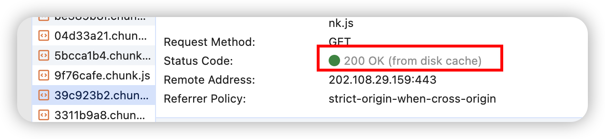
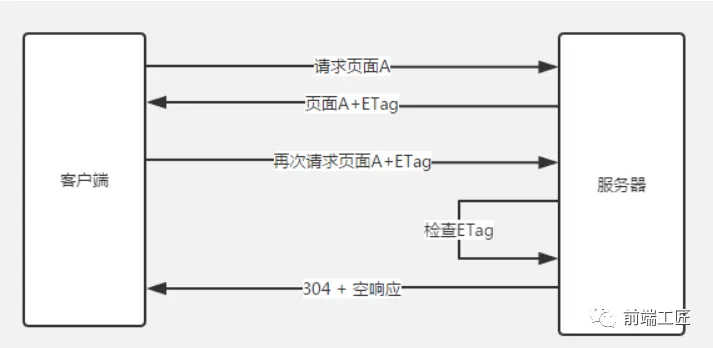
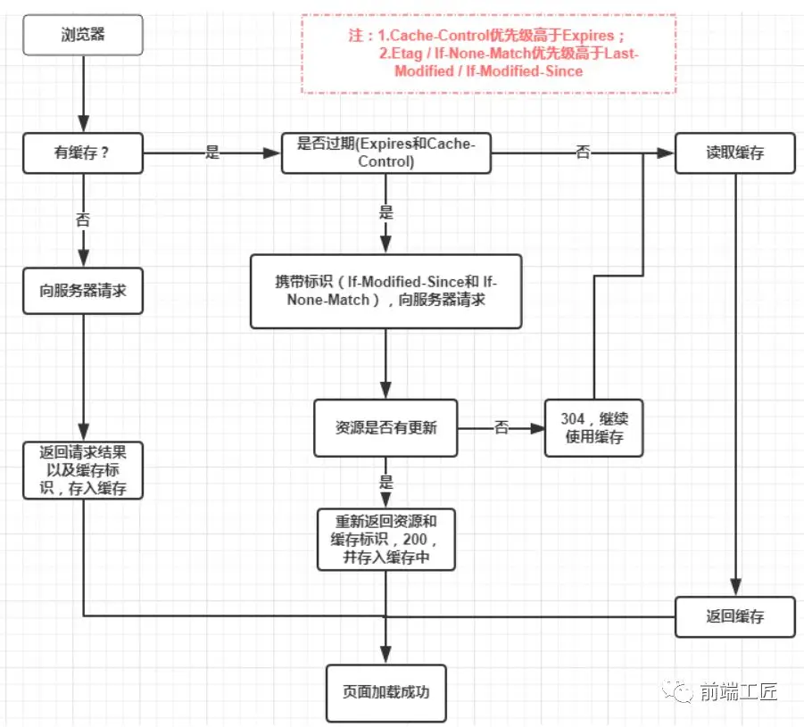

# 4. 浏览器缓存、DNS缓存、CDN缓存

## 浏览器缓存
对于 web 应用来说，缓存是提升页面性能同时减少服务器压力的利器。

⚠️`304 Not Modified` 是协商缓存，`200 OK (from disk cache)`是强制缓存

### `cache-control` 为什么 `request` 和 `response` 都有

`Cache-Control` 是 HTTP 协议中的一个头部字段，用于控制缓存的行为。它可以在 `request`（请求）和 `response`（响应）中都出现，但其含义和作用在不同的上下文中有所不同。

#### `request`中`Cache-Control`

在 `request` 中，`Cache-Control` 字段用于指定客户端（通常是浏览器）对缓存的要求和期望。客户端可以通过设置 `Cache-Control` 头部来告诉服务器它希望如何处理缓存。例如，客户端可以请求服务器返回最新的资源，或者允许使用缓存的副本。常见的 `request` 中的 `Cache-Control` 指令包括：

- `no-cache`：表示客户端不希望使用缓存的副本，而是要求服务器每次都返回最新的资源。
- `max-age=[seconds]`：指定客户端希望使用缓存的副本的最长时间（以秒为单位）。如果缓存的副本在这个时间内仍然有效，客户端将直接使用它，而不会再次向服务器发送请求。

#### `response`中`Cache-Control`

在 `response` 中，`Cache-Control` 字段用于指定服务器对缓存的控制策略。服务器可以通过设置 `Cache-Control` 头部来告诉客户端如何处理缓存的副本。例如，服务器可以指定缓存的副本可以被客户端使用的时间，或者是否允许缓存。常见的 `response` 中的 `Cache-Control` 指令包括：

- `public`：表示响应可以被任何缓存（包括客户端和中间代理）缓存。
- `private`：表示响应只能被客户端的缓存缓存，而不能被中间代理缓存。
- `max-age=[seconds]`：指定响应的缓存副本可以被客户端使用的最长时间（以秒为单位）。
- `no-cache`：表示客户端在使用缓存的副本之前必须先向服务器验证其有效性。
- `no-store`：表示不允许缓存响应的任何副本。


### **强缓存**

> 不会向服务器发送请求，直接从缓存中读取资源，在`chrome` 控制台的 `network` 选项中可以看到该请求返回 `200` 的状态码，并且显示`from disk cache` 或 `from memory cache`；

- **form memory cache**:这个是缓存在内存里面，优点是快速，但是具有时效性，当关闭 tab 时候缓存就会失效。
- **from disk cache**:这个是缓存在磁盘里面，虽然慢但是还是比请求快，优点是缓存可以一直被保留，即使关闭 tab 页，也会一直存在



**相关的 header:**
+ **Expires** ：`response header` 里的过期时间，浏览器再次加载资源时，如果在这个过期时间内，则命中强缓存。它的值为一个绝对时间的 `GMT` 格式的时间字符串， 比如`Expires:Thu,21 Jan 2018 23:39:02 GMT`

+ **Cache-Control** ：这是一个相对时间，在配置缓存的时候，以`秒`为单位，用数值表示。当值设为 `max-age=300` 时，则代表在这个请求正确返回时间（浏览器也会记录下来）的 `5 分钟`内再次加载资源，就会`命中强缓存`。比如 `Cache-Control:max-age=300`，

```http
General
Status Code: 200 OK (from disk cache)

Response Headers
Cache-Control: max-age=2592000

Request Headers
Cache-Control: 此时没有显示这个标识，被隐藏了
```

**简单概括**：其实这两者差别不大，区别就在于 `Expires` 是 `http1.0` 的产物，`Cache-Control`是`http1.1`的产物，两者同时存在的话，`Cache-Control优先级高于Expires`。

### **协商缓存**

⚠️当 `request header` 中包含 `Cache-Control: max-age=0` 时，浏览器会认为`缓存已经过期`，需要向服务器发送请求来验证资源是否有更新。

> 向服务器发送请求，服务器会根据这个请求的 `Request header`的一些参数来判断是否命中协商缓存，`如果命中，则返回 304 状态码`并带上新的 `Response header` 通知浏览器从缓存中读取资源；另外协商缓存需要与`cache-control 共同使用`。

#### `Last-Modified` 和 `If-Modified-Since`

当第一次请求资源时，服务器将资源传递给客户端时，会将资源最后更改的时间以`“Last-Modified: GMT”`的形式加在实体首部上一起返回给客户端。

**第一次请求js**:
```http
General
Status Code: 200 OK

Response Headers
Last-Modified: Wed, 12 Jun 2024 13:55:39 GMT
Cache-Control: max-age=2592000

Request Headers
If-Modified-Since: 此时没有这个标识
Cache-Control: no-cache
```

**第二次请求js**:
```http
General
Status Code: 304 Not Modified

Response Headers
Last-Modified:Wed, 12 Jun 2024 13:55:39 GMT
Cache-Control: max-age=2592000

Request Headers
If-Modified-Since: Wed, 12 Jun 2024 13:55:39 GMT
Cache-Control: max-age=0
```
**但 last-modified 存在一些缺点：**

+ 某些服务端不能获取精确的修改时间

+ 文件修改时间改了，但文件内容却没有变

所以就有了 `ETag` 和 `If-None-Match`

#### `ETag` 和 `If-None-Match`

`Etag`是上一次加载资源时，服务器返回的`response header`，是对该资源的一种唯一标识，`只要资源有变化，Etag 就会重新生成`。

首次请求资源时，状态码是 `200`，此时`Response Headers`中会返回`Etag`，`request header`里此时没有`If-None-Match`；
**第一次请求js**
```http
General
Status Code: 200 OK

Response Headers
Etag:
"2509A80186A9F5FCB9B6566652E13489"
Cache-Control: max-age=2592000

Request Headers
If-None-Match: 此时没有这个标识
Cache-Control: no-cache
```
浏览器在下一次加载资源向服务器发送请求时，会将上一次返回的`Etag`值放到`request header`里的`If-None-Match`里，服务器只需要比较客户端传来的`If-None-Match`跟自己服务器上该资源的`ETag`是否一致，就能很好地判断资源相对客户端而言是否被修改过了。

如果服务器发现`ETag`匹配不上，那么直接以常规`GET 200`回包形式将新的资源（当然也包括了`新的ETag`）发给客户端；

如果`ETag`是一致的，则直接`返回304`知会客户端直接使用本地缓存即可。

**第二次请求js，`request header`中的`If-None-Match`和`Response Headers`中的`Etag`一致，状态码为 304，没有修改过，走缓存**

```js
General
Status Code: 304 Not Modified

Response Headers
Etag:
"2509A80186A9F5FCB9B6566652E13489"
Cache-Control: max-age=2592000

Request Headers
If-None-Match:"2509A80186A9F5FCB9B6566652E13489"
Cache-Control: max-age=0
```


#### last-modified 和 Etag对比
+ **精确度上，Etag 要优于 Last-Modified。**
Last-Modified的时间单位是秒，如果某个文件在1秒内改变了多次，那么他们的Last-Modified其实并没有体现出来修改，但是Etag每次都会改变确保了精度；如果是负载均衡的服务器，各个服务器生成的Last-Modified也有可能不一致。

+ **在性能上，Etag 要逊于 Last-Modified。**
毕竟 Last-Modified 只需要记录时间，而 Etag 需要服务器通过算法来计算出一个 hash 值。

+ **优先级上，服务器校验优先考虑 Etag**




### 启发式缓存
我跟我们的请求头中确定缓存过期时间的字段一个都没有,例如:
```http
Age:23146
Cache-Control: public
Date:Tue, 28 Nov 2024 12:26:41 GMT
Last-Modified:Tue, 28 Nov 2017 05:14:02 GMT
Vary:Accept-Encoding
```

此时则会默认触发浏览器**启发式缓存**:
浏览器会根据响应头中2个时间字段 `Date` 和 `Last-Modified` 之间的时间差值，取其值的`10%`作为缓存时间周期。

### 缓存的优先级
在缓存策略上:**强缓存**>**协商缓存**>启发式缓存

进一步分析可得出,以下优先级：
`Cache-Control` > `Expires` >` ETag` > `Last-Modified`


## DNS 缓存

全称 Domain Name System，即**域名系统**。

万维网上作为域名和 IP 地址相互映射的一个分布式数据库，能够使用户更方便的访问互联网，而不用去记住能够被机器直接读取的 IP 数串。DNS 协议运行在 UDP 协议之上，使用端口号 53。

有 dns 的地方，就有缓存。浏览器、操作系统、Local DNS、根域名服务器，它们都会对 DNS 结果做一定程度的缓存。

**DNS 查询过程如下：**

1. 首先搜索`浏览器自身的 DNS 缓存`，如果存在，则域名解析到此完成。
2. 如果浏览器自身的缓存里面没有找到对应的条目，那么会尝试`读取操作系统的 hosts` 文件看是否存在对应的映射关系，如果存在，则域名解析到此完成。
3. 如果本地 hosts 文件不存在映射关系，则查找`本地 DNS 服务器`(ISP 服务器，或者自己手动设置的 DNS 服务器)，如果存在，域名到此解析完成。
4. 如果本地 DNS 服务器还没找到的话，它就会`向根服务器发出请求`，进行递归查询。

## CDN 缓存

CDN 缓存是指`内容分发网络（Content Delivery Network）中的缓存机制`。CDN 是一种`分布式网络架构`，它通过在`全球各地部署缓存服务器`，将网站的静态资源（如图片、CSS、JavaScript 等）`缓存到离用户更近的位置`，以提高资源的加载速度和性能。

当用户访问网站时，`CDN 会根据用户的地理位置和网络情况`，选择`最近的缓存服务器`来提供服务。如果缓存服务器中已经存在用户请求的资源，CDN 会直接将该资源返回给用户，而无需从原始服务器获取，从而减少了数据传输的延迟和带宽消耗。

**CDN 缓存的优点包括：**

1. **提高网站性能**：通过将资源缓存到离用户更近的位置，减少了数据传输的时间和延迟，提高了网站的加载速度和响应性能。
2. **减轻服务器负担**：CDN 可以分担原始服务器的流量压力，降低服务器的负载，提高服务器的稳定性和可靠性。
3. **提高内容可用性**：CDN 可以在多个缓存服务器上存储资源副本，即使某个缓存服务器出现故障，用户仍然可以从其他缓存服务器获取资源，提高了内容的可用性和可靠性。
4. **节省带宽成本**：CDN 可以减少从原始服务器传输的数据量，从而降低了带宽成本。

CDN 缓存的设置和管理通常`由 CDN 服务提供商负责`，网站管理员可以`通过配置 CDN 服务`来`控制缓存的行为`，例如设置缓存的过期时间、更新策略等。同时，CDN 服务提供商也会提供监控和管理工具，以便网站管理员实时了解 CDN 的性能和缓存状态。
