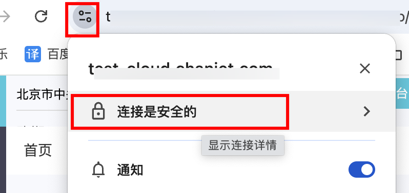

# 8. Https为什么安全？怎么知道当前请求是否安全？

## **一、HTTPS 安全的原因**

### 1. **加密通信**：
   - HTTPS 使用 `SSL/TLS` 协议对通信进行加密。在客户端与服务器之间建立连接时，双方会`进行密钥交换`，协商出用于加密和解密数据的`对称密钥`。这样，即使数据在网络中被拦截，攻击者也`很难破解加密内容`，因为破解高强度加密算法在计算上是非常困难的。
   - 加密可以防止数据被窃取和篡改，`确保数据的机密性和完整性`。

### 2. **身份验证**：
   - `HTTPS` 可以通过数字证书`对服务器进行身份验证`。服务器会向客户端提供由权威的证书颁发机构（CA）颁发的数字证书，`证书中包含服务器的公钥和身份信息`。客户端会`验证证书的合法性`，确保连接的是真实的、可信任的服务器，而不是假冒的服务器。
   - 这种身份验证机制可以`防止中间人攻击`，即攻击者`冒充服务器与客户端进行通信`。

### 3. **数据完整性校验**：
   - 在通信过程中，`SSL/TLS` 协议会对传输的数据进行`完整性校验`。通过使用消息认证码`（MAC）`等技术，`接收方`可以`检测数据`在传输过程中`是否被篡改`。如果数据被篡改，接收方会拒绝接收并通知发送方重新发送数据。

## **二、判断当前请求是否安全的方法**

### 1. **查看 URL**：
   - 在浏览器中，如果 `URL 以“https://”开头`，说明当前请求是通过 HTTPS 进行的，相对`比较安全`。而“http://”开头的请求则是未加密的，安全性较低。
   - 一些浏览器还会在`地址栏中显示锁形图标`，表示当前连接是安全的。点击锁形图标可以查看更多关于连接安全性的信息，如证书颁发机构、证书有效期等。

### 2. **检查证书**：
   - 可以通过浏览器的开发者工具查看当前连接的证书信息。在大多数浏览器中，可以`按下 F12 打开开发者工具，然后在“Security”（安全）选项卡中查看证书详情`。
   - 检查证书的颁发机构是否可信、证书是否在有效期内、证书中的域名是否与当前访问的域名一致等。如果证书存在问题，浏览器可能会发出警告。
   

### 3. **使用网络监测工具**：
   - 可以使用一些`网络监测工具来分析网络流量`，判断请求是否安全。这些工具可以检测是否存在加密通信、是否有异常的网络连接等。
   - 例如，`Wireshark` 是一个流行的网络协议分析工具，可以捕获和分析网络数据包，查看是否有未加密的敏感信息传输。
