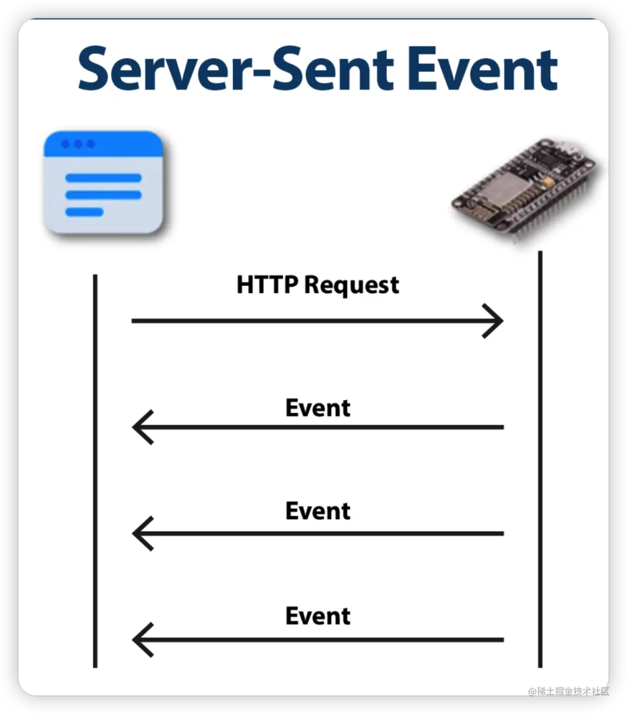
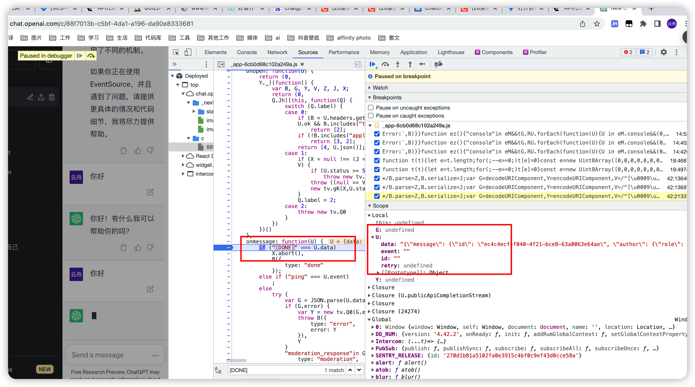
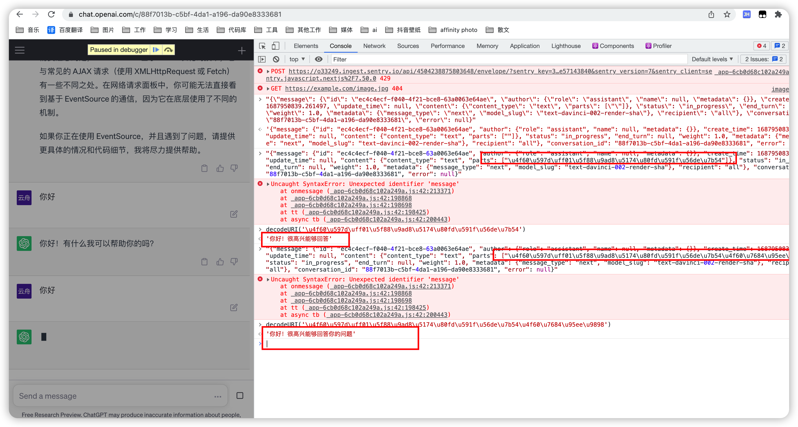
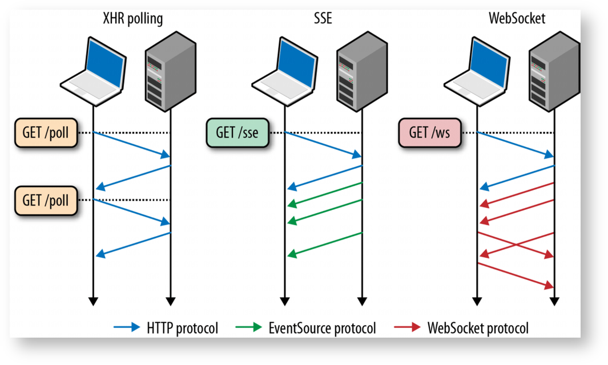
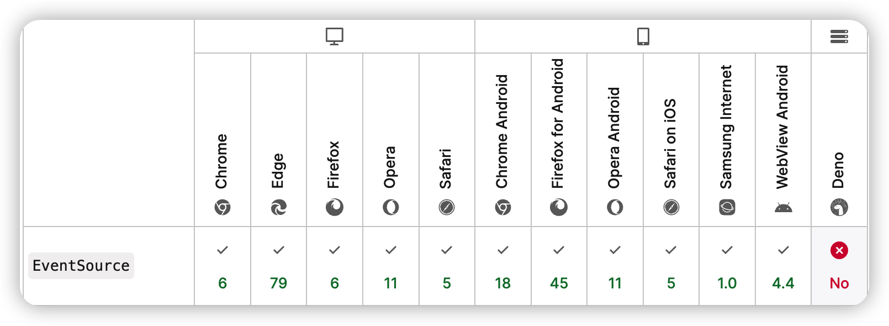
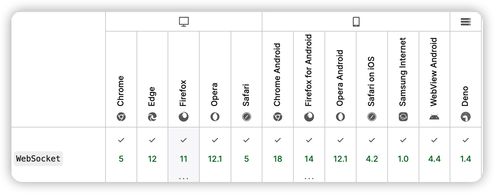
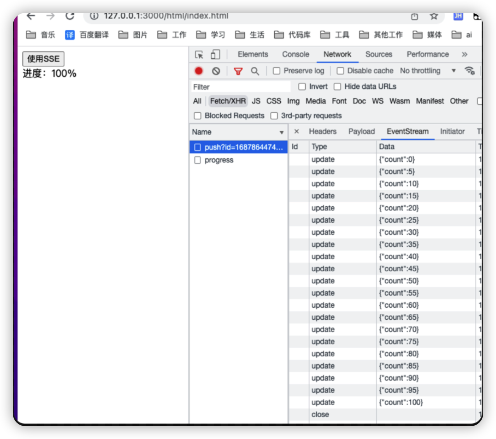

# 1. 基于SSE和EventSource实现服务端推送

### 相关文档
| 名称 | 地址 |
| --- | --- |
| MDN EventSouce | [https://developer.mozilla.org/en-US/docs/Web/API/EventSource](https://developer.mozilla.org/en-US/docs/Web/API/EventSource) |
| koa | [https://koa.bootcss.com/](https://koa.bootcss.com/) |
| koa-sse-stream | [https://www.npmjs.com/package/koa-sse-stream](https://www.npmjs.com/package/koa-sse-stream) |
| 完整项目地址 | [https://github.com/dai1254473705/EventSourceDemo](https://github.com/dai1254473705/EventSourceDemo) |

### 什么是SSE
> SSE 全称是 **Server Sent Event**，翻译过来的意思就是 服务器派发事件。 一个网页获取新的数据通常需要发送一个请求到服务器，也就是向服务器请求的页面。 使用 server-sent 事件，服务器可以在任何时刻向我们的 Web 页面推送数据和信息。 这些被推送进来的信息可以在这个页面上作为 Events [0] + data 的形式来处理。


### SSE原理
> SSE 的本质其实就是一个 HTTP 的长连接，只不过它给客户端发送的不是一次性的数据包，而是一个 stream 流，格式为** text/event-stream**。
> 客户端不会关闭连接，会一直等着服务器发过来的新的数据流





### chatGpt




### SSE特点

- SSE标准不允许POST

### XHR、SSE、WS交互区别

1. xhr请求完成后就会断开连接；
2. sse建立连接后，不手动断开就会一直处于连接状态，只能服务端推送消息到前端；
3. ws建立后，不手动断开就会一直处于连接状态，前后端可以互相推送消息；




### SSE和WS方式上区别对比
| **方式** | **协议** | **交互通道** | **内容编码** | **重连** | **事件类型** | **总结** |
| --- | --- | --- | --- | --- | --- | --- |
| SSE | HTTP | 服务端单向推送 | 默认文本 | 默认支持断线重连 | 支持自定义消息类型 | 轻量级 |
| WebSocket | WS（基于 TCP 传输层的应用层协议，RFC6455  [1] 对于它的定义标准） | 双向推送 | 默认二进制 | 手动实现 | NO | 扩展性、功能性强大 |

### EventSource及WS浏览器兼容性
> SSE在前端需要机遇H5提供的EventSource api 实现，EventSource不支持IE浏览器,可以通过**event-source-polyfill**支持IE






### EventSource 相关api
##### 语法
```typescript
evtSource = new EventSource(url, configuration);
```
##### 属性
| **名称** | **作用** |
| --- | --- |
| url | 远程资源的位置（服务端接口地址，仅支持get请求） |
| configuration.withCredentials | 默认为 false，指示 CORS 是否应包含凭据 ( credentials )。 |
| evtSource.readyState | 
- 0 — connecting
- 1 — open
- 2 — closed
 |

##### 方法
| **名称** | **作用** |
| --- | --- |
| evtSource.close() | 客户端主动关闭连接 |

##### 事件
| **名称** | **作用** | **语法** |
| --- | --- | --- |
| onclose | 连接关闭触发 | evtSource.onclose = function() {};
或者
addEventListener("close", (event) => {}); |
| onopen | 连接开启触发 | evtSource.onopen = function() {
  console.log("Connection to server opened.");
};
或者
addEventListener("open", (event) => {}); |
| onmessage | 服务端消息推动消息触发 | evtSource.onmessage = function(event) {};
或者
addEventListener("message", (event) => {}); |
| onerror | 发生错误 | evtSource.onerror = function() {};
或者
addEventListener("error", (event) => {}); |


### 服务端API
| **名称** | **作用** | **类型** | **备注** |
| --- | --- | --- | --- |
| data | 传输的文本 | String（默认）\\ 可以传输JSON | 可以多行累加 |
| event | 事件名称 | String | 可自定义 |
| id | 当前推送 id | String | 作为消息的标识 |
| retry | 超时重试时间 | Number | 客户端在感知 server 连接异常后。会通过 retry 设定时间进行重新连接 |


如下：
如果制定了event,前端需要监听对应的event，不指定event，则通过监听message得到数据
```
const event = 'update';
const data = JSON.stringify({name:234});
const retry = 3000;

`event:${event}\ndata: ${data}\n\nretry:${retry}\n\n`;
```

### koa-sse-stream
> koa中处理sse接口的中间件

```
const koasse = require('koa-sse-stream');
/**
 * koa sse middleware
 * @param {Object} opt
 * @param {Number} opts.maxClients max client number, default is 10000
 * @param {Number} opts.pingInterval heartbeat sending interval time(ms), default 60s
 * @param {String} opts.closeEvent if not provide end([data]), send default close event to client, default event name is "close"
 * @param {String} opts.matchQuery when set matchQuery, only has query (whatever the value) , sse will create
 */
const SSE_CONF = {
    maxClients: 2, // 最大连接数
    pingInterval: 3000 // 重连时间
}
router.get('/event/push', koasse(SSE_CONF), controller.eventPush);

```
对应eventpush方法实现
```
// 连接池
const clientList = new Map();
/**
 * 获取数据
 * @param {*} ctx 
 * @param {*} next 
 */
eventPush(ctx, next) {
    console.log(ctx.query);
    const { id } = ctx.query;
    // 如果clientList 对应ID已经存在，就覆盖
    clientList.set(id, {
        sse: ctx.sse,
        timer: null,
        count: 0
    });
    console.log(clientList.size, '===length===');
}
```

### 前端eventSouce实现
```
const evtSource = new EventSource(`/event/push?id=${id}`, {
    withCredentials: false
});

// 监听服务端推送消息
evtSource.addEventListener("update", (e) => {
    const data = JSON.parse(e.data);
    console.log('update==>',data);
    const ele = document.querySelector(".progress");
    ele.textContent = data.count;
});

// 调用接口，触发进度，开始在event/push接口中推送数据
 document.querySelector('#sse').onclick = function () {
    console.log('hahaha');
    // 发起一个post请求
    axios({
        method: 'post',
        url: '/event/progress',
        data: {
            id: id,
        },
    }).then(function (response) {
        console.log(response, '===');
    });
}

// 页面关闭的时候关闭事件，并通知服务端移除连接池中对应客户端
window.onbeforeunload = (event) => {
        evtSource.close();
        // 发起一个post请求
        axios({
            method: 'get',
            url: '/event/remove',
            params: {
                id: id,
            },
        });
    }
```
### 效果如图


### 
### 项目地址
[https://github.com/dai1254473705/EventSourceDemo](https://github.com/dai1254473705/EventSourceDemo)

