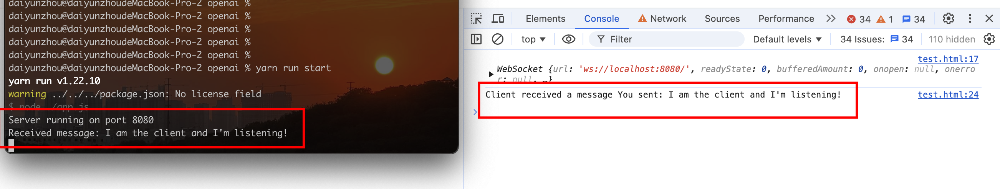

# 2. 理解WebSocket 及其在 Koa2 中的简单应用

## 一、WebSocket 简介
`WebSocket` 作为 `HTML5` 规范中极具创新性的 `Web` 技术，正逐步成为现代 `Web` 开发中实现实时双向通信的关键力量。它打破了传统 `HTTP` 通信模式的单向性和短连接特性，开启了全新的双向数据交互通道。

与传统的 `Ajax` 技术相比，`WebSocket` 优势显著。`Ajax` 依赖`客户端频繁发起请求来获取服务器更新`，犹如学生不断主动向老师提问；而 `WebSocket` 允许`服务器主动推送信息给客户端`，恰似老师发现重要知识随时告知学生，极大地`提高了信息传输的及时性和效率`。其使用的协议为 `ws`（非加密）或 `wss`（加密，类似 HTTPS），目前主流浏览器如 Firefox、Chrome、Opera、Safari 等早已提供支持，为 Web 实时应用开发提供了坚实基础。

## 二、原生 WebSocket 使用基础

在客户端，使用 WebSocket 简洁直观。例如：

```javascript
// 创建一个Socket实例
var socket = new WebSocket('ws://localhost:8080');

// 打开Socket
socket.onopen = function(event) {
    // 发送一个初始化消息
    socket.send('I am the client and I\'m listening!');
    // 监听消息
    socket.onmessage = function(event) {
        console.log('Client received a message', event.data);
    };
    // 监听Socket的关闭
    socket.onclose = function(event) {
        console.log('Client notified socket has closed', event);
    };
};
```
这里创建一个指向本地 `8080` 端口的 WebSocket 连接，连接成功打开（`onopen`）后发送初始化消息，同时监听服务器发来的消息（`onmessage`）以及连接关闭事件（`onclose`）。

服务器端若用原生 `JavaScript` 配合 `Node.js` 实现，需借助 `net` 模块等构建 `TCP` 服务器基础，再依据 `WebSocket` 协议规范处理握手、数据帧解析等复杂流程，相对复杂，这也凸显了使用成熟框架的便利性。

## 三、结合 Koa2 实现简单的 WebSocket 应用

### （一）搭建 Koa2 服务器
首先确保已安装 Koa2 及相关依赖，创建一个基础的 Koa2 服务器：

```javascript
const Koa = require('koa');
const app = new Koa();

app.use(async (ctx) => {
    ctx.body = 'Hello, Koa2 with WebSocket!';
});

const port = 8080;
app.listen(port, () => {
    console.log(`Server running on port ${port}`);
});
```

### （二）引入 WebSocket 支持
使用 `koa-websocket` 库（假设已安装）为 Koa2 轻松集成 WebSocket 功能：
```javascript
const Koa = require('koa');
const app = new Koa();
const websocket = require('koa-websocket');
const wsApp = websocket(app);

wsApp.ws.use(async (ctx, next) => {
    const { websocket } = ctx;
    websocket.on('message', (message) => {
        console.log('Received message:', message);
        // 向客户端发送响应消息
        websocket.send(`You sent: ${message}`);
    });
    websocket.on('close', () => {
        console.log('Socket closed');
    });
    await next();
});

app.use(async (ctx) => {
    ctx.body = 'Hello, Koa2 with WebSocket!';
});

const port = 8080;
app.listen(port, () => {
    console.log(`Server running on port ${port}`);
});
```



在上述代码中，`koa-websocket` 将 Koa2 应用转换为支持 WebSocket 的应用（`wsApp`）。在 WebSocket 中间件里，监听客户端发来的消息，打印并回传一条包含原消息的响应，同时监听连接关闭事件。客户端只要连接到此服务器，就能实时交互，实现简单的双向通信场景，如简易聊天、实时数据反馈等。

WebSocket 以其独特优势在诸多领域大放异彩，无论是社交媒体的实时聊天、协同办公软件的实时编辑，还是金融领域的实时报价推送，都离不开它的身影。掌握原生及结合框架（如 Koa2）的使用，能为开发高效、实时的 Web 应用提供有力保障，开启 Web 实时交互新篇章。 
