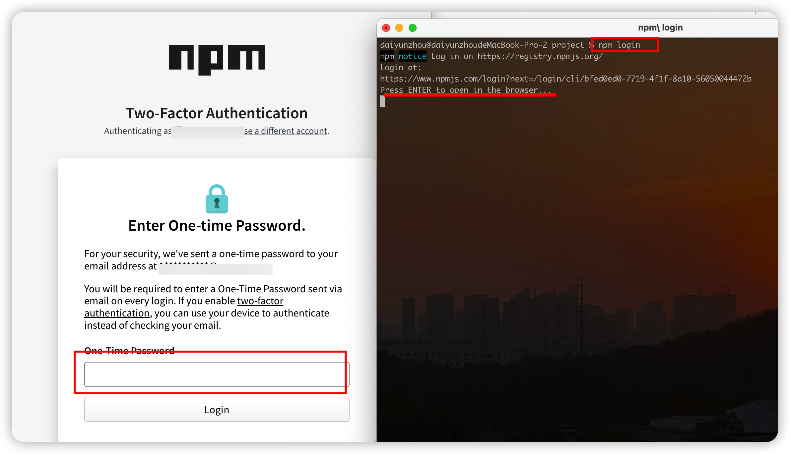

> 发布自己的代码到npm（Node Package Manager）是将JavaScript库或工具分享给全球开发者的重要途径。本指南将详细介绍从准备工作到实际发布的完整流程，确保您的代码能够顺利地在npm社区中上线。

## 一、准备工作

### 1. 安装并配置npm

确保您已安装了最新版本的Node.js，因为npm随Node.js一同安装。检查当前版本：

```sh
node -v
```

### 2. 创建或更新 package.json

在项目根目录下，确保有一个完整的`package.json`文件，它包含了项目的元数据、依赖信息、脚本等关键内容。如果没有，可以使用以下命令创建：

```sh
npm init -y
```

### 3. 确认项目结构与文件

确保您的源代码、文档、测试等文件结构清晰，符合开源项目的常规规范。如有必要，编写**README**、**LICENSE**等说明文件。

## 二、发布流程

### 1. 登录npm账号
创建新账号参考官网：[https://docs.npmjs.com/creating-a-new-npm-user-account](https://docs.npmjs.com/creating-a-new-npm-user-account)


终端输入下面命令：

```sh
npm login 
```
按照提示输入用户名、密码和电子邮件地址或者邮箱收到的校验码



然后测试是否登录成功：

```sh
npm whoami
```
如下所示，终端输出当前登录npm账号的用户名：
```sh
daiyunzhou@daiyunzhoudeMacBook-Pro-2 project % npm whoami
yunzhoudai
```

### 2. 更新 package.json

确保`package.json`中的以下字段准确无误：

- `name`: 项目唯一标识符，遵循npm包命名规则。
- `version`: 当前版本号

### 3.发布到npm

```sh
npm publish
```
